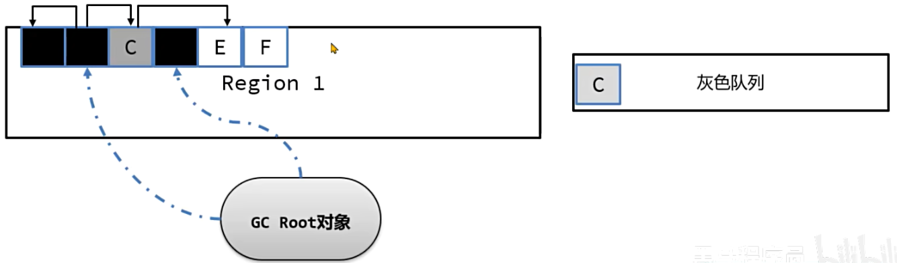
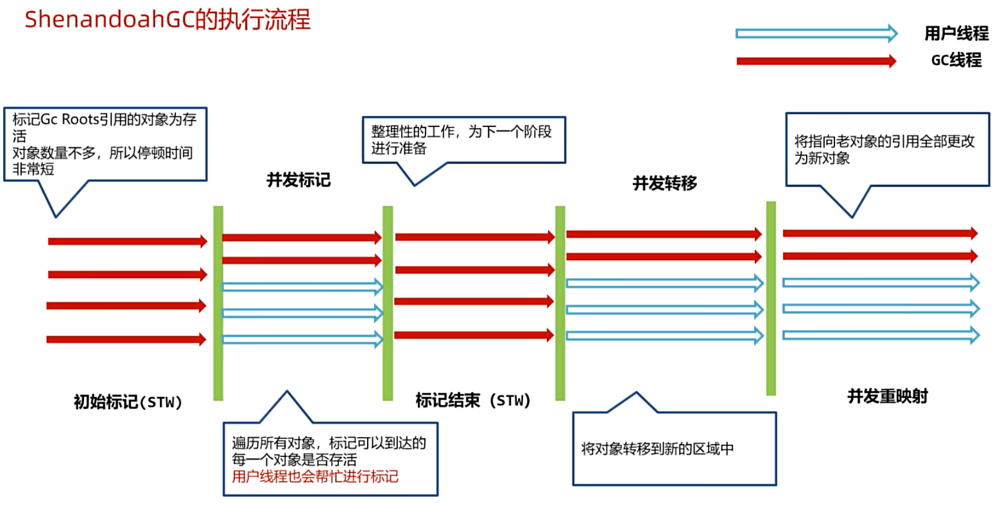

# Java 虚拟机原理


## 1. 栈上的数据存储


在局部变量表中，每个数组元素空间大小：

1. 32 位虚拟机为 32 位，4 个字节
2. 64 位虚拟机为 64 位，8 个字节

对于 long 和 double 类型，在 32 位虚拟机中会占用两个数组元素的位置 (slot 槽)。但是在 64 位虚拟机中实际会占用 16 个字节，会产生一定的空间浪费。

为了跨平台性，需要保证局部变量表既能适配 32 位虚拟机又能适配 64 位虚拟机，java 虚拟机允许了这种空间浪费的设计。Java 虚拟机的设计也并非是完美的，为了满足一些需求，需要在设计上让步。

操作数栈里的存储大小与局部变量表相同。


问题：boolean、byte、char、short 在栈上是不是存在空间浪费？

是的，Java 虚拟机采用的是空间换时间方案，在栈上不存储具体的类型，只根据 slot 槽进行数据的处理，浪费了一些内存空间但是避免不同数据类型不同处理方式带来的时间开销。

同时，像 long 类型在 64 位系统中占用 2 个 slot，使用了 16 字节的空间，但实际上在 Hotspot 虚拟机中，它的高 8 个字节没有使用，这样就满足了 long 型使用 8 个字节的需要。


### 案例：验证 boolean 在栈上的存储方式

编写如下代码，并查看字节码文件中对 boolean 数据类型处理的指令。

```java
class Main {
    public static void main(String[] args) {
        boolean a = true;
        if (a) {
            System.out.println("a is true");
        } else {
            System.out.println("a is false");
        }

        if (a == true) {
            System.out.println("a is true");
        } else {
            System.out.println("a is false");
        }
        byte b = 1;
        float f = 1;
        long l = 1;
        double d = 1;
    }
}
```

通过这个案例可以看到所有使用一个 slot 槽位的数据类型都被当成 int 类型来处理，使用 iconst 和 istore 指令。有一个特例是 float 类型，在字节码中使用的是 fconst 和 fstore，这是一组为 float 单独定制的指令。

对于 long 和 double 这些占用两个槽的类型，long 对应的是 lconst 和 lstore 指令，double 对应的是 dconst 和 dstore 指令。

在 Java 虚拟机中栈上 boolean 类型保存方式与 int 类型相同，所以它的值如果是 1 代表 true，如果是 0 代表 false。但是可以通过修改字节码文件，让它的值超过 1。


使用 ASM 框架修改字节码指令，将 iconst1 指令修改为 iconst2，并测试验证结果。

提示：可以在  idea 中使用 ASM ByteCode Outline 插件快速生成 ASM 代码来进行字节码文件的生成，也可以在  jclasslib 中手动修改字节码后保存字节码文件。

将 boolean 的指令从 iconst1修改为 iconst2 之后，出现了不一样的结果，两个 if 语句分别打印出了 true 和 false。产生不一致的原因，其实就是因为在所有布尔类型判断中 1 代表 true，0 代表 false，而如果强行将布尔值修改为非 0 非 1 的值，那么布尔判断就会出现问题。这也验证了在 Java 虚拟机栈中处理这些基本类型时，已经将它原始的类型屏蔽掉了。


问题：栈中的数据要保存到堆上或者从堆中加载到栈上时怎么处理？

1. 堆中的数据加载到栈上，由于栈上的数据单位空间大于或者等于堆上的数据单位空间，所以可以直接处理，但是需要注意符号位。
   - boolean、char 为无符号，低位复制，高位补 0。
   - byte、short 为有符号，低位复制，高位非负则补 0，负则补 1。
2. 栈中的数据要保存到堆上，byte、char、short 由于堆上数据单位存储空间较小，需要将高位去掉。boolean 比较特殊，只取低位的最后一位保存。


### 案例：验证 boolean 从栈保存到堆上只取最后一位

将 a 保存在堆上 (使用 static)，使用 ASM 框架修改字节码指令，将 iconst1 指令修改为 iconst2 和 iconst3，并测试验证结果。

```java
class Main {
    static boolean a;
    public static void main(String[] args) {
        a = true;
        if (a) {
            System.out.println("a is true");
        } else {
            System.out.println("a is false");
        }

        if (a == true) {
            System.out.println("a is true");
        } else {
            System.out.println("a is false");
        }
    }
}
```

对于 iconst2 来说：


对于 iconst3 来说：


## 2. 对象在堆上是如何存储的

编译运行如下代码，计算该类占用多少字节

```java
public class Student {
    private long id;
    private int age;
    private String name;

    public long getId() {
        return id;  
    }

    public void setId(long id) {
        this.id = id;
    }

    public int getAge() {
        return age;
    }

    public void setAge(int age) {
        this.age = age;
    }

    public String getName() {
        return name;
    }

    public void setName(String name) {
        this.name = name;
    }

    public static void main(String[] args) throws IOException {
        Student student = new Student();
        System.in.read();
    }
}
```

初步估算，long 占 8 字节，int 占 4 字节，String 在 64 位虚拟机上占 8 字节，总计 20 字节。但是启动 visualVM 查看 Student 实际占用 32 字节。


### 对象在堆中的内存布局

对象在堆中的内存布局，指的是对象在堆中存放时的各个组成部分，主要分为以下几个部分：


这里的对象分成两类，一类是普通对象，一类是数组对象。这两类对象的内存布局都分成两部分：

- 对象头 Object header：对象头中存放的是一些元信息 (基本信息)

  - Mark Word 标记字段：保存锁、垃圾回收等特定功能的信息

    这个标记字段在 32 位虚拟机占 4 字节，在 64 位虚拟机占 8 字节。

  - Klass pointer 元数据的指针：指向方法区的 InstanceKlass 对象，该对象包含了字段、方法、虚方法表等内容

  - 如果是数组对象，还包含了 length 数组长度。`.length` 获取的就是对象头中的数组长度。

- 对象数据：存放对象字段数据

  - 每一个字段对应的数据。
  - 内存对齐补充，它不会用于任何的逻辑处理，仅仅是把当前对象的长度进行规整 (向上取整)。


重新计算前面 Student 对象占的字节大小，标记字段占 8 字节，元数据指针占 8 字节，共 16 字节。算上对象数据的 20 字节，共 36 字节，略大于 visualVM 的监控结果。这说明还有一部分细节 (压缩指针)。


#### 对象在堆中的内存布局 - 标记字段

标记字段相对比较复杂。在不同的对象状态 (有无锁、是否处于垃圾回收的标记中) 下存放的内容是不同的，同时在 64 位 (又分为是否开启指针压缩)、32 位虚拟机中的布局都不同，以 64 位开启压缩指针为例：


JOL 打印内存布局

JOL 是用于分析 JVM 中对象布局的一款专业工具。工具中使用 Unsafe、JVMTI 和 Serviceability Agent (SA) 等虚拟机技术来打印实际的对象内存布局。

使用方法：

1. 添加依赖

   ```xml
   <dependency>
       <groupId>org.openjdk.jol</groupId>
       <artifactId>jol-core</artifactId>
       <version>0.9</version>
   </dependency>
   ```

2. 使用如下代码打印对象内存布局

   ```java
   System.out.println(ClassLayout.parseInstance(对象).toPrintable());
   ```


使用 jol 打印前面 Student 对象的内存布局

```java
public static void main(String[] args) {
    Student student = new Student();
    System.out.println(ClassLayout.parseInstance(student).toPrintable());
}
```

结果如下

```bash
demo1.Student object internals:
 OFFSET  SIZE               TYPE DESCRIPTION                               VALUE
      0     4                    (object header)                           01 00 00 00 (00000001 00000000 00000000 00000000) (1)
      4     4                    (object header)                           00 00 00 00 (00000000 00000000 00000000 00000000) (0)
      8     4                    (object header)                           00 30 00 01 (00000000 00110000 00000000 00000001) (16789504)
     12     4                int Student.age                               0
     16     8               long Student.id                                0
     24     8   java.lang.String Student.name                              null
Instance size: 32 bytes
Space losses: 0 bytes internal + 0 bytes external = 0 bytes total
```

可以发现标记字段部分实际占 12 字节，这是由于压缩指针导致的，可以添加虚拟机参数 `-XX:-UseCompressedOops` 重新测试。

添加以下代码输出 hash 值，并与内存布局输出对照

```java
System.out.println(Integer.toBinaryString(student.hashCode()));
```

可以将 VALUE 字段第 2-5 个字节的数据从后往前排列，与上面输出的 hash 值可以从后往前一一对应。(正常状态)

64 位不开启指针压缩 ，只是将 CMS 使用这部分弃用。

32 位虚拟机目前使用的场景已经不多了，整体结构与 64 位类似：


#### 对象在堆中的内存布局 - 元数据指针

Klass pointer 元数据的指针指向方法区中保存的 InstanceKlass 对象：


指针压缩

在 64 位的 Java 虚拟机中，Klass Pointer 以及对象数据中的对象引用都需要占用 8 个字节，为了减少这部分的内存使用量，64 位 Java 虚拟机使用指针压缩技术，将堆中原本 8 个字节的指针压缩成 4 个字节，此功能默认开启，可以使用 `-XX:-UseCompressedOops` 关闭。

指针压缩的思想是将寻址的单位放大，比如原来按 1 字节去寻址，现在可以按 8 字节寻址。如下图所示，原来按 1 去寻址，能拿到 1 字节开始的数据，现在按 1 寻址，就可以拿到 8 个字开始的数据。


这样将编号当成地址，就可以用更小的内存访问更多的数据。但是这样的做法有两个问题：

1. 需要进行内存对齐，指的是将对象的内存占用填充至 8 字节的倍数。存在空间浪费 (对于 Hotspot 来说即便不开启指针压缩，也需要进行内存对齐)

2. 寻址大小仅仅能支持 2 的 35 次方个字节 (32GB，如果超过 32GB 指针压缩会自动关闭)。

   不使用压缩指针，应该支持 2 的 64 次方 (16EB)，使用压缩指针就是 8 字节的单位 (2 的 3 次方)，乘以 4 字节的大小 (2 的 32 次方) 就是 2 的 35 次方。


#### 案例：在 hsdb 工具中验证 klass pointer 正确性

操作步骤：

1. 使用 JOL 打印对象的 Klass Pointer。
2. 使用 Klass Pointer 的地址，在 hsdb 工具中使用 Inspector 找到 InstanceKlass 对象。

注意：由于使用了小端存储，打印的地址要反过来读。

观察得出，在对象头中的后 8 个字节保存了当前 InstanceKlass 对象的地址。


对象数据部分需要保证能被 8 整除，因此会出现内存对齐填充。这个填充和是否使用压缩指针没有必然联系，不管是否开启压缩指针，内存填充是一定存在的。


### 内存对齐

内存对齐的主要目的是为了解决并发情况下 CPU 缓存失效的问题：


内存对齐之后，同一个缓存行中不会出现不同对象的属性。在并发情况下，如果让 A 对象一个缓存行失效，是不会影响到 B 对象的缓存行的。


#### 内存对齐 - 字段重排列

在 Hotspot 中，要求每个属性的偏移量 Offset (字段地址 - 起始地址) 必须是字段长度的 N 倍。即字段的 Offset 可以被对应的 Size 整除，否则，一个字段可能会被分割排列在两个不同的缓存行中，大大影响缓存行读写效率。

这种调整顺序让 offset 能被字段长度整除的机制就叫做字段重排列。

如果重排列还不能满足要求，会尝试使用内存对齐，通过在属性之间插入一块对齐区域以达到目的。


#### 案例：子类和父类的偏移量

通过如下代码验证：子类继承自父类的属性，属性的偏移量和父类是一致的。

```java
class A {
    long l;
    int i;
}

class B extends A {
    long l;
    int i;
}
```

子类会继承父类的属性，它会先将父类的字段放到内存布局的第一块，子类每个字段的偏移量和父类是完全一致的，然后再去处理子类字段在内存中的布局。


##  3. 方法调用的原理

方法调用的本质是通过字节码指令的执行，一个完整的代码执行的流程就是通过一个个方法的栈帧实现的，在栈上创建栈帧，并执行调用方法中的字节码指令。

以 invoke 开头的字节码指令的作用是执行方法的调用。

可以查看如下代码的字节码，进行分析

```java
public class MethodDemo {
    public static void main(String[] args) {
        study();
    }

    private static void study() {
        eat();
        sleep();
    }

    private static void eat() {
        System.out.println("eat");
    }
    private static void sleep() {
        System.out.println("sleep");
    }
}
```


在 JVM 中，一共有五个字节码指令可以执行方法调用：

1. invokestatic：调用静态方法
2. invokespecial：调用对象的 private 方法、构造方法，以及使用 super 关键字调用父类实例的方法、构造方法，以及所实现接口的默认方法。
3. invokevirtual：调用对象的非 private 方法。
4. invokeinterface：调用接口对象的方法。
5. invokedynamic：用于调用动态方法，主要应用于 lambda 表达式，机制极为复杂。(了解即可)

`Invoke方法` 的核心作用就是找到字节码指令并执行。

Invoke 指令执行时，需要找到方法区中 instanceKlass 中保存的方法相关的字节码信息。但是方法区中有很多类，每一个类又包含很多个方法，怎么精确地定位到方法的位置？


### 方法调用的原理 - 静态绑定

1. 编译期间，invoke 指令会携带一个参数符号引用，引用到常量池中的方法定义。方法定义中包含了类名 + 方法名 + 返回值 + 参数。
2. 在方法第一次调用时，这些符号引用就会被替换成内存地址的直接引用，这种方式称之为静态绑定。

静态绑定适用于处理静态方法、私有方法、使用 final 修饰的方法，因为这些方法不能被继承之后重写。

静态绑定支持的指令：

- invokestatic
- invokespecial
- final 修饰的 invokevirtual


### 方法调用的原理 - 动态绑定

对于非 static、非 private、非 final 的方法，有可能在子类重写方法，那么就需要通过动态绑定来完成方法地址绑定的工作。比如在这段代码中，调用的其实是 Cat 类对象的 eat 方法，但是编译完之后虚拟机指令中调用的是 Animal 类的 eat 方法，这就需要在运行过程中通过动态绑定找到 Cat 类的 eat 方法，这样就实现了多态。

```java
public abstract class Animal {
    abstract void eat();

    @Override
    public String toString() {
        return "Animal";
    }

    public static void main(String[] args) {
        Animal animal = new Cat();
        animal.eat();
    }

}

class Cat extends Animal {

    @Override
    void eat() {
        System.out.println("eat fish");
    }
}
```


动态绑定是基于方法表来完成的，invokevirtual 使用了虚方法表 (vtable)，invokeinterface 使用了接口方法表 (itable)，整体思路类似。所以接下来使用 invokevirtual 和虚方法表来解释整个过程。

每个类中都有一个虚方法表，本质上它是一个数组，记录了方法的地址。子类方法表中包含父类方法表中的所有方法，子类如果重写了父类方法，则使用自己类中方法的地址进行转换。

产生 invokevirtual 调用时，先根据对象头中的类型指针找到方法区中 InstanceKlass 对象，获得虚方法表。再根据虚方法表找到对应的方法，获得方法的地址，最后调用方法。


Java 虚拟机就是通过虚方法表实现多态的。


### 总结

在 JVM 中，一共有五个字节码指令可以执行方法调用：

1. invokestatic：调用静态方法。静态绑定
2. invokespecial：调用对象的 private 方法、构造方法，以及使用 super 关键字调用父类实例的方法、构造方法，以及所实现接口的默认方法。静态绑定
3. invokevirtual：调用对象的非 private 方法。非 final 方法使用动态绑定，使用虚方法表找到方法的地址，子类会复制父类的虚方法表，如果子类重写了方法，会替换成重写后方法的地址。
4. invokeinterface：调用接口对象的方法。动态绑定，使用接口表找到方法的地址，进行调用。
5. invokedynamic：用于调用动态方法，主要应用于 lambda 表达式，机制极为复杂。(了解即可)

`Invoke方法` 的核心作用就是找到字节码指令并执行。


## 4. 异常捕获的原理

在 Java 中，程序遇到异常时会向外抛出，此时可以使用 try-catch 捕获异常的方式将异常捕获并继续让程序按程序员设计好的方式运行。比如如下代码：在 try 代码块中如果抛出了 Exception 对象或者子类对象，则会进入 catch 分支。异常捕获机制的实现，需要借助于编译时生成的异常表。

```java
public static void test() {
    int i = 0;
    try {
        i = 1;
    } catch (Exception e) {
        i = 2;
    }
}
```

对应的字节码指令以及异常表如下


在位置 2 到 4 字节码指令执行范围内，如果出现了 Exception 对象的异常或者子类对象异常，直接跳转到位置 7 的指令，也就是 i = 2 代码位置。这行字节码指令 astore 的作用是从操作数栈中把一个对象的地址取出来放到当前的局部变量表的一号位置，这个对象就是异常对象 Exception。

异常表在编译时生成，存放的是代码中异常的处理信息，包含了异常捕获的生效范围以及异常发生后跳转到的字节码指令位置。

起始/结束 PC：此条异常捕获生效的字节码起始/结束位置。

跳转 PC：异常捕获之后，跳转到的字节码位置。


程序运行中触发异常时，Java 虚拟会从上至下遍历异常表中的所有条目。当触发异常的字节码的索引值在某个异常表条目的监控范围内，Java 虚拟机会判断所抛出的异常和该条目想要捕获的异常是否匹配。

1. 如果匹配，跳转到 “跳转 PC” 对应的字节码位置。
2. 如果遍历完都不能匹配，说明异常无法在当前方法执行时被捕获，此方法栈帧直接弹出，在上一层的栈帧中进行异常捕获的查询。

多个 catch 分支情况下，异常表会从上往下遍历，先捕获 RuntimeException，如果捕获不了，再捕获 Exception。

同理，multi-catch 的写法也是一样的处理过程，多个 catch 分支情况下，异常表会从上往下遍历，先捕获 RuntimeException，如果捕获不了，再捕获 IOException。

finally 的处理方式就相对比较复杂，分为以下几个步骤：

1. finally  中的字节码指令会插入到 try 和 catch 代码块中，保证在 try 和 catch 执行之后一定会执行 finally 中的代码。

   考虑一些特殊情况是当前的异常不在可捕获的异常范围内，或者在执行 catch 代码块时抛出了新的异常，那么 finally 代码块不会被执行。

2. 如果抛出的异常范围超过了 Exception，比如 Error 或者 Throwable，此时也要执行 finally，所以异常表中增加了两个条目，覆盖了 try 和 catch 两段字节码指令的范围，any 代表可以捕获所有种类的异常。在最后需要将异常继续向外抛出。


## 5. JIT 即时编译器

在 Java 中，JIT 即时编译器是一项用来提升应用程序代码执行效率的技术。字节码指令被 Java 虚拟机解释执行，如果有一些指令执行频率高，称之为热点代码，这些字节码指令则被 JIT 即时编译器编译成机器码同时进行一些优化，最后保存在内存中，将来执行时直接读取就可以运行在计算机硬件上了。

在 Hotspot 中，有三款即时编译器，C1、C2 和 Graal，其中 Graal 是 GraalVM 的即时编译器。

C1 编译效率比 C2 快，但是优化效果不如 C2，所以 C1 适合优化一些执行时间较短的代码，C2 适合优化服务端程序中长期执行的代码。


JDK7 之后，采用了分层编译的方式，在 JVM 中 C1 和 C2 会一同发挥作用，分层编译将整个优化级别分成了 5 个等级。


C1 即时编译器和 C2 即时编译器都有独立的线程去进行处理，内部会保存一个队列，队列中存放需要编译的任务。一般即时编译器是针对方法级别来进行优化的，当然也有对循环进行优化的设计。

详细说明 C1 和 C2 是如何进行协作的：

1. 由 C1 执行过程中收集所有运行中的信息，方法执行次数、循环执行次数、分支执行次数等等，然后等待执行次数触发阈值 (分层即时编译器由 JVM 动态计算) 之后，进入 C2 即时编译器进行深层次的优化。

   

2. 方法字节码执行数目过少，先收集信息，JVM 判断 C1 和 C2 优化性能差不多，那之后转为不收集信息，由 C1 直接进行优化。

   

3. C1 线程都在忙碌的情况下，直接由 C2 进行优化。

   

4. C2 线程忙碌时，先由 2 级 C1 编译收集一些基础信息，多运行一会儿，然后再交由 3 级 C1 处理，由于 3 级 C1 处理效率不高，所以尽量减少这一层停留时间 (C2 忙碌着，一直收集没有意义)，最后 C2 线程不忙碌了再交由 C2 进行处理。

   


### 案例：测试 JIT 即时编译器的优化效果

1. 编写 JMH 案例，代码如下

   ```java
   public int add(int a, int b) {
       return a + b;
   }
   
   public int jitTest() {
       int sum = 0;
       for (int i = 0; i < 10000000; i++) {
           sum = add(sum, 100);
       }
       return sum;
   }
   ```

2. 分别采用三种不同虚拟机参数测试 JIT 优化效果：不加参数 (开启完全 JIT 即时编译)、`-Xint` (关闭 JIT 只使用解释器)、`-XX:TieredStopAtLevel=1` (分层编译下只使用 1 级 C1 进行编译)

 

### 常见的 JIT 即时编译器优化手段

JIT 编译器主要优化手段是方法内联和逃逸分析。

方法内联 (Method Inline)：方法体中的字节码指令直接复制到调用方的字节码指令中，节省了创建栈帧的开销。


#### 方法内联

##### 案例：使用 JIT Watch 工具查看方法内联的优化结果

1. 安装 JIT Watch工具，下载源码：https://github.com/AdoptOpenJDK/jitwatch/releases/tag/1.4.2 (高版本可能有乱码问题)。

2. 按照文档配置 hsdis 插件，用于反汇编，文档地址：https://github.com/liuzhengyang/hsdis

3. 配置 sandbox，勾选 Show Disassembly，保存配置后，点击 RUN 启动 sandbox 环境

   通过测试一个简单的循环调用累加代码，观察汇编代码，可以看到 C1 对方法进行了内联优化，避免了频繁创建栈帧，而 C2 直接将累加变成了乘法操作，只需要很少的时间就能完成操作。

4. 通过 JIT Watch 观察到通过 C1 调用多次收集信息之后，进行 C2 优化。C2 优化之后的机器码大小非常小。

   

5. 方法调用进行了内联优化，汇编代码中直接使用乘法计算出值再进行累加，这样效率更高。

   


##### 方法内联的限制

并不是所有的方法都可以内联，内联有一定的限制：

1. 方法编译之后的字节码指令总大小 < 35 字节，可以直接内联。(通过 `-XX:MaxInlineSize=值` 控制)
2. 方法编译之后的字节码指令总大小 < 325 字节，并且是一个热方法。(通过 `-XX:FreqInlineSize=值` 控制)
3. 方法编译生成的机器码不能大于 1000 字节。(通过 `-XX:InlineSmallCode=值` 控制)
4. 一个接口的实现必须小于 3 个，如果大于三个就不会发生内联。


##### 案例：String 的 toUpperCase 方法性能优化

1. String 的 toUpperCase 为了适配很多种不同的语言导致方法编译出来的字节码特别大，通过编写一个方法只处理 a-z 的大写转换提升性能。
2. 通过 JIT Watch 观察方法内联的情况。


#### 逃逸分析

逃逸分析指的是如果 JIT 发现在方法内创建的对象不会被外部调用，那么就可以采用锁消除、标量替换等方式进行优化。

下面这段代码可以使用逃逸分析进行优化，因为 test 对象不会被外部引用，只会在循环中使用，它既不能在其他方法中被局部变量引用，也不能被其它的静态变量访问，对象没有发生逃逸。

```java
for (int i = 0; i < 10000000; i++) {
    Test test = new Test();
    int t = test.a;
}
```

下面这段代码就会有一定的问题，如果在方法中对象被其它静态变量引用，那优化就无法进行。这段代码在创建完对象之后，将对象传递到某一个方法的内部，此时有可能会产生逃逸，比如在方法里被其它的静态变量引用，这样在其它线程里就可能访问到这个对象，对象发生了逃逸。

```java
for (int i = 0; i < 10000000; i++) {
    Test test = new Test();
    int t = testToMethod(test);
}
```


##### 逃逸分析 - 锁消除

锁消除指的是如果对象被判断不会逃逸出去，那么对象就不存在并发访问问题，对象上的锁处理都不会执行，从而提高性能，比如以下写法，JIT 优化会直接去除锁的代码

```java
synchronized (new Test()) {}
```

不过锁消除优化在实际工作中并不常见，一般加锁的对象都是支持多线程访问的。


##### 逃逸分析 - 标量替换

逃逸分析真正对性能优化比较大的方式是标量替换，在 Java 虚拟机中，对象中的基本数据类型称为标量，引用的其它对象称为聚合量。标量替换指的是如果方法中的对象不会逃逸，那么其中的标量就可以直接在栈上分配。


##### 案例：逃逸分析的优化测试

1. 编写 JMH 性能测试案例，测试方法内联和标量替换之后的性能变化。
2. 分别使用三种不同的虚拟机参数进行测试：
   - 开启方法内联和标量替换
   - 关闭标量替换 `-XX:-DoEscapeAnalysis`
   - 关闭所有优化 `-Xint`
3. 对比测试结果。


### JIT 优化的建议

根据 JIT 即时编译器优化代码的特性，在编写代码时注意以下几个事项，可以让代码执行时拥有更好的性能：

1. 尽量编写比较小的方法，让方法内联可以生效。
2. 高频使用的代码，特别是第三方依赖库甚至是 JDK 中的，如果内容过度复杂是无法内联的，可以自行实现一个特定的优化版本。
3. 注意下接口的实现数量，尽量不要超过 2 个，否则会影响内联的处理。
4. 高频调用的方法中创建对象临时使用，尽量不要让对象逃逸。


## 6. 垃圾回收器原理

### G1 垃圾回收器原理


#### 年轻代回收和混合回收

1. 新创建的对象会存放在 Eden 区。当 G1 判断年轻代区不足 (max 默认 60%)，无法分配对象需要回收时会执行 Young GC。
2. 标记出 Eden 和 Survivor 区域中的存活对象。
3. 根据配置的最大暂停时间选择某些区域将存活对象复制到一个新的 Survivor 区中 (年龄 +1)，清空这些区域。
4. 后续 Young GC 时与之前相同，只不过 Survivor 区中存活对象会被搬运到另一个 Survivor 区。
5. 当某个存活对象的年龄达到阈值 (默认 15)，将被放入老年代。
6. 部分对象如果大小超过 Region 的一半，会直接放入老年代，这类老年代被称为 Humongous 区。比如堆内存是 4G，每个 Region 是 2M，只要一个对象超过了 1M 就会被放入 Humongous 区，如果对象过大和横跨多个 Region。
7. 多次回收之后，会出现很多 Old 老年代区，此时总堆占有率达到阈值时 (`-XX:InitiatingHeapOccupancyPercent` 默认 45%) 会触发混合回收 Mixed GC，回收所有年轻代和部分老年代的对象以及大对象区。采用复制算法来完成。


#### G1 垃圾回收器原理 - 年轻代回收

年轻代回收只扫描年轻代对象 (Eden + Survivor)，从 GC Root 到年轻代的对象或者年轻代对象引用了其它年轻代的对象都很容易扫描出来。

这里有个问题，年轻代回收只扫描年轻代对象 (Eden + Survivor)，如果有老年代中的对象引用了年轻代中的对象，如何处理？

方案1：从 GC Root 开始，扫描所有对象，如果有年轻代对象在引用链上，就标记为存活。不可行，需要遍历引用链上所有对象，效率太低。

方案2：维护一个详细的表，记录哪个对象被哪个老年代引用了。在年轻代中被引用的对象，不进行垃圾回收。


问题：如果对象太多这张表会占用很大的内存空间，且存在错标情况。


方案 2 第一次优化：只记录 Region 被哪些对象引用了。这种引用详情表称为记忆集 RememberedSet (简称 RS 或 RSet)，是一种记录了从非收集区域对象引用收集区域对象的这些关系的数据结构。扫描时将记忆集中的对象也加入到 GC Root 中，就可以根据引用链判断哪些对象需要回收了。


问题：如果区域中引用对象很多，还是占用很多内存。


方案 2 第二次优化：将所有区域中的内存按一定大小划分成很多个块，每个块进行编号。记忆集中只记录对块的引用关系。如果一个块中有多个对象，只需要引用一次，减少了内存开销。


这个分块是通过卡表实现的。


##### G1 垃圾回收器原理 - 卡表 (Card Table)

每一个 Region 都拥有一个自己的卡表，如果产生了跨代引用 (老年代引用)，此时这个 Region 对应的卡表上就会将字节内容进行修改，在 JDK8 源码中 0 代表了脏卡。这样就可以标记出当前 Region 被老年代中的哪些部分引用了。那么要生成记忆集就比较简单了，只需要遍历整个卡表，找到所有脏卡。


年轻代回收时，会将记忆集中的对象也加入到 GC Root 对象中，进行扫描并标记其引用链上的对象。


修改卡表内容是通过写屏障实现的。


##### G1 垃圾回收器原理 - 写屏障

JVM 使用写屏障 (Write Barrier) 技术，在执行引用关系建立的代码时，可以在代码前和代码后插入一段指令，从而维护卡表。

记忆集中不会记录新生代到新生代的引用，同一个 Region 的引用也不会记录。


##### G1 垃圾回收器原理 - 记忆集生成流程

记忆集的生成流程分为以下几个步骤：

1. 通过写屏障获得引用变更的信息。
2. 将引用关系记录到卡表中，同时记录到一个脏卡队列中。
3. JVM 中会由 Refinement 线程定期从脏卡队列中获取数据，生成记忆集。不直接写入记忆集的原因是避免过多线程并发访问记忆集。


更详细地分析年轻代回收的步骤，整个过程是 STW 的：

1. Root 扫描，将所有的静态变量、局部变量扫描出来。
2. 处理脏卡队列中的没有处理完的信息，更新记忆集数据，此阶段完成后，记忆集中包含了所有老年代对当前 Region 的引用关系。
3. 标记存活对象。记忆集中的对象会加入到 GC Root 对象集合中，在 GC Root 引用链上的对象也会被标记为存活对象。
4. 根据设定的最大停顿时间，选择本次收集的区域，称之为回收集合 Collection Set。
5. 复制对象。将标记出来的对象复制到新的区中，将年龄加 1，如果年龄到达 15 则晋升到老年代。老的区域内存直接清空。
6. 处理软、弱、虚、终结器引用，以及 JNI 中的弱引用。


#### G1 年轻代回收核心技术

##### 1. 卡表 Card Table

每一个 Region 都拥有一个自己的卡表，卡表是一个字节数组，如果产生了跨代引用 (老年代引用年轻代)，G1 会将卡表上引用对象所在的位置字节内容修改为 0，称为脏卡。卡表的主要作用是生成记忆集。

卡表会占用一定的内存空间，堆大小是 1G 时，卡表大小为 1G = 1024MB / 512 = 2MB

##### 2. 记忆集 RememberedSet (简称 RS 或 RSet)

每一个 Region 都拥有一个自己的记忆集，如果产生了跨代引用，记忆集中会记录引用对象所在的卡表位置。标记阶段将记忆集中的对象加入 GC Root 集合中一起扫描，就可以将被引用的对象向标记为存活。

##### 3. 写屏障 Write Barrier

G1 使用写屏障技术，在执行引用关系建立的代码执行后插入一段指令，完成卡表的维护工作。

这会损失大约 5% ~ 10% 的性能。


#### G1 垃圾回收器原理 - 混合回收

多次回收之后，会出现很多 Old 老年代区，此时总堆占有率达到阈值 (默认 45%) 时会触发混合回收 Mixed GC。

混合回收会由年轻代回收之后或者大对象分配之后触发，混合回收会回收整个年轻代 + 部分老年代。

老年代很多时候会有大量对象，要标记出所有存活对象耗时较长，所以整个标记过程要尽量能做到和用户线程并行执行。

混合回收的步骤：

1. 初始标记，STW，采用三色标记法标记从 GC Root 可直达的对象。
2. 并发标记，并发执行，对存活对象进行标记。
3. 最终标记，STW，处理 SATB 相关的对象标记。
4. 清理，STW，如果区域中没有任何存活对象就直接清理。
5. 转移，将存活对象复制到别的区域。


##### G1 垃圾回收器原理 - 初始标记

初始标记会暂停所有用户线程，只标记从 GC Root 可直达的对象，所以停顿时间不会太长。采用三色标记法进行标记，三色标记法在原有双色标记 (黑也就是 1 代表存活，白 0 代表可回收) 增加了一种灰色，采用队列的方式保存标记为灰色的对象。

黑色：存活，当前对象在 GC Root 引用链上，同时它引用的其它对象也都已经标记完成。

灰色：待处理，当前对象在 GC Root 引用链上，它引用的其它对象还未标记完成。

白色：可回收，不在 GC Root 引用链上。

三色标记中的黑色和白色是使用位图 (bitmap) 来实现的，比如 8 个字节使用 1 个 bit 来标识标记的内容，黑色为 1，白色为 0，灰色不会体现在位图中，会单独放入一个队列中。如果对象超过 8 个字节，仅仅使用第一个 bit 位处理。


##### G1 垃圾回收器原理 - 并发标记

接下来进入并发标记阶段，继续执行未完成的标记任务，此阶段和用户线程并发执行。

从灰色队列中获取尚未完成标记的对象 B。标记 B 关联的 A 和 C 对象，由于 A 和 C 对象并未引用其它对象，可以直接标记成黑色，而 B 也完成了所有引用对象的标记，也标记为黑色。C 对象有引用对象 E，所以先标记成灰色。



最后从队列中获取 C 对象，标记为黑色，E 也标记为黑色，剩余对象 F 就是白色，可回收。


三色标记存在一个比较严重的问题，由于用户线程可能同时在修改对象的引用关系，就会出现错标的情况。比如这个案例中正常情况下，B 和 C 都会被标记成黑色，但是在 BC 标记前，用户线程执行了 `B.c = null;` 将 B 到 C 的引用去除了。


同时执行了 `A.c = c;` 添加了 A 到 C 的引用。此时会出现严重问题，B 对象已经没有引用对象了，可以标记成黑色，而 A 对象已经处理完了，不会继续处理 C 的引用关系。实际上 C 本应该被标记为黑色，结果 C 是白色可回收。一旦回收，代码中再去使用该对象会造成重大问题。


##### G1 垃圾回收器原理 - SATB

G1 为了解决这个问题，使用 SATB 技术 (Snapshot At The Beginning，初始快照)。SATB 技术是这样处理的：

1. 标记开始时创建一个快照，记录当前所有对象，标记过程中新生成的对象直接标记为黑色。

2. 采用前置写屏障技术，在引用赋值前比如 `B.c = null` 之前，将之前引用的对象 C 放入 SATB 待处理队列中。每个线程都有一个 SATB 队列，最终会汇总都一个大的 SATB 队列中。 

3. 最终标记会暂停所有用户线程，主要是为了处理 SATB 相关的对象标记。这一步会将所有线程的 SATB 队列中剩余的数据合并到总的 SATB 队列中，然后逐一处理。

   SATB 队列中的对象，默认按照存活处理，同时要处理它们引用的对象。SATB 的确定是在本轮清理时可能会将不存活的对象标记成存活对象，产生了一些所谓的浮动垃圾，等到下一轮清理时才能回收。


案例：SATB 练习题

如下引用变更之后，最终标记结束之后会出现什么情况？

B 不再引用 C，D 引用 C，D 不再引用 E


B 不再引用 C 时，会通过写屏障判断 C 和 E 对象是否在初始快照中，判断下来 CE 存在于初始快照中，所以 CE 会被加入到当前的 SATB 队列。

接下来 ABD 三个对象完成标记，均为黑色。

在最终标记阶段，把 CE 从队列里取出来，全部标记为黑色。

最后的结果是 ABCDE 五个对象全部都是黑色的。此时 E 对象也成为了浮动垃圾。


##### G1 垃圾回收器原理 - 转移

转移的步骤如下：

1. 根据最终标记的结果，计算出来每一块区域垃圾对象占用的内存空间大小，根据停顿时间，选择转移效率最高 (垃圾对象最多) 的几个区域。
2. 转移时先转移 GC Root 直接引用的对象，然后再转移其它对象。 
3. 回收老的区域，如果外部有其它区域对象引用了转移对象，也需要重新设置引用关系。


### ZGC 原理


ZGC 与 G1 垃圾回收器最大的区别就在于最后一步，ZGC 的转移阶段，用户线程和 GC 线程可以同时进行，这样就保证 ZGC 在转移阶段的停顿时间不会太长。

但是 G1 垃圾回收器为什么没有在转移阶段实现这一个优化？

#### G1 转移时需要停顿的主要原因

在转移时，能不能让用户线程和 GC 线程同时工作？考虑下面的问题：

转移完成之后，需要将 A 对旧对象的引用更改为对新对象的引用，但是在更改之前，执行了 `A.c.count = 2`，此时更改的是转移前对象中的属性


更改引用之后，A 引用了转移之后的对象，此时获取 A.c.count 发现属性值依然是 1。这样就产生了问题，所以 G1 为了解决问题，在转移过程中需要进行用户线程的停止。ZGC 和 Shenandoah 解决了这个问题，让转移过程也能够并发执行。


#### ZGC 的解决方案

在 ZGC 中，使用了读屏障 Load Barrier 技术来实现转移后对象的获取。当获取一个对象引用时，会触发读后的屏障指令，如果对象指向的不是转移后的对象，用户线程会将引用指向转移后的对象。

- 写屏障技术，指的是在当前对象引用关系建立前或后插入一段指令，执行固定的业务逻辑。
- 读屏障技术，指的是在当前对象引用关系获取前或后插入一段指令，执行固定的业务逻辑。

这个解决方案实现的技术难点有两个：

- 首先判断一个对象是否是转移前的对象
- 其次是获取到转移后的对象，并重新建立引用关系。

为了解决这两个技术难点，ZGC 引入了一种新的技术 - 着色指针。


##### 着色指针 (Colored Pointers)

访问对象引用时，使用的是对象的地址。在 64 位虚拟机中，这个地址占 8 个字节，最大寻址范围可达 16 EB，所以一般内存中对象地址的高几位都是没有使用到的，这样就出现了一定的浪费。着色指针就是利用了这多余的几位，存储了状态信息。

着色指针将原来的 8 字节保存地址的指针拆分成了三部分：

1. 最低的 44 位，用于表示对象的地址，所以最多能表示 16TB 的内存空间。

2. 中间 4 位是颜色位，每一位只能存放 0 或者 1，并且同一时间只有一位是 1

   终结位：只能通过终结器访问

   重映射位 (Remap)：转移完之后，对象的引用关系已经完成变更

   Marked0 和 Marked1：标记可达对象

3. 16 位未使用


正常应用程序使用 8 个字节去进行对象的访问，现在只使用了 44 位，不会产生问题？

应用程序使用的对象地址，只是虚拟内存，操作系统会将虚拟内存转换成物理内存。正常情况下操作系统会根据这 48 位地址映射到物理内存，但是 ZGC 修改了这层逻辑，使得操作系统只使用最低的 44 位地址找到对应的物理内存。这样即使颜色位不同，指针也能指向同一个对象。


#### ZGC 的内存划分

在 ZGC 中，与 G1 垃圾回收器一样将堆内存划分成很多个区域，这些内存区域被称之为 Zpage。

Zpage 分成三类大中小，管控粒度比 G1 更细，这样更容易去控制停顿时间。

小区域：2M，只能保存 256KB 以内的对象。

中区域：32M，只能保存 256KB - 4M 的对象。

大区域：只保存一个大于 4M 的对象。


#### 初始标记阶段

标记 GC Roots 引用的对象为存活对象，数量不多，所以停顿时间非常短。


#### 并发标记阶段

遍历所有对象，标记可以到达的每一个对象是否存活，用户线程使用读屏障，如果发现对象没有完成标记也会帮忙进行标记。


#### 并发处理阶段

选择需要转移的 Zpage，创建转移表，用于记录转移前对象和转移后对象地址。


#### 转移开始阶段

转移 GC Root 直接关联的对象，不转移的对象 remapped 值设置成 1，避免重复进行判断。转移之后将对象原本的地址和当前的地址计入转移映射表。


#### 并发转移阶段

将剩余对象转移到新的 Zpage 中，转移之后将对象原本的地址和当前的地址计入转移映射表。转移完之后，转移前的 Zpage 就可以清空了，转移表保留。


这时存在一个问题，虽然对象被转移了，但是里面的指针还没有完全处理完，如果用户线程通过 GC Root 对象找到 4' 对象，再去寻找 5 对象就会找不到。

可以通过读屏障，根据转移映射表，将 4' 对 5 的引用进行重置，修改为对 5' 的引用，同时将 remap 标记为 1 代表已经重新映射完成。


并发转移阶段结束之后，这一轮的垃圾回收就结束了，但其实并没有完成所有指针的重映射工作，这个工作会放到下一轮垃圾回收，在下一轮垃圾回收的标记阶段一起完成 (因为这两个过程都需要遍历整个对象图)，这样也减少了每次垃圾回收的执行时间。


#### 第二次垃圾回收的初始标记阶段

第二次垃圾回收的初始标记阶段，沿着 GC Root 标记对象。

#### 第二次垃圾回收的并发标记阶段

如果 Marked0 为 1 代表上一轮的重映射还没有完成，先完成重映射， 从转移表中找到老对象转移后的新对象，再进行标记。如果 Remap 为 1，则表示已经完成重映射，只需要直接标记为 Marked1。


这也解释了为什么标记位有 Marked0 和 Marked1 两位，其中一位用来表示当前这一轮的垃圾回收的标记阶段，另一位用来表示上一轮垃圾回收的标记阶段。这两个标记位会在多轮垃圾回收中交替使用。

#### 第二次垃圾回收的并发处理阶段

将转移映射表删除，释放内存空间。


#### 并发转移阶段 - 并发问题

如果用户线程在帮忙转移时，GC 线程也也发现这个对象需要复制时，那么就会尝试写入转移映射表，如果发现映射表中已经有相同的老对象，直接放弃。


上面考虑的是不分代 ZGC 的设计。


#### 分代 ZGC 的设计

在 JDK21 之后，ZGC 设计了年轻代和老年代，这样可以让大部分对象在年轻代回收，减少老年代的扫描次数，可以提升一定的性能。同时，年轻代和老年代的垃圾回收可以并行执行。

分代之后的着色指针将原来的 8 字节保存地址的指针拆分成了三部分：

1. 46 位用来表示对象地址，最多可以表示 64TB 的地址空间。
2. 中间的 12 位为颜色位。
3. 最低 4 位和最高 2 位未使用。

整个分代之后的读写屏障、着色指针的移位使用都变得异常复杂，了解即可。


#### ZGC 核心技术

1. 着色指针 (Colored Pointers)

   着色指针将原来的 8 字节保存地址的指针拆分成了三部分，不仅能保留对象的地址，还可以保存当前对象所属的状态。

   不支持 32 位系统、不支持压缩指针

2. 读屏障 (Load Barrier)

   在获取对象引用前判断对象所属状态，如果所属状态和当前 GC 阶段的颜色状态不一致，由用户线程完成本阶段的工作。

   会损失一部分的性能，大约在 5% ~ 10% 之间。


### ShenandoahGC 原理

#### ShenandoahGC 的设计

ShenandoahGC 和 ZGC 不同，ShenandoahGC 使用了很多 G1 源代码改造而成，所以在很多算法、数据结构的定义上，与 G1 十分相像，而 ZGC 是完全重新开发的一套内容。

1. ShenandoahGC 的区域定义与 G1 是一样的。
2. 没有着色指针，通过修改对象头的设计来完成并发转移过程的实现。
3. ShenandoahGC 有两个版本，1.0 版本存在于 JDK8 和 JDK11 中，后续的 JDK 版本中均使用 2.0 版本。

##### 1.0 版本设计

1.0 版本，在对象的前 8 个字节，增加了一个前向指针。

前向指针指向转移之后的对象，如果没有就指向自己。


如果转移阶段未完成，此时转移前的对象和转移后的对象都会存活。如果用户去访问数据，需要使用转移后的数据。ShenandoahGC 使用了读前屏障，根据对象的前向指针来获取到转移后的对象并读取。


写入数据时，也会使用写前屏障，判断 Mark Word 中的 GC 状态，如果 GC 状态为 0 证明没有处于 GC 过程中，直接写入，如果不为 0 则根据 GC 状态值确认当前处于垃圾回收的哪个阶段，让用户线程执行垃圾回收相关的任务。


##### 2.0 版本设计

1.0 版本的缺点：

1. 对象内存大大增加，每个对象都需要增加 8 个字节的前向指针，基本上会占用 5% - 10% 的空间。
2. 读屏障中加入了复杂的指令，影响使用效率。

2.0 版本优化了前向指针的位置，仅转移阶段将其放入了 Mark Word 中。





#### 并发转移阶段 - 并发问题

如果用户线程在帮忙转移时，ShenandoahGC 线程也发现这个对象需要复制，那么就会去尝试写入前向指针。使用了类似 CAS (Compare And Swap，比较交换) 的方式来实现，只有一个线程能成功修改，其它线程会放弃转移的操作。
