# Java虚拟机基础

## 1. 初识 JVM

### 1.1 JVM 到底是什么？

JVM 全称是 Java Virtual Machine，中文译名 Java 虚拟机，是一个运行在计算机上的程序，它的职责是运行 Java 字节码文件。

### 1.2 JVM 的三大核心功能是什么？

JVM 包含内存管理、解释执行虚拟机指令、即时编译三大功能。

### 1.3 常见的 JVM 虚拟机有哪些？

常见的 JVM 有 HotSpot、GraalVM、OpenJ9 等，另外 DragonWell 龙井 JDK 也提供了一款功能增强版的 JVM。其中使用最广泛的是 HotSpot 虚拟机。


## 2. 字节码文件详解

### 2.1 Java 虚拟机的组成

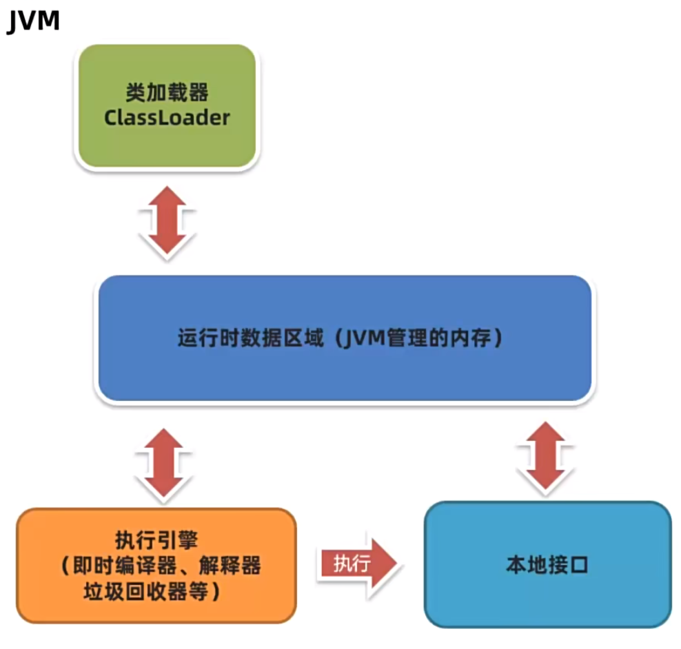

### 2.2 字节码文件的组成

#### 2.2.1 以正确的姿势打开文件

用最直观的方式阅读字节码文件

- 字节码文件中保存了源代码编译之后的内容，以二进制的方式存储，无法直接用记事本打开阅读。
- 可以使用 [jclasslib](https://github.com/ingokegel/jclasslib/) 工具查看字节码文件。


#### 2.2.2 字节码文件的组成

深度理解字节码文件的重要组成部分

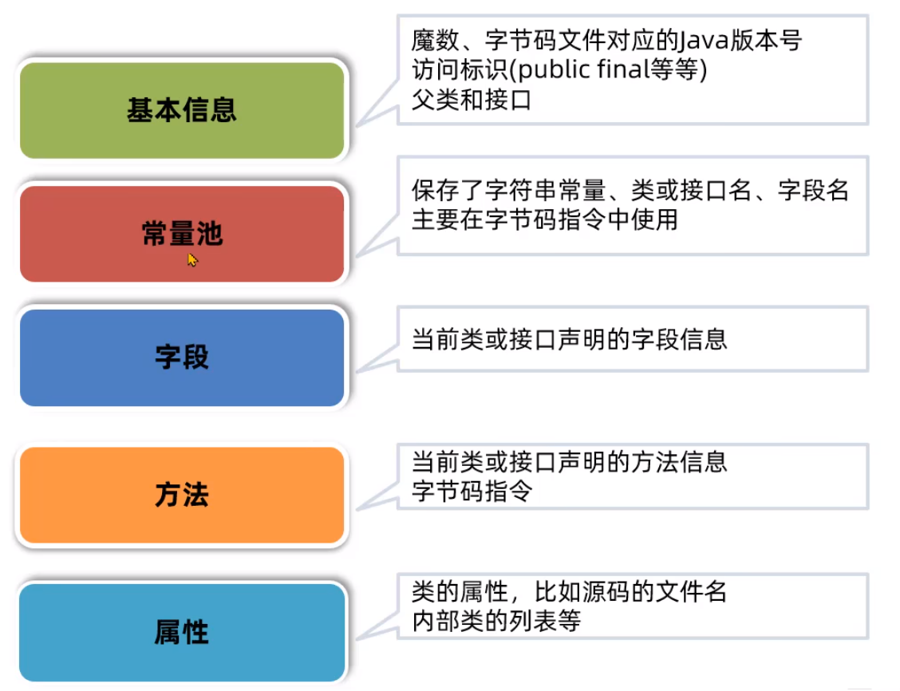

字节码文件的组成部分—— Magic 魔数

- 文件是无法通过文件扩展名来确定文件类型的，文件扩展名可以随意修改，不影响文件的内容。

- 软件使用文件的头几个字节 (文件头) 去校验文件的类型，如果软件不支持该类型就会出错。

- Java 字节码文件中，将文件头称为 magic 魔数。

  |        文件类型         | 字节数 |          文件头          |
  | :---------------------: | :----: | :----------------------: |
  |        JPEG(jpg)        |   3    |          FFD8FF          |
  |        PNG(png)         |   4    | 89504E47(文件尾也有要求) |
  |           bmp           |   2    |           424D           |
  |        XML(xml)         |   5    |        3C3F786D6C        |
  |        AVI(avi)         |   4    |         41564920         |
  | Java 字节码文件(.class) |   4    |         CAFEBABE         |

  linux 下查看文件的十六进制有以下方法

  - vim + xxd：先执行 `vim -b [file]` 以二进制形式打开文件，再输入 `:%!xxd` 将当前文本转换为十六进制格式，输入 `:%!xxd -r` 还原，此方法会修改文件内容。
  - hexdump：执行 `hexdump -C [file]` 即可查看，通常与 `less` 一起使用，用于分页查看大文件的十六进制。

字节码文件的组成部分——主副版本号

- 主副版本号指的是编译字节码文件的 JDK 版本号，主版本号用来标识大版本号，JDK 1.0-1.1 使用了 45.0-45.3，JDK1.2 是 46，之后每升级一个大版本就加 1；副版本号是当主版本号相同时作为区分不同版本的标识，一般只需要关心主版本号。

  > 1.2 之后大版本号计算方法就是：主版本号 - 44，例如主版本号 52 就是 JDK8

- 版本号的作用主要是判断当前字节码的版本和运行时的 JDK 是否兼容。

  > 常用于解决主版本号不兼容的问题


字节码文件的组成——基础信息

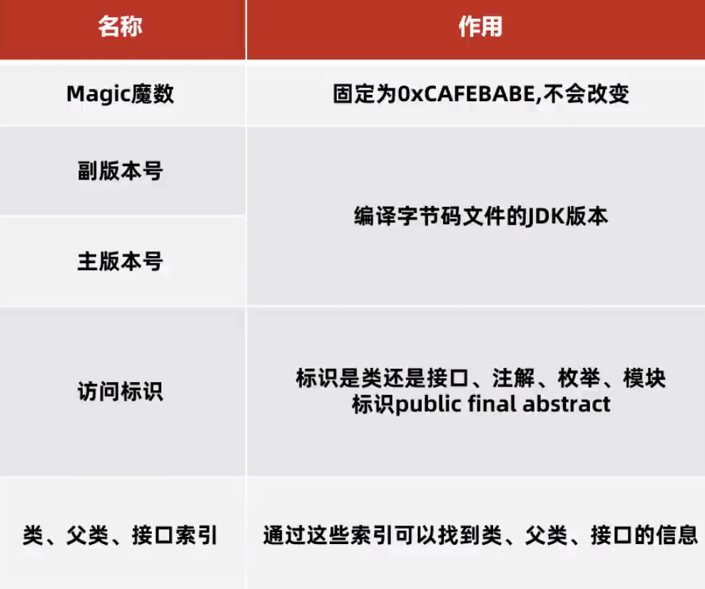


字节码文件的组成部分——常量池

- 字节码文件中的常量池的作用：避免相同的内容重复定义，节省空间。
- 常量池中的数据都有一个编号，编号从 1 开始。在字段或字节码指令中通过编号可以快速地找到对应的数据。
- 字节码指令中通过编号引用到常量池的过程称之为符号引用。

字节码文件的组成部分——方法

- 字节码中的方法区域是存放字节码指令的核心位置，字节码指令的内容存放在方法的 Code 属性中。
- 操作数栈是临时存放数据的地方，局部变量表是存放方法中局部变量的位置。


<font color='red'>面试题：int i = 0; i = i++; 最终 i 的值是多少？</font>

答案是 0，我们通过分析字节码指令发现，i++ 先把局部变量表中的 0 取出来放入临时的操作数栈中，接下来在局部变量表中对 i 进行加 1，此时 i 变成了 1，但是最后一步需要把之前保存在操作数栈的临时值 0 放入局部变量表中，最后 i 就变成了 0。


#### 2.2.3 玩转字节码常用工具

Javap 命令、Jclasslib 字节码插件、Arthas

javap 命令

- javap 是 JDK 自带的反编译工具，可以通过控制台查看字节码文件的内容。适合在服务器上查看字节码文件内容。
- 直接输入 javap 查看所有参数。
- 输入 javap -v 字节码文件名称 查看具体的字节码信息。(如果是 jar 包需要先使用 jar -xvf 命令解压)


jclasslib 字节码插件

- jclasslib 也有 idea 插件版本，可以在代码编译之后实时看到字节码文件内容。


arthas

- Arthas 是一款线上监控诊断工具，通过全局视角实时查看应用 load、内存、gc、线程的状态信息，并能在不修改应用代码的情况下，对业务问题进行诊断，大大提升线上问题排查效率。
- 官网：https://arthas.aliyun.com/doc/
- dump 类的全限定类名：dump 已加载类的字节码文件到特定目录。
- jad 类的全限定类名：反编译已加载类的源码。


#### 总结

1. 如何查看字节码文件
   - 本地可以使用 jclasslib 工具查看，开发环境使用 jclasslib 插件。
   - 服务器上使用 javap 命令直接查看，也可以通过 arthas 的dump 命令导出字节码文件再查看文件，还可以使用 jad 命令反编译出源代码。
2. 字节码文件的核心组成有哪些？


### 2.3 类的生命周期

类的生命周期描述了一个类加载、使用、卸载的整个过程。

运行时常量池、类加载器的作用、多态的原理、类的加密和解密。

#### 2.3.1 生命周期概述

类的生命周期：加载、连接、初始化、使用、卸载。

连接阶段可以细分为验证、准备、解析。

#### 2.3.2 加载阶段

1. 加载 (Loading) 阶段第一阶段是类加载器根据类的全限定名通过不同的渠道以二进制流的方式获取字节码信息。开发者可以使用 Java 代码拓展不同的渠道。
2. 类加载器在加载完类之后，Java 虚拟机会将字节码中的信息保存到方法区中。
3. 生成一个 InstanceKlass 对象，保存类的所有信息，里面还包含实现特定功能比如多态的信息。
4. 同时，Java 虚拟机还会在堆中生成一份与方法区中数据类似的 java.lang.Class 对象。作用是在 Java 代码中去获取类的信息以及存储静态字段的数据 (JDK8 及以上)。

对于开发者来说，只需要访问堆中的 Class 对象而不需要访问方法区中所有信息。这样 Java 虚拟机就能很好地控制开发者访问数据的范围。

查看内存中的对象：推荐使用 JDK 自带的 hsdb 工具查看 Java 虚拟机内存信息。

#### 2.3.3 连接阶段

验证：验证内容是否满足《Java 虚拟机规范》

- 连接 (Linking) 阶段的第一个环节是验证，验证的主要目的是检测 Java 字节码文件是否遵守了《Java 虚拟机规范》中的约束。这个阶段一般不需要开发者介入。
- 主要包含如下四部分，具体详见《Java 虚拟机规范》：
  1. 文件格式验证，比如文件是否以 0xCAFEBABE 开头，主次版本号是否满足当前 Java 虚拟机版本要求。
  2. 元信息验证，例如类必须有父类 (super 不能为空)。
  3. 验证程序执行指令的语义，比如方法内的指令执行中跳转到不正确的位置。
  4. 符号引用验证，例如是否访问了其他类中 private 的方法等。

准备：给静态变量赋初值

- 准备阶段为静态变量 (static) 分配内存并设置初始值。
- 准备阶段只会给静态变量赋初始值，而每一种基本数据类型和引用数据类型都有其初始值。

解析：将常量池中的符号引用替换成指向内存的直接引用

- 解析阶段主要是将常量池中的符号引用替换为直接引用。
- 符号引用就是在字节码文件中使用编号来访问常量池中的内容。
- 直接引用不再使用编号，而是使用内存中地址访问具体的数据。

#### 2.3.4 初始化阶段

- 初始化阶段会执行静态代码块中的代码，并为静态变量赋值。

- 初始化阶段会执行字节码文件中 clinit 部分的字节码指令。

- 以下几种方式会导致类的初始化：

  1. 访问一个类的静态变量或静态方法，注意如果变量是 final 修饰的并且等号右边是常量则不会触发初始化。
  2. 调用 Class.forName(String className)。
  3. new 一个该类的对象时。
  4. 执行 Main 方法的当前类。

  添加 `-XX:+TraceClassLoading` 参数可以打印出加载并初始化的类。


<font color='red'>经典笔试题</font>

```java
public class Test1 {
    public static void main(String[] args) {
        System.out.println("A");
        new Test1();
        new Test1();
    }

    public Test1() {
        System.out.println("B");
    }

    {
        System.out.println("C");
    }

    static {
        System.out.println("D");
    }
}
```

执行 main 方法先初始化 Test1 的初始化方法，输出 DA

执行两次 Test1 的构造方法，输出结果 DACBCB


特殊情况：

- clinit 指令在特殊情况下不会出现，以下几种情况是不会进行初始化指令执行的。
  1. 无静态代码块且无静态变量赋值语句。
  2. 有静态变量的声明，但是没有赋值语句。
  3. 静态变量的定义使用 final 关键字，这类变量会在准备阶段直接进行初始化。
- 直接访问父类的静态变量，不会触发子类的初始化。
- 子类的初始化 clinit 调用之前，会先调用父类的 clinit 初始化方法。


<font color='red'>笔试题</font>

```java
public class Demo02 {
    public static void main(String[] args) {
        new B02();
        System.out.println(B02.a);
    }
}

class A02 {  
    static int a = 0;
    static {
        a = 1;
    }
}

class B02 extends A02 {
    static {
        a = 2;
    }
}
```

1. 调用 new 创建对象，需要初始化 B02，优先初始化父类，a = 1;
2. 子类初始化，a = 2;

如果把 `new B02()` 去掉

1. 访问父类的静态变量，只初始化父类，a = 1;

访问父类的静态变量不需要初始化子类，而初始化子类之前一定会初始化父类。


```java
public class Test2 {
    public static void main(String[] args) {
        Test2_A[] arr = new Test2_A[10];
    }
}

class Test2_A {
    static {
        System.out.println("Test2_A的静态代码块执行");
    }
}
```

数组的创建不会导致数组中元素的类进行初始化。

```java
public class Test4 {
    public static void main(String[] args) {
        System.out.println(Test4_A.a);
    }
}

class Test4_A {
    public static final int a = 1;
    static {
        System.out.println("Test4的静态代码块执行");
    }
}
```

final 修饰的变量如果赋值的内容需要执行指令才能得出结果，会执行 clinit 方法进行初始化。


### 2.4 类加载器

什么是类加载器

- 类加载器 (ClassLoader) 是 Java 虚拟机提供给应用程序去实现获取类和接口字节码数据的技术。

  本地接口 JNI 是 Java Native Interface 的缩写，允许 Java 调用其他语言编写的方法。在 hotspot 类加载器中，主要用于调用 Java 虚拟机中的方法，这些方法使用 C++ 编写。

应用场景

- 企业级应用：SPI 机制、类的热部署、Tomcat 类的隔离
- 大量面试题：什么是类的双亲委派机制、打破类的双亲委派机制、自定义类加载器
- 解决线上问题：使用 Arthas 不停机解决线上故障


#### 2.4.1 类加载器的分类

类加载器分为两类，一类是 Java 代码中实现的，一类是 Java 虚拟机底层源码实现的。

虚拟机底层实现：源代码位于 Java 虚拟机的源码中，实现语言与虚拟机底层语言一致，比如 Hotspot 使用 C++

> 加载程序运行时的基础类：保证 Java 程序运行中基础类被正确地加载，比如 java.lang.String，确保其可靠性

JDK 中默认提供或者自定义：JDK 中默认提供了多种处理不同渠道的类加载器，开发者也可以自己根据需求定制

> 继承自抽象类 ClassLoader：所有 Java 中实现的类加载器都需要继承 ClassLoader 这个类


- 类加载器的设计在 JDK8 和以后的版本差别比较大，JDK8 及之前的版本中默认的类加载器有如下几种：

  虚拟机底层实现 (C++)：启动类加载器  Bootstrap (加载 Java 中最核心的类)

  Java：扩展类加载器 Extension (允许扩展 Java 中比较通用的类)、应用程序加载器 Application (加载应用使用的类)

- 类加载器的详细信息可以通过 Arthas 的 classloader 命令查看：

  classloader —— 查看 classloader 的继承树、urls、类加载信息、使用 classloader 去 getResource


**以下限定 JDK8 及之前的版本**

启动类加载器

- 启动类加载器 (Bootstrap ClassLoader) 是由 Hotspot 虚拟机提供的、使用 C++ 编写的类加载器。
- 默认加载 Java 安装目录 /jre/lib 下的类文件，比如 rt.jar、tools.jar、resources.jar 等

通过类加载器去加载用户 jar 包：

- 放入 jre/lib 下进行扩展：不推荐，可能引起很多问题。
- 使用参数进行扩展：推荐，使用 `-Xbootclasspath/a:jar包目录/jar包名` 进行扩展


Java 中的默认类加载器

- 扩展类加载器和应用程序类加载器都是 JDK 中提供的、使用 Java 编写的类加载器。
- 它们的源码都位于 sun.misc.Launcher 中，是一个静态内部类。继承自 URLClassLoader，可以通过目录或者指定 jar 包将字节码文件加载到内存中。

扩展类加载器

- 扩展类加载器 (Extension ClassLoader) 是 JDK 中提供的、使用 Java 编写的类加载器。
- 默认加载 Java 安装目录 /jre/lib/ext 下的类文件。

通过扩展类加载器去加载用户 jar 包：

- 放入 /jre/lib/ext 下进行扩展：不推荐
- 使用参数进行扩展：使用 `-Djava.ext.dirs=jar包目录` 进行扩展，这种方式会覆盖掉原始目录，可以使用 `;` (windows) 或 `:` (macos/linux) 表示追加上原始目录

应用程序类加载器

- 加载 classpath 下的类文件，包括项目中自己编写的类和接口的文件以及第三方 jar 包中的类和接口的文件。


类加载器的加载路径可以通过 Arthas 的 `classloader -c hash值` 查看，可以先用 `classloader -l` 查看 hash 值。


#### 2.4.2 双亲委派机制

由于 Java 虚拟机中有多个类加载器，双亲委派机制的核心是解决一个类到底由谁加载的问题。

**双亲委派机制有什么用？**

1. 保证类加载的安全性：通过双亲委派机制避免恶意代码替换 JDK  中的核心类库，比如 java.lang.String，确保核心类库的完整性和安全性。
2. 避免重复加载：双亲委派机制可以避免同一个类被多次加载。

双亲委派机制：当一个类加载器接收到加载类的任务时，会自底向上查找是否加载过，如果没有加载过，再自顶向下进行加载。

向下委派加载起到了一个加载优先级的作用。


问题：

1. 重复的类，如果一个类重复出现在三个类加载器的加载位置，应该由谁来加载？

   启动类加载器加载，根据双亲委派机制，它的优先级是最高的

2. String 类能覆盖吗？在自己的项目中去创建一个 java.lang.String 类，会被加载吗？

   不能，会返回启动类加载器加载在 rt.jar 包中的 String 类

   > 在 Java 中如何使用代码的方式去主动加载一个类？
   >
   > 方式1：使用 `Class.forName` 方法，使用当前类的类加载器去加载指定的类。
   >
   > 方式2：获取到类加载器，通过类加载器的 loadClass 方法指定某个类加载器加载。


父类加载器的小细节

- 每个 Java 实现的类加载器中保存了一个成员变量叫“父” (Parent) 类加载器，可以理解为它的上级，并不是继承关系。
- 应用程序类加载器的 parent 父类加载器是扩展类加载器，而扩展类加载器的 parent 是空，但是在代码逻辑上，扩展类加载器依然会把启动类加载器当成父类加载器处理。
- 启动类加载器使用 C++ 编写，没有父类加载器。


类加载器的父子关系可以通过 Arthas 的 classloader -t 命令查看。


<font color='red'>面试题</font>

类的双亲委派机制是什么？

1. 当一个类加载器去加载某个类的时候，会自底向上向父类查找是否加载过，如果加载过就直接返回，如果一直到最顶层的类加载器都没有加载过，再自顶向下进行加载。
2. 应用程序类加载器的父类加载器是扩展类加载器，扩展类加载器的父类加载器是启动类加载器。
3. 双亲委派机制的好处有两点：第一是避免恶意代码替换 JDK 中的核心类库，比如 java.lang.String，确保核心类库的完整性和安全性，第二是避免一个类重复地被加载。


#### 2.4.3 打破双亲委派机制

三种方式

1. 自定义类加载器
   - 自定义类加载器并且重写 loadClass 方法，就可以将双亲委派机制的代码覆盖
   - Tomcat 通过这种方式实现应用之间类隔离
2. 线程上下文类加载器
   -  利用上下文类加载器加载类，比如 JDBC 和 JNDI 等
3. Osgi 框架的类加载器
   - 历史上 Osgi 框架实现了一套新的类加载器机制，允许同级之间委托进行类的加载


**自定义类加载器**

- 一个 Tomcat 程序中是可以运行多个 Web 应用的，如果这两个应用中出现了相同限定名的类，比如 Servlet 类，Tomcat 要保证这两个类都能加载并且它们应该是不同的类。
- 如果不打破双亲委派机制，当应用类加载器加载 Web 应用 1 的 MyServlet 之后，Web 应用 2 中相同限定名的 MyServlet 类就无法被加载了。
- Tomcat 使用了自定义类加载器来实现应用之间类的隔离。每一个应用会有一个独立的类加载器加载对应的类。

实现一个不遵循双亲委派机制的自定义类加载器

- 先来分析 ClassLoader 的原理，ClassLoader 中包含了 4 个核心方法。

- 双亲委派机制的核心代码就位于 loadClass 方法中。

  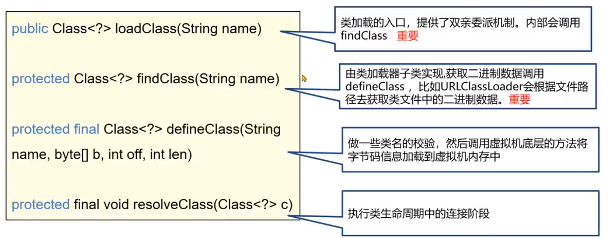

- 阅读双亲委派机制的核心代码，分析如何通过自定义的类加载器打破双亲委派机制。

  ```java
  // parent 等于 null 说明父类加载器是启动类加载器，直接调用 findBootstrapClassOrNull
  // 否则调用父类加载器的加载方法
  if (parent == null) {
      c = parent.loadClass(name, false);
  } else {
      c = findBootstrapClassOrNull(name);
  }
  // 父类加载器的加载路径中没有对应的类
  if (c == null) {
      c = findClass(name);
  }
  ```

- 打破双亲委派机制的核心就是将代码重新实现。

自定义类加载器默认的父类加载器？

- JDK8 为例，ClassLoader 类中提供了构造方法设置 parent 的内容。
- 这个构造方法由另外一个构造方法调用，其中父类加载器由 getSystemClassLoader 方法设置，该方法返回的是 AppClassLoader。

两个自定义类加载器加载相同的限定名的类，不会冲突吗？

- 不会冲突，在同一个 Java 虚拟机中，只有相同类加载器+相同的类限定名才会被认为是同一个类。
- 在 Arthas 中使用 sc -d 类名的方式查看具体的情况。

正确地去实现一个自定义类加载器的方式是重写 findClass 方法，这样不会破坏双亲委派机制


**JDBC 案例**

- JDBC 中使用 DriverManager 来管理项目中引入的不同数据库的驱动，比如 mysql 驱动、oracle 驱动。
- DriverManager 类位于 rt.jar 包中，由启动类加载器加载。
- DriverManager 属于 rt.jar 是启动器类加载器加载的，而用户 jar 包中的驱动需要由应用类加载器加载，这就违反类双亲委派机制。 

问题：DriverManager 怎么知道 jar 包中要加载的驱动在哪？

SPI 机制

- spi 全称为 Service Provider Interface，是 JDK 内置的一种服务提供发现机制。
- spi 的工作原理：
  1. 在 ClassPath 路径下的 META-INF/services 文件夹中，以接口的全限定名来命名文件名，对应的文件里面写该接口的实现。 
  2. 使用 ServiceLoader 加载实现类。
- DriverManager 使用 SPI 机制，最终加载 jar 包中对应的驱动类。

问题：SPI 中是如何获取到应用程序类加载器的？

- SPI 中使用了线程上下文中保存的类加载器进行类的加载，这个类加载器一般是应用程序类加载器。


JDBC 案例总结：

1. 启动类加载器加载 DriverManager。
2. 在初始化 DriverManager 时，通过 SPI 机制加载 jar 包中的 mysql 驱动。
3. SPI 中利用了线程上下文类加载器 (应用程序类加载器) 去加载类创建对象。

- 这种由启动类加载器加载的类，委派应用程序类加载器去加载类的方式，打破了双亲委派机制。


争议：JDBC 案例中真的打破了双亲委派机制吗？

打破了双亲委派机制：这种由启动类加载器加载的类，委派应用程序类加载器去加载类的方式，打破了双亲委派机制。

没有打破双亲委派机制：类加载流程中，没有违反双亲委派机制。


**OSGi 模块化**

- 历史上，OSGi 模块化框架，它存在同级之间的类加载器的委托加载。OSGi 还使用类加载器实现了热部署的功能。
- 热部署指的是在服务不停止的情况下，动态地更新字节码文件到内存中。

使用 Arthas 不停机解决线上问题

思路：

1. 在出问题的服务器上部署一个 arthas，并启动。

2. `jad --source-only 类全限定名 > 目录/文件名.java`

   jad 目录反编译，然后可以用其它编辑器，比如 vim 来修改源码

3. `mc -c 类加载器的hashcode 目录/文件名.java -d 输出目录`

   mc 命令用来编译修改过的代码，可以用 `sc -d 全限定名` 查看类加载器的 hashcode

4. `retransform class文件所在目录/xxx.class`

   用 retransform 命令加载新的字节码

注意事项：

1. 程序重启之后，字节码文件会恢复，除非将 class 文件放入 jar 包中进行更新。
2. 使用 retransform 不能添加方法或者字段，也不能更新正在执行中的方法。

因此使用 arthas 热部署仅仅是一种应急手段。


#### 2.4.4 JDK8 之后的类加载器

JDK8 及之前的版本中，扩展类加载器和应用程序类加载器的源码位于 rt.jar 包中的 sun.misc.Launcher.java。

JDK8 之后的类加载器

- 由于 JDK9 引入了 module 的概念，类加载器在设计上发生了很多变化。

  1. 启动类加载器使用 Java 编写，位于 jdk.internal.loader.ClassLoaders 类中。

     Java 中的 BootClassLoader 继承自 BuiltinClassLoader 实现从模块中找到要加载的字节码资源文件。

     启动类加载器依赖无法通过 Java 代码获取到，返回的仍然是 null，保持了统一。

     > 从 C++ 编写的 Bootstrap 过渡到 Java 编写的 BootClassLoader

  2. 扩展类加载器被替换成了平台类加载器 (Platform Class Loader)。

     平台类加载器遵循模块化方式加载字节码文件，所以继承关系从 URLClassLoader 变成了 BuiltinClassLoader，BuiltinClassLoader 实现从模块中加载字节码文件。平台类加载器的存在更多是为了与老版本的设计方案兼容，自身没有特殊的逻辑。


#### 2.4.5 面试题

1. 类加载器的作用是什么？

   类加载器 (ClassLoader) 负责在类加载过程中的字节码获取并加载到内存这一部分。通过加载字节码数据放入内存转换成 byte[]，接下来调用虚拟机底层方法将 byte[] 转换成方法区和堆中的数据。

2. 有几种类加载器？

   - 启动类加载器 (Bootstrap ClassLoader) 加载核心类
   - 扩展类加载器 (Extension ClassLoader) 加载扩展类
   - 应用程序类加载器 (Application ClassLoader) 加载应用 classpath 中的类
   - 自定义类加载器，重写 findClass 方法。
   - JDK8 之后扩展类加载器变成了平台类加载器 (Platform ClassLoader)

3. 什么是双亲委派机制？

   每个 Java 实现的类加载器中保存了一个成员变量 parent 类加载器。

   自底向上查找是否加载过，再自顶向下进行加载。避免了类重复加载以及核心类被应用程序重写并覆盖的问题，提高了安全性。

4. 怎么打破双亲委派机制？

   - 重写 loadClass 方法，不再实现双亲委派机制。
   - JNDI、JDBC、JCE、JAXB 和 JBI 等框架使用了 SPI 机制 + 线程上下文类加载器。
   - OSGi 实现了一整套类加载机制，允许同级类加载器之间互相调用。


## 3. JVM 的内存区域

- Java 虚拟机在运行 Java 程序过程中管理的内存区域，称之为运行时数据区。

- 《Java 虚拟机规范》中规定了每一部分的作用。

  线程不共享：程序计数器、Java 虚拟机栈、本地方法栈

  线程共享：方法区、堆

要求：

- 了解运行时内存结构

- 掌握内存问题的产生原因

- 掌握内存调优的基本方法

问题：

- Java 的内存分成哪几部分？

- Java 内存中哪些部分会内存溢出？

- JDK7 和 JDK8 在内存结构上的区别是什么？


### 3.1 运行时数据区

##### 程序计数器

- 程序计数器 (Progarm Counter Register) 也叫 PC 寄存器，每个线程会通过程序计数器记录当前要执行的字节码指令地址。
- 在加载阶段，虚拟机将字节码文件中的指令读取到内存之后，会将原文件中的偏移量转换成内存地址。每一条字节码指令都会拥有一个内存地址。
- 在代码执行过程中，程序计数器会记录下一行字节码指令的地址。执行完当前指令之后，虚拟机的执行引擎根据程序计数器执行下一行指令。
- 程序计数器可以控制程序指令的进行，实现分支、跳转、异常等逻辑。
- 在多线程执行情况下，Java 虚拟机需要通过程序计数器记录 CPU 切换前解释执行到那一句指令并继续解释运行。

问题：程序计数器在运行中会出现内存溢出吗？

- 内存溢出指的是程序在使用某一块内存区域时，存放的数据需要占用的内存大小超过了虚拟机能提供的内存上限。
- 因为每个线程只存储一个固定长度的内存地址，程序计数器是不会发生内存溢出的。
- 开发者无需对程序计数器做任何处理。

##### 栈

Java 虚拟机栈

Java 虚拟机栈 (Java Virtual Machine Stack) 采用栈的数据结构来管理方法调用中的基本数据，先进后出 (First In Last Out)，每一个方法的调用使用一个栈帧 (Stack Frame) 来保存。

- Java 虚拟机栈随着线程的创建而创建，而回收则会在线程的销毁时进行。由于方法可能会在不同线程中执行，每个线程都会包含一个自己的虚拟机栈。

栈帧的组成

- 局部变量表：在运行过程中存放所有的局部变量。编译成字节码文件时就可以确定局部变量表的内容。

  - 栈帧中的局部变量表是一个数组，数组中每一个位置称之为槽 (slot)，long 和 double 类型占用两个槽，其他类型占用一个槽。
  - 实例方法中序号为 0 的位置存放的是 this，指的是当前调用方法的对象，运行时会在内存中存放实例对象的地址。
  - 方法参数也会保存在局部变量表中，其顺序与方法中参数定义的顺序一致。
  - 局部变量表保存的内容有：实例方法的 this 对象，方法的参数，方法体中声明的局部变量。

  问题：以下代码的局部变量表会占用几个槽？

  ```java
  public void test4(int k, int m) {
      {
          int a = 1;
          int b = 2;
      }
      {
          int c = 1;
      }
      int i = 0;
      long j = 1;
  }
  ```

  实际占用 6 个槽

  - 为了节省空间，局部变量表中的槽是可以复用的，一旦某个局部变量不再生效，当前槽就可以再次被使用。

- 操作数栈：虚拟机在执行指令过程中用来存放临时数据的一块区域

  - 操作数栈是栈帧中虚拟机在执行指令过程中用来存放中间数据的一块区域。它是一种栈式的数据结构，如果一条指令将一个值压入操作数栈，则后面的指令可以弹出并使用该值。
  - 在编译期就可以确定操作数栈的最大深度，从而在执行时正确地分配内存大小。

- 帧数据：主要包含动态链接、方法出口、异常表的引用

  - 当前类的字节码指令引用了其他类的属性或者方法时，需要将符号引用 (编号) 转换成对应的运行时常量池中的内存地址。动态链接就保存了编号到运行时常量池的内存地址的映射关系。
  - 方法出口指的是方法在正确或者异常结束时，当前栈帧会被弹出，同时程序计数器应该指向上一个栈帧中的下一条指令的地址。所以在当前栈帧中，需要存储此方法出口的地址。
  - 异常表存放的是代码中异常的处理信息，包含了异常捕获的生效范围以及异常发生后跳转到的字节码指令位置。

栈内存溢出

- Java 虚拟机栈如果栈帧过多，占用内存超过栈内可以分配的最大大小时就会出现内存溢出。
- Java 虚拟机栈内存溢出时会出现 StackOverflow Error 的错误。

默认大小

- 如果不指定栈的大小，JVM 将创建一个具有默认大小的栈，大小取决于操作系统和计算机的体系结构。

设置大小

- 要修改 Java 虚拟机栈的大小，可以使用虚拟机参数 -Xss
- 语法：`-Xss栈大小`
- 单位：字节 (默认必须是 1024 的倍数)、k/K(KB)、m/M(MB)、g/G(GB)

注意事项

1. 与 -Xss 类似，也可以使用 `-XX:ThreadStackSize` 调整标志来配置堆栈大小。格式为：`-XX:ThreadStackSize=1024`
2. HotSpot JVM 对栈大小的最大值和最小值有要求，windows 64 位下 JDK8 要求 JVM 栈大小不低于 180k，不超过 1024m。
3. 局部变量过多、操作数栈深度过大也会影响栈内存的大小。

一般情况下，工作中即便使用了递归进行操作，栈的深度最多也只能到几百，不会出现栈的溢出。所以此参数可以手动指定为 -Xss256k 节省内存。


本地方法栈

- Java 虚拟机栈存储了 Java 方法调用时的栈帧，而本地方法栈存储的是 native 本地方法的栈帧。
- 在 HotSpot 虚拟机中，Java 虚拟机栈和本地方法栈实现上使用了同一个栈空间。本地方法栈会在栈内存上生成一个栈帧，临时保存方法的参数，同时方便出现异常时也把本地方法的栈信息打印出来。


##### 堆

Java 堆

- 一般 Java 程序中堆内存是空间最大的一块内存区域，创建出来的对象都存在于堆上。

- 栈上的局部变量表中，可以存放堆上对象的引用。静态变量也可以存放堆对象的引用，通过静态变量就可以实现对象在线程之间共享。

- 堆内存大小是有上限的，当对象一直向堆中放入对象达到上限之后，就会抛出 OutOfMemory 错误。

- 堆空间有三个需要关注的值：used total max。

- used 指的是当前已使用的堆内存，total 是 java 虚拟机已经分配的可用堆内存，max 是 java 虚拟机可以分配的最大堆内存。

- 堆内存 used total max 三个值可以通过 dashboard 命令看到。

- 手动指定刷新频率 (不指定默认 5 秒一次)：`dashboard -i 刷新频率(毫秒)`

- 随着堆中的对象增多，当 total 可以使用的内存即将不足时，java 虚拟机会继续分配内存给堆。

- 如果堆内存不足，java 虚拟机就会不断地分配内存，total 值会变大，total 最多只能与 max 相等。

  问题：是不是当 used = max = total 时，堆内存就溢出？

  - 不是，堆内存溢出的判断条件比较复杂，与垃圾回收器有关。

- 如果不设置任何的虚拟机参数，max 默认是系统内存的 1/4，total 默认是系统内存的 1/64。在实际应用中一般需要手动设置 total 和 max 的值。

堆——设置大小

- 要修改堆的大小，可以使用虚拟机参数 -Xmx (max 最大值) 和 -Xms (初始的 total)
- 语法：`-Xmx值` `-Xms值`
- 单位：字节 (默认必须是 1024 的倍数)、k/K(KB)、m/M(MB)、g/G(GB)
- 限制：Xmx 必须大于 2 MB，Xms 必须大于 1 MB

问题：为什么 arthas 中显示的 heap 堆大小与设置的实际值不一样？

- arthas 中的 heap 堆内存使用了 JMX 技术中内存获取方式，这种方式与垃圾回收器有关，计算的是可以分配对象的内存，而不是整个内存。

设置合理的参数

- Java 服务端程序开发时，建议将 -Xmx 和 -Xms 设置为相同的值，这样在程序启动之后可使用的总内存就是最大内存，而无需向 java 虚拟机再次申请，减少了申请并分配内存时间上的开销，同时也不会出现内存过剩之后堆收缩的情况。
- -Xmx 具体设置的值与实际的应用程序运行环境有关。


##### 方法区

- 方法区是存放基础信息的位置，线程共享，主要包含三部分内容：
  - 类的元信息
  - 运行时常量池
  - 字符串常量池
- 方法区存储了每个类的基本信息 (元信息)，一般称之为 InstanceKlass 对象，在类的加载阶段完成。
- 方法区除了存储类的元信息之外，还存放了运行时常量池。常量池中存放的是字节码中的常量池的内容。
- 字节码文件中通过编号查表的方式找到常量，这种常量池称为静态常量池。当常量池加载到内存中之后，可以通过内存地址快速地定位到常量池中的内容，这种常量池称为运行时常量池。
- 方法区是《Java 虚拟机规范》中设计的虚拟概念，每款 Java 虚拟机在实现上都各不相同。HotSpot 设计如下：
  - JDK 7 及之前的版本将方法区存放在堆区域中的永久代空间，堆的大小由虚拟机参数来控制。
  - JDK 8 及之后的版本将方法区存放在元空间中，元空间位于操作系统维护的直接内存中，默认情况下只要不超过操作系统承受的上限，可以一直分配。


arthas 中查看方法区

- 使用 memory 打印出内存情况，JDK7 及之前的版本查看 ps_perm_gen 属性。
- JDK8之后的版本查看 metaspace 属性。

通过 ByteBuddy 框架，动态生成字节码数据，加载到内存中。通过死循环不停地加载到方法区，观察方法区是否会出现内存溢出的情况，分别在 JDK7 和 JDK8 上运行上述代码。

ByteBuddy 框架基本使用方法

ByteBuddy 是一个基于 Java 的开源库，用于生成和操作 Java 字节码。

1. 引入依赖

   ```xml
   <dependency>
       <groupId>net.bytebuddy</groupId>
       <artifactId>byte-buddy</artifactId>
       <version>1.12.23</version>
   </dependency>
   ```

2. 创建 ClassWriter 对象

   ```java
   ClassWriter classWriter = new ClassWriter(0);
   ```

3. 调用 visit 方法，创建字节码数据

   ```java
   classWriter.visit(Opcodes.V1_7, Opcodes.ACC_PUBLIC, name,null, "java/lang/Object", null);
   byte[] bytes = classWriter.toByteArray();
   ```

测试发现，JDK7 上运行大概十几万次，就出现了错误。在 JDK8 上运行百万次，程序都没有出现任何错误，但是内存会直线升高。这说明 JDK7 和 JDK8 在方法区的存放上，采用了不同的设计。

- JDK7 将方法区存放在堆区域中的永久代空间，堆的大小由虚拟机参数 `-XX:MaxPermSize=值` 来控制。

- JDK8 将方法区存放在元空间中，元空间位于操作系统维护的直接内存中，默认情况下只要不超过操作系统承受的上限，可以一直分配。可以使用 `-XX:MaxMetaspaceSize=值` 将元空间最大大小进行限制。

  > 一般设置为 256 M 即可。

方法区——字符串常量池

- 方法区中除了类的元信息、运行时常量池之外，还有一块区域叫字符串常量池 (StringTable)。
- 字符串常量池存储在代码中定义的常量字符串内容。比如 “123” 这个 123 就会被放入字符串常量池。

问题：字符串常量池和运行时常量池有什么关系？

早期设计时，字符串常量池是属于运行时常量池的一部分，他们存储的位置也是一致的。后续做出了调整，将字符串常量池和运行时常量池做了拆分。

- JDK7 之前：运行时常量池逻辑包含字符串常量池，hotspot 虚拟机对方法区的实现为永久代。
- JDK7：字符串常量池被单独从方法区转移到堆中，运行时常量池其余部分仍在永久代 PermGen
- JDK8 之后：hotspot 移除了永久代，用元空间 Metaspace 取而代之，字符串常量池还是在堆中，运行时常量池则则转移到元空间中。

问题：通过字节码指令分析如下代码运行结果？

```java
public static void main(String[] args) {
    String a = "1";
    String b = "2";
    String c = "12";
    String d = a + b;
    System.out.println(c == d);
}
```

"1", "2", "12" 都位于字符串常量池，a, b, c 存储其对应的位置。`String d = a + b;` 底层使用的是 StringBuilder，使用 append 的方法将 "1" 和 "2" 拼接成新的 "12" 字符串，再使用 toString 方法将其转换为字符串对象存放到堆内存中，d 存储其对应的堆内存位置。

显然 c 指向字符串常量池中的 "12", d 指向堆内存中的 "12"，最后的结果为 `false`

再分析以下代码

```java
public static void main(String[] args) {
    String a = "1";
    String b = "2";
    String c = "12";
    String d = "1" + "2";
    System.out.println(c == d);
}
```

这次通过字节码分析的结果应该为 `true`

变量连接使用 StringBuilder，常量在编译阶段就会直接连接。


神奇的 intern

- String.intern() 方法是可以手动将字符串放入字符串常量池中，分别在 JDK6 JDK8下执行代码，JDK6 中结果是 false flase，JDK8 中是 true false

  ```java
  public static void main(String[] args) {
      String s1 = new StringBuilder().append("think").append("123").toString();
      System.out.println(s1.intern() == s1);
      String s2 = new StringBuilder().append("ja").append("va").toString();
      System.out.println(s2.intern() == s2);
  }
  ```

  JDK6 版本中 intern() 方法会把第一次遇到的字符串实例复制到永久代的字符串常量池中，返回的也是永久代里面这个字符串实例的引用。JVM 启动时就会把 "java" 加入到常量池中。

  JDK7 及之后版本中由于字符串常量池在堆上，所以 intern() 方法会把第一次遇到的字符串的**引用**放入字符串常量池。


问题：静态变量存储在 哪里？

- JDK6 及之前的版本中，静态变量是存放在方法区中的，也就是永久代。
- JDK7 及之后的版本中，静态变量是存放在堆中的 Class 对象中，脱离了永久代。具体源码可参考虚拟机源码：BytecodeInterpreter 针对 putstatic 指令的处理。


##### 直接内存

- 直接内存 Direct Memory 并不在《Java 虚拟机规范》中存在，所以并不属于 Java 运行时的内存区域。在 JDK1.4 中引入了 NIO 机制，使用了直接内存，主要为了解决以下两个问题：

  1. Java 堆中的对象如果不再使用要回收，回收时会影响对象的创建和使用。

  2. IO 操作比如读文件，需要先把文件读入直接内存 (缓冲区) 再把数据复制到 Java 堆中。

     现在直接放入直接内存即可，同时 Java 堆上维护直接内存的引用，减少了数据复制的开销。写文件也是类似的思路。

- 要创建直接内存上的数据，可以使用 ByteBuffer。

- 语法：`ByteBuffer directBuffer = ByteBuffer.allocateDirect(size);`

- 注意事项：arthas 的 memory 命令可以查看直接内存大小，属性名 direct。

- 如果需要手动调整直接内存的大小，可以使用 `-XX:MaxDirectMemorySize=大小`

  单位 k 或 K 千字节，m 或 M 兆字节，g 或 G 千兆字节。默认不设置该参数的情况下，JVM 自动选择最大分配的大小。

  直接内存大小的设置至少要比压测环境下的直接内存最大值大。


### 总结

1. 运行时数据区分成哪几部分，每一部分的作用是什么？

   程序计数器、Java 虚拟机栈、本地方法栈，线程不共享；方法区、堆，线程共享。

   - 程序计数器：每个线程会通过程序计数器记录当前要执行的字节码指令的地址，可以控制程序指令的执行，实现分支、跳转、异常等逻辑。这块区域是不会出现内存溢出的。
   - 虚拟机栈和本地方法栈：采用栈的数据结构来管理方法调用中的基本数据 (局部变量、操作数等)，每一个方法的调用使用一个栈帧来保存。这块区域有可能出现内存溢出。
   - 堆：堆中存放的是创建出来的对象，这也是最容易产生内存溢出的位置。堆内存的溢出是整个内存区域中最复杂的，和垃圾回收机制相关。
   - 方法区：方法区主要存放的是类的元信息，同时还保存了常量池。当方法区存放了大量类的元信息，并且设置了不合理的大小限制，这个时候就会出现内存溢出。

2. 不同 JDK 版本之间运行时数据区域的区别是什么？

   JDK6：方法区存放在堆里面，使用永久代作为这块内存区域的实现，字符串常量池存放在方法区里面。

   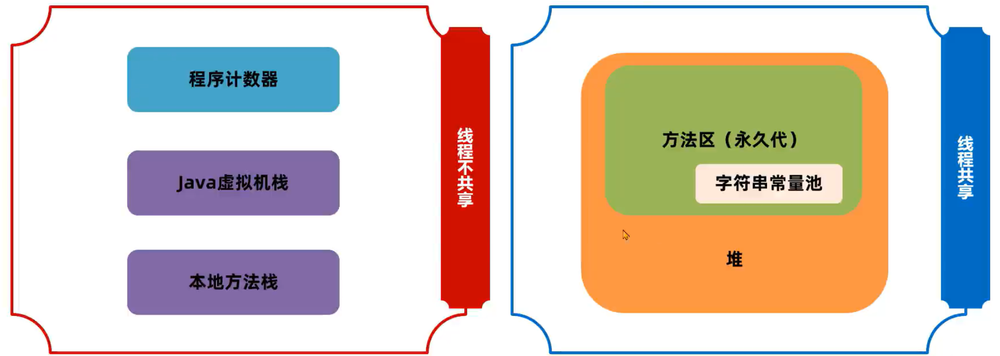

   JDK7：字符串常量池从永久代转移到堆中，单独占有一块空间。

   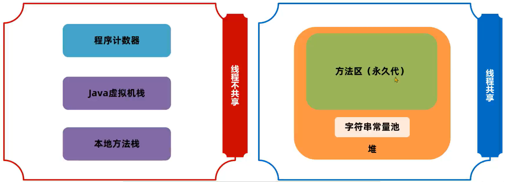

   JDK8：永久代被移除，方法区使用元空间实现，元空间是属于直接内存的一块区域，字符串常量池依旧在堆中。

   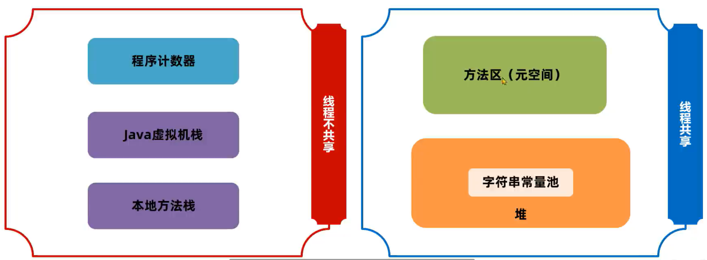

   

## 4. JVM 的垃圾回收

C/C++ 的内存管理

- 在 C/C++ 这类没有自动垃圾回收机制的语言中，一个对象如果不再使用，需要手动释放，否则就会出现内存泄漏。这种释放对象的过程称为垃圾回收，需要编写代码进行回收的方式为手动回收。
- 内存泄漏指的是不再使用的对象在系统中未被回收，内存泄漏的积累可能会导致内存溢出。

Java 的内存管理

- Java 中为了简化对象的释放，引入了自动的垃圾回收 (Garbage Collection 简称 GC) 机制。通过垃圾回收器来对不再使用的对象完成自动的回收，垃圾回收器主要负责对堆上的内存进行回收。其他很多现代语言比如 C#、Python、Go 都拥有自己的垃圾回收器。

垃圾回收对比

自动垃圾回收

自动根据对象是否使用由虚拟机来回收对象

- 优点：降低实现难度、降低对象回收 bug 的可能性
- 缺点：无法手动控制内存回收的及时性

手动垃圾回收

手动编程实现对象的删除

- 优点：回收及时性高，由开发者把控回收的时机
- 缺点：编写不当容易出现悬空指针、重复释放、内存泄漏等问题


自动垃圾回收——应用场景

- 解决系统僵死问题：许多系统僵死问题都与频繁的垃圾回收有关
- 性能优化：对垃圾回收器进行合理的设置可以有效地提升程序的执行性能
- 高频面试题
  - 常见的垃圾回收器
  - 常见的垃圾回收算法
  - 四种引用
  - 项目中用了哪一种垃圾回收器


### 4.1 方法区的回收

Java 的内存管理和自动垃圾回收

- 线程不共享的部分，都是伴随着线程的创建而创建，线程的销毁而销毁，而方法的栈帧在执行完方法之后就会自动弹出栈并释放掉对应的内存。

方法区的回收

- 方法区中能回收的内容主要就是不再使用的类。

  判定一个类是否可以卸载，需要同时满足下面三个条件：

  1. 此类所有实例对象都已经被回收，在堆中不存在任何该类的实例对象以及子类对象。
  2. 加载该类的类加载器已经被回收。
  3. 该类对应的 java.lang.Class 对象没有在任何地方被引用。

手动触发回收

- 如果需要手动触发垃圾回收，可以调用 System.gc() 方法。
- 语法：`System.gc()`
- 注意事项：调用 `System.gc()` 方法并不一定会立即回收垃圾，仅仅是向 Java 虚拟机发送一个垃圾回收请求，具体是否需要执行垃圾回收由 Java 虚拟机自行判断。

> 开发中此类场景一般很少出现，主要在如 OSGi、JSP 的热部署等应用场景中。每个 jsp 文件对应一个唯一的类加载器，当一个 jsp 文件修改了，就直接卸载这个 jsp 类加载器。重新创建类加载器，重新加载 jsp 文件。


### 4.2 堆回收

#### 4.2.1 引用计数法

如何判断堆上的对象可以回收？

Java 中的对象是否能被回收，是根据对象是否被引用来决定的。如果对象被引用了，说明该对象还在使用，不允许被回收。

只有无法通过引用获取到对象时，该对象才能被回收。

问题：如何判断堆上的对象可以回收？

```java
public class Test {
    public static void main(String[] args) {
        A a1 = new A();
        B b1 = new B();
        a1.b = b1;
        b1.a = a1;
    }
}
class A {
    B b;
}
class B {
    A a;
}
```

如果在 main 方法中最后执行 a1 = null, b1 = null，是否能回收 A 和 B 对象呢？

可以回收，方法中已经没有办法使用引用去访问 A 和 B 对象了。

> JVM 底层实际上是使用可达性分析法判断对象是否可回收。


常见的判断方法有两种：引用计数法和可达分析法。

- 引用计数法会为每个对象维护一个引用计数器，当对象被引用时加 1，取消引用是减 1。

- 引用计数法的优点是实现简单，C++ 中的智能指针就采用了引用计数法，但是它也存在缺点，主要有两点：

  1. 每次引用和取消引用都需要维护计数器，对系统性能会有一定的影响

  2. 存在循环引用问题，所谓循环引用就是当 A 引用 B，B 同时引用 A 时会出现对象无法回收的问题

     那么此时由于计数器无法归零，垃圾就一直无法回收。

- 如果想要查看垃圾回收的信息，可以使用 `-verbose:gc` 参数。

- 语法：`-verbose:gc`


#### 4.2.2 可达性分析法

可达性分析算法

Java 底层使用的是可达性分析算法来判断对象是否可以被回收。可达性分析将对象分为两类：垃圾回收的根对象 (GC Root) 和普通对象，对象与对象之间存在引用关系。

可达性分析算法指的是如果从某个到 GC Root 对象是可达的，对象就不可被回收。

问题：哪些对象被称为 GC Root 对象？

- 线程 Thread 对象，引用线程栈帧中的方法参数、局部变量等。
- 系统类加载器加载的 java.lang.Class 对象，引用类中的静态变量。
- 监视器对象，用来保存同步锁 synchronized 关键字持有的对象。
- 本地方法调用时使用的全局对象

查看 GC Root

通过 arthas 和 [eclipse Memory Analyzer (MAT)](https://eclipse.dev/mat/downloads.php) 工具可以查看 GC Root，MAT 工具是 eclipse 推出的 Java 堆内存检测工具。具体操作步骤如下：

1. 使用 arthas 的 heapdump 命令将堆内存快照保存到本地磁盘中。
2. 使用 MAT 工具打开堆内存快照文件。
3. 选择 GC Roots 功能查看所有的 GC Root。


问题：是否只有在一个对象的引用链上没有 GC Root 时，该对象才能被回收？

GC Root 引用链只是其中一种引用方式 (强引用)。

#### 4.2.3 五种对象引用

几种常见的对象引用

可达性算法中描述的对象引用，一般指的是强引用，即 GC Root 对象对普通对象有引用关系，只要这层关系存在，普通对象就不会被回收。除了强引用之外，Java 中还设计了几种其他引用方式：

- 软引用
- 弱引用
- 虚引用
- 终结器引用

##### 软引用

软引用相对于强引用是一种比较弱的引用关系，如果一个对象只有软引用关联到它，当程序内存不足时，就会将软引用中的数据进行回收。

在 JDK 1.2 版之后提供了 SoftReference 类来实现软引用，软引用常用于缓存中。

软引用的执行过程如下：

1. 将对象使用软引用包装起来，new  SoftReference<对象类型>(对象)。
2. 内存不足时，虚拟机尝试进行垃圾回收。
3. 如果垃圾回收仍不能解决内存不足的问题，回收软引用中的对象。
4. 如果内存依然不足，抛出 OutOfMemory 异常。

软引用中的对象如果在内存不足时回收，SoftReference对象本身也需要被回收。如何知道哪些 SoftReference 对象需要被回收？

SoftReference 提供了一套队列机制：

1. 软引用创建时，通过构造器传入引用队列
2. 在软引用中包含的对象被回收时，该软引用对象会被放入引用队列
3. 通过代码遍历引用队列，将 SoftReference 的强引用删除

```java
public class SoftReferenceDemo {
    public static void main(String[] args) {
        ArrayList<SoftReference> softReferences = new ArrayList<>();
        ReferenceQueue<byte[]> queue = new ReferenceQueue<>();
        for (int i = 0; i < 10; i++) {
            byte[] bytes = new byte[1024 * 1024 * 100];
            SoftReference<byte[]> ref = new SoftReference<>(bytes, queue);
            softReferences.add(ref);
        }

        SoftReference<byte[]> nullRef = null;
        int count = 0;
        while ((nullRef = (SoftReference<byte[]>) queue.poll()) != null) {
            count++;
        }
        System.out.println(count);
    }
}
```

> 这里需要设置堆大小 `-Xms200m`  方便测试。

10 个软引用对象最终回收了 9 个。


软引用使用场景——缓存

软引用也可以使用继承自 SoftReference 类的方式来实现。

通过构造器传入软引用包含的对象，以及引用队列。


案例：使用软引用实现学生数据的缓存

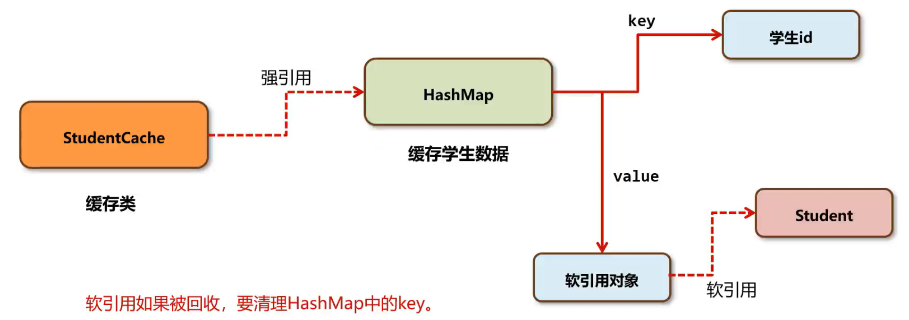

```java
public class StudentCache {
    private static StudentCache cache = new StudentCache();

    public static void main(String[] args) {
        for (int i = 0; ; i++) {
            StudentCache.getInstance().cacheStudent(new Student(i, String.valueOf(i)));
        }
    }

    private Map<Integer, StudentRef> StudentRefs; // 用于 Cache 内容的缓存
    private ReferenceQueue<Student> q; // 垃圾 Reference 的队列

    // 继承 SoftReference，使得每一个实例都具有可识别的标识
    // 且该标识与其在 HashMap 内的 key 相同
    private class StudentRef extends SoftReference<Student> {
        private Integer _key = null;

        public StudentRef(Student em, ReferenceQueue<Student> q) {
            super(em, q);
            _key = em.getId();
        }
    }

    // 构建一个缓存器实例
    private StudentCache() {
        StudentRefs = new HashMap<Integer, StudentRef>();
        q = new ReferenceQueue<Student>();
    }

    // 取得缓存器实例
    public static StudentCache getInstance() {
        return cache;
    }

    // 以软引用的方式对一个 Student 对象的实例进行引用并保存该引用
    private void cacheStudent(Student em) {
        cleanCache(); // 清除垃圾引用
        StudentRef ref = new StudentRef(em, q);
        StudentRefs.put(em.getId(), ref);
        System.out.println(StudentRefs.size());
    }

    // 根据指定的 ID 号，重新获取相应 Student 对象的实例
    public Student getStudent(Integer id) {
        Student em = null;
        // 判断缓存中是否有该 Student 实例的软引用，如果有，从软引用中取得
        if (StudentRefs.containsKey(id)) {
            StudentRef ref = StudentRefs.get(id);
            em = ref.get();
        }
        // 如果没有软引用，或者从软引用中获取的是 null，重新构建一个实例
        // 并保存这个新建实例的软引用
        if (em == null) {
            em = new Student(id, String.valueOf(id));
            System.out.println("Retrieve From StudentInfoCenter. ID=" + id);
            this.cacheStudent(em);
        }
        return em;
    }

    // 清除那些软引用的 Student 对象已经被回收的 StudentRef 对象
    private void cleanCache() {
        StudentRef ref = null;
        while ((ref = (StudentRef) q.poll()) != null) {
            StudentRefs.remove(ref._key);
        }
    }
}

class Student {
    int id;
    String name;

    public Student(int id, String name) {
        this.id = id;
        this.name = name;
    }

    public int getId() {
        return id;
    }

    public void setId() {
        this.id = id;
    }

    public String getName() {
        return name;
    }

    public void setName(String name) {
        this.name = name;
    }
}
```

为了方便测试，可以设置 `-Xmx10m` 来限制堆内存

测试结果发现 `StudentRefs` 的大小在一定的范围内波动。通过软引用队列 `q` 获取到所有已经被回收掉 `Student` 的软引用对象 `StudentRef` ，根据 `StudentRef` 中的 `_key` 从 HashMap 集合 (`StudentRefs`)  中移除掉响应的键值对，就可以实现软引用对象自身的回收。

通过这种机制就实现了让缓存框架在内存不足时自动回收的特性。

软引用主要实现了当程序内存不足时将软引用回收里存放的数据对象进行回收，常用于缓存中。软引用本身的回收需要借助引用队列实现。


##### 弱引用

弱引用的整体机制和软引用基本一致，区别在于弱引用包含的对象在垃圾回收时，不管内存够不够都会直接被回收。

在 JDK 1.2 版之后提供了 WeakReference 类来实现弱引用，弱引用主要在 ThreadLocal 中使用。

弱引用对象本身也可以使用引用队列进行回收。


##### 虚引用和终结器引用

- 这两种引用在常规开发中不会使用。

- 虚引用也叫幽灵引用/幻影引用，不能通过虚引用对象获取到包含的对象。虚引用唯一的用途是当对象被垃圾回收器回收时可以接收到对应的通知。Java 中使用 PhantomReference 实现了虚引用，直接内存中为了及时知道直接引用对象不再使用，从而回收内存，使用了虚引用来实现。

  `ByteBuffer.allocateDirect(size)` 方法底层就使用到了 `Cleaner` 类，而 `Cleaner` 就继承了 `PhantomReference` 实现虚引用。

- 终结器引用指的是在对象需要被回收时，对象将会被放置在 Finalizer 类的引用队列中，在稍后由一条由 FinalizerThread 线程从队列中获取对象，然后执行对象的 finalize 方法，在对象第二次被回收时，该对象才真正地被回收。在这个过程中可以在 finalize 方法中再将自身对象使用强引用关联上，但是不建议这样做，如果耗时过长会影响其他对象的回收。

  测试代码

  ```java
  public class FinalizeReferenceDemo {
      public static FinalizeReferenceDemo reference = null;
  
      public void alive() {
          System.out.println("当前对象还存活");
      }
  
      @Override
      protected void finalize() throws Throwable {
          try {
              System.out.println("finalize 执行了....");
              // 设置强引用自救
              reference = this;
          } finally {
              super.finalize();
          }
      }
  
      public static void main(String[] args) throws Throwable {
          reference = new FinalizeReferenceDemo();
          test();
          test();
  
      }
  
      private static void test() throws InterruptedException {
          reference = null;
          // 回收对象
          System.gc();
          // 执行 finalize 方法的优先级较低，休眠 500ms 等待
          Thread.sleep(500);
          if (reference != null) {
              reference.alive();
          } else {
              System.out.println("对象已被回收");
          }
      }
  }
  ```

  finalize 只能被调用一次，第一次调用 finalize 强引用关联导致 reference 存活，第二次不能再调用 finalize 方法，导致 reference 被释放。


#### 4.2.4 垃圾回收算法

核心思想

- Java 是如何实现垃圾回收的呢？简单来说，垃圾回收要做的有两件事：
  1. 找到内存中存活的对象，通过 GC Root 的引用链寻找，能找到的则标记为存活。
  2. 释放不再存活对象的内存，使得程序能再次利用这部分空间。

垃圾回收算法的历史和分类

- 1960 年 John McCarthy 发布了第一个 GC 算法：标记——清除算法。
- 1963 年 Marvin L. Minsky 发布了复制算法。

本质上后续所有垃圾回收算法，都是在上述两种算法的基础上优化而来。

- 标记—清除算法 Mark Sweep GC
- 复制算法 Copying GC
- 标记—整理算法 Mark Compact GC
- 分代 Generational GC


垃圾回收算法的评价标准

Java 垃圾回收过程会通过单独的 GC 线程来完成，但是不管使用哪一种 GC 算法，都会有部分阶段需要停止所有的用户线程。这个过程被称之为 Stop The World 简称 STW，如果 STW 时间过长则会影响用户的使用。

所以判断 GC 算法是否优秀，可以从三方面来考虑：

1.  吞吐量

   吞吐量指的是 CPU 用于执行用户代码的时间与 CPU 总执行时间的比值，即 吞吐量 = 执行用户代码时间 / (执行用户代码时间 + GC 时间)。吞吐量数值越高，垃圾回收的效率就越高。

2. 最大暂停时间

   最大暂停时间指的是所有在垃圾回收过程中的 STW 时间最大值。比如如下的图中，黄色部分的 STW 就是最大暂停时间，显而易见上面的图比下面的图拥有更少的最大暂停时间。最大暂停时间越短，用户使用系统时受到的影响就越短。

   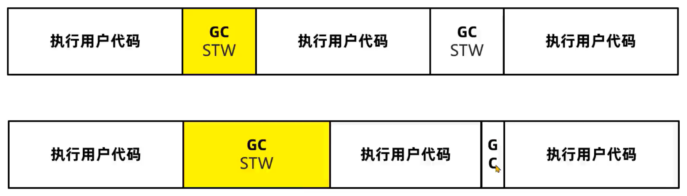

3. 堆使用效率

   不同垃圾回收算法，对堆内存的使用方式是不同的。比如标记清除算法，可以使用完整的堆内存，而复制算法会将堆内存一分为二，每次只使用一半内存。从堆使用效率上来说，标记清除算法要优于复制算法。

   

上述三种评价标准：堆使用效率、吞吐量、最大暂停时间不可兼得。

一般来说，堆内存越大，最大暂停时间就越长。想要减少最大暂停时间，就会降低吞吐量。

不同的垃圾回收算法，适用于不同的场景。


##### 标记清除算法

标记清除算法的核心思想分为两个阶段：

1. 标记阶段，将所有存活的对象进行标记。Java 中使用可达性分析算法，从 GC Root 开始通过引用链遍历出所有存活对象。
2. 清除阶段，从内存中删除没有被标记也就是非存活对象。

标记清除算法的优缺点

优点：实现简单，只需要在第一阶段给每个对象维护标志位，第二阶段删除对象即可。

缺点：

1. 碎片化问题

   由于内存的连续的，所以在对象被删除之后，内存中会出现很多细小的可用内存单元。如果需要的是一个比较大的空间，很有可能这些内存单元的大小过小无法进行分配。

2. 分配速度慢

   由于内存碎片的存在，需要维护一个空闲链表，极有可能发生每次需要遍历到链表的最后才能获得合适的内存空间。


##### 复制算法

复制算法的核心思想：

1. 准备两块空间 From 空间和 To 空间，每次在对象分配阶段，只能使用其中一块空间 (From 空间)。
2. 在垃圾回收 GC 阶段，将 From 中存活对象复制到 To 空间。
3. 将两块空间的 From 和 To 名字互换。

完整例子：

1. 将堆内存分割成两块，From 空间和 To 空间，对象分配阶段，创建对象。
2. GC 阶段开始，将 GC Root 搬运到 To 空间
3. 将 GC Root 关联的对象，搬运到 To 空间 (此时 From 空间只剩下需要被回收的对象)
4. 清理 From 空间，并把两个空间的名称互换。

复制算法优缺点：

优点：

1. 吞吐量高

   复制算法只需要遍历一次存活对象复制到 To 空间即可，比标记—整理算法少了一次遍历的过程，因而性能较好，但是不如标记—清除算法，因为标记清除算法不需要进行对象的移动。

2. 不会发生碎片化

   复制算法在复制之后就会将对象按顺序放入 To 空间中，所有对象以外的区域都是可用空间，不存在碎片化内存空间。

缺点：

1. 内存使用效率低

   整个堆内存每次只有一半的内存空间可以存放对象。


##### 标记整理算法

标记整理算法也叫标记压缩算法，是对标记清理算法中容易产生碎片问题的一种解决方案。

核心思想分为两个阶段：

1. 标记阶段，将所有存活的对象进行标记。Java 中使用可达性分析算法，从 GC Root 开始通过引用链遍历出所有存活对象。
2. 整理阶段，将存活对象移动到堆的一端。清理掉非存活对象的内存空间。

标记整理算法的优缺点：

优点：

1. 内存使用效率高

   整个堆内存都可以使用，不会像复制算法只能使用半个堆内存

2. 不会发生碎片化

   在整理阶段可以将对象往内存的一侧进行移动，剩下的空间都是可以分配对象的有效空间

缺点：

1. 整理阶段的效率不高

   整理算法有很多种，比如 Lisp2 整理算法需要对整个堆中的对象搜索 3 次，整体性能不佳。可以通过 Two-Finger、表格算法、ImmixGC 等高效的整理算法优化此阶段的性能。


##### 分代垃圾回收算法

现代优秀的垃圾回收算法，会将上述描述的垃圾回收算法组合进行使用，其中应用最广的就是分代垃圾回收算法 (Generational GC)。

分代垃圾回收将整个内存区域划分为年轻代和老年代：

- 年轻代 (新生代) Young 区：存放存活时间比较短的对象
  - Eden 区 伊甸园
  - Survivor 幸存者区
    - S0
    - S1

- 老年代 Old 区：存放存活时间比较长的对象

arthas 查看分代之后的内存情况

- 在 JDK8 中，添加 `-XX:+UseSerialGC` 参数使用分代回收的垃圾回收器，运行程序。
- 在 arthas 中使用 memory 命令查看内存，显示出三个区域的内存情况。

调整内存区域的大小

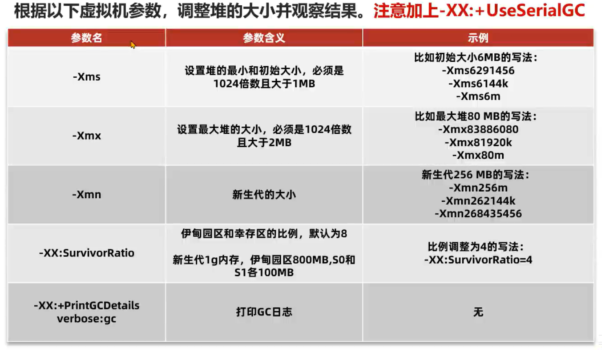

老年代的大小可以用当前堆大小减去新生代大小计算得到，例如参数 `-Xms60m -Xmn20m -Xmx60m` 计算出来的老年代大小就是 40m，加上参数 `-XX:SurvivorRatio=3` 可以计算出伊甸园区和幸存区的大小分别为 12m 和 4m、4m

测试代码

```java
// -XX:+UseSerialGC -Xms60m -Xmn20m -Xmx60m -XX:SurvivorRatio=3 -XX:+PrintGCDetails
public class GcDemo {
    public static void main(String[] args) throws IOException {
        List<Object> list = new ArrayList<>();
        int count = 0;
        while (true) {
            System.in.read();
            System.out.println(++count);
            // 每次添加 1m 的数据
            list.add(new byte[1024 * 1024 * 1]);
        }
    }
}
```

启动 arthas 连接进程测试内存分布情况

步骤：

- 分代回收时，创建出来的对象，首先会被放入 Eden 伊甸园区。

- 随着对象在 Eden 区越来越多，如果 Eden 区满，新创建的对象已经无法放入，就会触发年轻代的 GC，称为 Minor GC 或者 Young GC。

  Minor GC 会把 eden 和 From (S0) 中需要回收的对象回收，把没有回收的对象放入 To (S1) 区。

- 接下来，S0 会变成 To 区，S1 变成 From 区。当 eden 区满时再往里放入对象，依然会发生 Minor GC。

  此时会回收 eden 区和 S1 (from) 中的对象，并把 eden 和 from 区中剩余的对象放入 S0。

  注意：每次 Minor GC 都会为对象记录它的年龄，初始值为 0，每次 GC 完加 1。

- 如果 Minor GC 后对象的年龄达到阈值 (最大 15，默认值和垃圾回收器有关)，对象就会被晋升至老年代。

  当年代空间不足以容纳即将晋升的对象时，它会先尝试执行 Minor GC，通过清理年轻代中的死对象并晋升存活对象到老年代来释放更多年轻代空间，间接减轻老年代的压力。如果在 Minor GC 之后老年代空间仍然不足，则可能触发 Full GC 来对整个堆进行更彻底的垃圾回收，以释放老年代空间。

  如果 Full GC 依然无法回收掉老年代的对象那么当对象继续放入老年代时，就会抛出 Out Of Memory 异常。

  > 当老年代空间不足时，意味着老年代中有大量对象占用空间，可能无法为更多晋升的对象提供空间。在这种情况下，触发 Minor GC 的目的有几个方面：
  >
  > 1. **减少晋升对象数量**：通过执行 Minor GC，一些年轻代中的对象被回收，只有少数存活对象需要晋升到老年代。这减少了因为对象晋升导致的老年代空间需求。
  > 2. **延迟老年代填满时刻**：通过减少一次性晋升到老年代的对象数量，Minor GC 帮助延长了老年代填满的时间，给系统更多的时间来处理老年代中的对象，可能通过之后的正常运作或其他 GC 周期中自然地回收一些老年代对象。
  > 3. **优化内存使用**：在某些情况下，Minor GC 通过晋升旧对象到老年代，也可能促进老年代中对象的整理和压缩，尽管这主要是 Full GC 的任务。
  >
  > 因此，虽然 Minor GC 主要针对年轻代，但通过减少需要立即晋升到老年代的对象数量，它可以“间接”减轻老年代的内存压力，至少是暂时的。这种策略不是直接清理老年代中的空间，而是通过优化年轻代的空间使用和晋升逻辑，来间接影响老年代的空间利用和压力。
  >
  > 
  >
  > 特殊情况1：年轻代空间充足但老年代空间紧张
  >
  > - **情景描述**：这种情况下，尽管年轻代还有足够空间来分配新对象，老年代的空间却不足以容纳更多的晋升对象。
  > - **处理方式**：垃圾回收器可能会更加谨慎地选择哪些对象被晋升到老年代，可能通过调整晋升阈值来延迟对象晋升。如果老年代空间真的不足，垃圾回收器可能触发一次 Full GC，以清理老年代中的垃圾并回收空间。
  >
  > 特殊情况2：存活对象过多导致的提前晋升
  >
  > - **情景描述**：在 Minor GC 过程中，如果年轻代中存活对象过多，超出了 Survivor 区能够容纳的范围，一些还没有达到晋升年龄阈值的对象可能会被提前晋升到老年代，即使老年代的空间也比较紧张。
  > - **处理方式**：这种提前晋升有助于避免过多的 Minor GC 或是“晋升失败”。垃圾回收器在这种情况下可能会尝试执行Full GC，但在实际操作中，它也会权衡 Full GC 的成本，可能会根据情况动态调整年轻代和老年代的大小或晋升策略。
  >
  > 特殊情况3：连续多次 Minor GC 后仍然空间不足
  >
  > - **情景描述**：有时候，即使经过多次 Minor GC，由于存活对象过多或其他原因，年轻代或老年代的空间仍然不足。
  > - **处理方式**：在这种情况下，垃圾回收器可能会被迫触发 Full GC，即使这会导致较长时间的停顿。同时，JVM 可能会考虑自动调整堆大小或者其他性能参数，以防止未来再次发生这种情况。


现代优秀的垃圾回收算法，将上述描述的垃圾算法组合进行使用，其中应用最广的就是分代垃圾回收算法 (Generational GC)。

分代垃圾回收将整个内存区域划分为年轻代和老年代，这就涉及到了垃圾回收器的设计。


#### 4.2.5 垃圾回收器

问题：为什么分代 GC 算法要把堆分成年轻代和老年代？

- 系统中的大部分对象，都是创建出来之后很快就不再使用，可以被回收，比如用户获取订单数据，订单数据返回给用户之后就可以释放了。
- 老年代中会存放长期存活的对象，比如 Spring 的大部分 bean 对象，在程序启动之后就不会被回收了。
- 在虚拟机的默认设置中，新生代大小要远小于老年代的大小。


虚拟机参数设置 `-XX:+UseSerialGC -Xmx1g -Xms1g -XX:+PrintGCDetails` ，测试代码如下

```java
public class GcDemo {
    public static void main(String[] args) throws IOException {
        List<Object> list = new ArrayList<>();
        int count = 0;
        while (true) {
            System.in.read();
            System.out.println(++count);
            // 每次添加 1m 的数据
            list.add(new byte[1024 * 1024 * 1]);
        }
    }
}
```

执行后可在第一次输入时就停止程序，控制台会打印出此时的内存情况。


分代算法将堆分成年轻代和老年代主要原因有：

1. 可以通过调整年轻代和老年代的比例来适应不同类型的应用程序，提高内存的利用率和性能。
2. 新生代和老年代使用不同的垃圾回收算法，新生代一般选择复制算法，老年代可以选择标记—清除和标记—整理算法，由开发者来选择，灵活度较高。
3. 分代的设计中允许只回收新生代 (minor gc)，如果能满足对象分配的要求就不需要堆整个堆进行回收 (full gc)，STW 时间就会减少。


垃圾回收器的组合关系

垃圾回收器是垃圾回收算法的具体实现。

由于垃圾回收器分为年轻代和老年代，除了 G1 之外其他垃圾回收器必须成对组合进行使用。

具体的关系图如下：

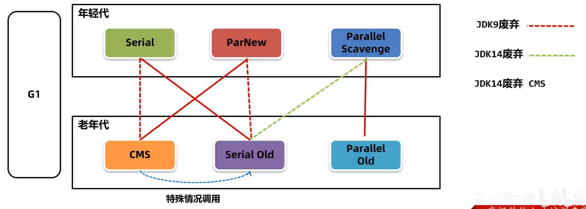


##### 年轻代 - Serial 垃圾回收器

Serial 是一种单线程串行回收年轻代的垃圾回收器。

回收年代：年轻代

算法：复制算法

优点：单核 CPU 处理器下吞吐量非常出色

缺点：多核 CPU 下吞吐量不如其他垃圾回收器，堆如果偏大会让用户线程处于长时间的等待

适用场景：Java 编写的客户端程序或者硬件，配置有限的场景

##### 老年代 - Serial Old 垃圾回收器

Serial Old 是 Serial 垃圾回收器的老年代版本，采用单线程串行回收

`-XX:+UseSerialGC` 使新生代、老年代都使用串行回收器，可以使用 arthas 验证。

回收年代：老年代

算法：标记 - 整理算法

优缺点同上

适用场景：与 Serial 垃圾回收器搭配使用，或者在 CMS 特殊情况下使用


##### 年轻代 - ParNew 垃圾回收器

ParNew 垃圾回收器本质上是对 Serial 在多线程 CPU 下的优化，使用多线程进行垃圾回收

`-XX:+UseParNewGC` 新生代使用 ParNew 回收器，老年代使用串行回收器

回收年代：年轻代

算法：复制算法

优点：多 CPU 处理器下停顿时间较短

缺点：吞吐量和停顿时间不如 G1，所以在 JDK9 之后不建议使用

适用场景：JDK8 及之前的版本中，与 CMS 老年代垃圾回收器搭配使用

使用 `-Xmn20m -Xmx60m -XX:SurvivorRatio=3 -XX:+PrintGCDetails -XX:+UseParNewGC` 参数测试以下代码

```java
public class GcDemo {
    public static void main(String[] args) throws IOException {
        List<Object> list = new ArrayList<>();
        int count = 0;
        while (true) {
            System.in.read();
            System.out.println(++count);
            // 每次添加 1m 的数据
            list.add(new byte[1024 * 1024 * 1]);
        }
    }
}
```

这里在 JDK8 测试的时候会提示 ParNew 和 Serial Old 的组合会在未来某个版本中弃用，如果使用 JDK17 测试会发现使用上面的参数已经无法正常地启动 JVM 了。

需要使用 ParNew 的话，推荐与 CMS 组合使用。

##### 老年代 - CMS(Concurrent Mark Sweep) 垃圾回收器

CMS 垃圾回收器关注的是系统的暂停时间，允许用户线程和垃圾回收线程在某些步骤中同时执行，减少了用户线程的等待时间。

参数：`-XX:+UseConcMarkSweepGC`

回收年代：老年代

算法：标记清除算法

优点：系统由于垃圾回收出现的停顿时间较短，用户体验好

缺点：1.内存碎片问题 2.退化问题 3.浮动垃圾问题

适用场景：大型的互联网系统中用户请求数据大、频率高的场景，比如订单接口、商品接口等

CMS 执行步骤：

1. 初始标记，用极短的时间标记出 GC Roots 能直接关联到的对象。
2. 并发标记，标记所有的对象，用户线程不需要暂停。
3. 重新标记，由于并发标记阶段有些对象会发生变化，存在错标、漏标等情况，需要重新标记。
4. 并发清理，清理死亡的对象，用户线程不需要暂停

CMS 缺点

1. CMS 使用了标记 - 清除算法，在垃圾回收之后会出现大量的内存碎片，CMS 会在 Full GC 时进行碎片的整理。这样会导致用户线程暂停，可以使用 `-XX:CMSFullGCsBeforeCompaction=N` 参数 (默认 0) 调整 N 次 Full GC 之后再整理。
2. 无法处理在并发清理过程中产生的 “浮动垃圾”，不能做到完全的垃圾回收。
3. 如果老年代内存不足无法分配对象，CMS 就会退化成 Serial Old 单线程回收老年代。


##### 年轻代 - Parallel Scavenge 垃圾回收器

Parallel Scavenge 是 JDK8 默认的年轻代垃圾回收器，多线程并行回收，关注的是系统的吞吐量，具备自动调整堆内存大小的特点。

回收年代：年轻代

算法：复制算法

优点：吞吐量高，而且手动可控，为了提高吞吐量，虚拟机会动态调整堆的参数

缺点：不能保证单次的停顿时间

适用场景：后台任务，不需要与用户交互，并且容易产生大量的对象，比如：大数据的处理，大文件导出

##### 老年代 - Parallel Old 垃圾回收器

Parallel Old 是为 Parallel Scavenge 垃圾回收器设计的老年代版本，利用多线程并行回收。

参数：`-XX:+UseParallelGC` 或 `-XX:+UseParallelOldGC` 可以使用 Parallel Scanvenge + Parallel Old 的组合。

回收年代：老年代

算法：标记 - 整理算法

优点：并行回收，在多核 CPU 下效率较高

缺点：暂停时间会比较长

适用场景：与 Parallel Scavenge 配套使用


Parallel Scavenge 允许手动设置最大暂停时间和吞吐量。

Oracle 官方建议在使用这个组合时，不要设置堆内存的最大值，垃圾回收器会根据最大暂停时间和吞吐量自动调整内存大小。

最大暂停时间：`-XX:MaxGCPauseMillis=n` 设置每次垃圾回收时的最大停顿毫秒数

吞吐量：`-XX:GCTimeRatio=n` 设置吞吐量为 n (用户线程执行时间占比 = $\frac{n}{n+1}$) 

自动调整内存大小：`-XX:UseAdaptiveSizePolicy` 设置可以让垃圾回收器根据吞吐量和最大停顿的毫秒数自动调整内存大小 (JDK8 默认启用此设置)

使用虚拟机参数 `-XX:+PrintGCDetails -XX:+UseParallelOldGC -XX:+PrintFlagsFinal` 测试以下代码

```java
public class GCDemo2 {
    public static void main(String[] args) {
        int count = 0;
        List<Object> list = new ArrayList<>();
        while (true) {
            if (count++ % 1024 == 0) {
                list.clear();
            }
            list.add(new byte[1024 * 1024 * 1]);
        }
    }
}
```

通过 `-XX:+PrintFlagsFinal` 可以看到虚拟机设置的一些默认参数值，可以发现 `UseAdaptiveSizePolicy` 默认为 `true`。


##### G1 垃圾回收器

JDK9 之后默认的垃圾回收器 G1 (Garbage First) 垃圾回收器。

Parallel Scavenge 关注吞吐量，允许用户设置最大暂停时间，但是会减少年轻代可用空间的大小。

CMS 关注暂停时间，但是吞吐量方面会下降。

而 G1 设计目标就是将上述两种垃圾回收器的优点融合：

1. 支持巨大的堆空间回收，并有较高的吞吐量。
2. 支持多 CPU 并行垃圾回收。
3. 允许用户设置最大暂停时间。

JDK9 之后强烈建议使用 G1 垃圾回收器。


内存结构

G1 出现之前的垃圾回收器，内存结构一般是连续的，如下图

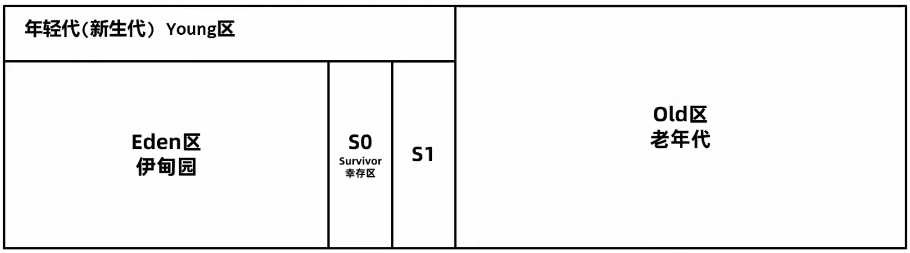

G1 的整个堆会被划分成多个大小相等的区域，称之为 Region，区域不要求是连续的。分为 Eden、Survivor、Old 区。Region 的大小通过堆空间大小 / 2048 计算得到，也可以通过参数 `-XX:G1HeapRegionSize=32m` 指定 (32m 指定 region 大小为 32M)，Region size 必须是 2 的指数幂，取值范围 1M - 32M。

G1 垃圾回收有两种方式：

- 年轻代回收 Young GC

- 混合回收 Mixed GC

年轻代回收 Young GC，回收 Eden 区和 Survivor 区中不用的对象，会导致 STW，G1 中可以通过参数 `-XX:MaxGCPauseMillis=n` (默认 200) 设置每次垃圾回收时的最大暂停时间毫秒数，G1 垃圾回收器会尽可能地保证暂停时间。

执行流程

1. 新创建的对象会存放在 Eden 区。当 G1 判断年轻代区不足 (max 默认 60%)，无法分配对象时会执行 Young GC。

2. 标记出 Eden 和 Survivor 区域中的存活对象

3. 根据配置的最大暂停时间选择某些区域，将存活对象复制到一个新的 Survivor 区中 (年龄 +1)，清空这些区域。

   G1 在进行 Young GC 的过程中会去记录每次垃圾回收时每个 Eden 区和 Survivor 区的平均耗时，以作为下次回收时的参考依据。这样就可以根据配置的最大暂停时间计算出本次回收时最多能回收多少个 Region 区域了。

   比如 `-XX:MaxGCPauseMillis=n` (默认 200)，每个 Region 回收耗时 40ms，那么这次回收最多只能回收 4 个 Region。

4. 后续 Young GC 与之前相同，只不过 Survivor 区中存活对象会被搬运到另一个 Survivor 区。

5. 当某个存活对象的年龄达到阈值 (默认 15)，将被放入老年代。

6. 部分对象如果大小超过 Region 的一半，会直接放入老年代，这类老年代被称为 Humongous 区。比如堆内存是 4G，每个 Region 是 2M，只要一个大对象超过了 1M 就被放入 Humongous 区，如果对象过大会横跨多个 Region。

7. 多次回收之后，会出现很多 Old 老年代区，此时总堆占有率达到阈值时 (`-XX:InitiatingHeapOccupancyPercent` 默认 45%) 会触发混合回收 Mixed GC，回收所有年轻代和部分老年代的对象以及大对象区，采用复制算法完成。

混合回收

- 混合回收分为：初始标记 (initial mark)、并发标记 (concurrent mark)、最终标记 (remark 或者 Finalize Marking)、并发清理 (cleanup)

- G1 对老年代的清理会选择存活度最低的区域来进行回收，这样可以保证回收效率最高，这也是 G1 (Garbage first) 名称的由来。

  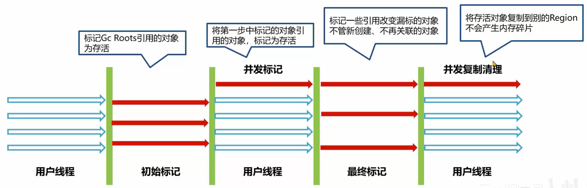

- 最后清理阶段使用复制算法，不会产生内存碎片。

  注意：如果清理过程中发现没有足够的空 Region 存放转移的对象，会出现 Full GC。单线程执行标记 - 整理算法，此时会导致用户线程的暂停。所以尽量保证堆内存有多余的空间。


G1 - Garbage First 垃圾回收器

参数1：`-XX:+UseG1GC`  启用 G1，JDK9 之后默认启用

参数2：`-XX:MaxGCPauseMillis=毫秒值` 最大暂停的时间

回收年代：年轻代 + 老年代

算法：复制算法

优点：对比较大的堆如超过 6G 的堆回收时，延迟可控，不会产生内存碎片，并发标记的 SATB 算法效率高

缺点：JDK8 之前不够成熟

适用场景：JDK8 最新版本、JDK9之后建议默认使用


##### 总结

垃圾回收器的组合关系虽然很多，但是针对几个特定的版本，比较好的组合选择如下：

JDK8 及之前：ParNew + CMS (关注暂停时间)、Parallel Scavenge + Parallel Old (关注吞吐量)、G1 (JDK8 之前不建议，较大堆并且关注暂停时间)

JDK9 之后：G1 (默认)

从 JDK9 之后，由于 G1 日趋成熟，JDK 默认的垃圾回收器已经修改为 G1，所以强烈建议在生产环境上使用 G1。


问题回顾

1. Java 中有哪几块内存需要进行垃圾回收？

   对于线程不共享的程序计数器以及栈空间来说，它们伴随着线程的创建而创建，随着的线程的回收而回收。对于线程共享的方法区和堆来说，方法区一般不需要回收，在特定技术如 JSP 会通过回收类加载器方法去回收方法区中的类，堆由垃圾回收器负责回收。

2. 有哪几种常见的引用类型？

   - 强引用，最常见的引用方式，由可达性分析算法来判断
   - 软引用，对象在没有强引用情况下，内存不足时会回收
   - 弱引用，对象在没有强引用情况下，会直接回收
   - 虚引用，通过虚引用知道对象被回收
   - 终结器引用，对象回收时可以自救，不建议使用

3. 有哪几种常见的垃圾回收算法？

   标记 - 清除算法 Mark Sweep GC：标记之后再清除，容易产生内存碎片

   复制算法 Copying GC：从一块区域复制到另一块区域容易造成只能使用一部分内存

   标记 - 整理算法 Mark Compact GC：标记之后将存活的对象推到一边，对象会移动，效率不高

   分代 Generational GC：将内存区域划分成年轻代、老年代进行回收，可以整合使用多种回收算法

4. 常见的垃圾回收器有哪些？

   Serial 和 Serial Old 组合：单线程回收，主要适用于单核 CPU 场景

   PerNew 和 CMS 组合：暂停时间较短，适用于大型互联网应用中与用户交互的部分

   Parallel Scavenge 和 Parallel Old 组合：吞吐量高，适用于后台进行大量数据操作

   G1：适用于较大的堆，具有可控的暂停时间
