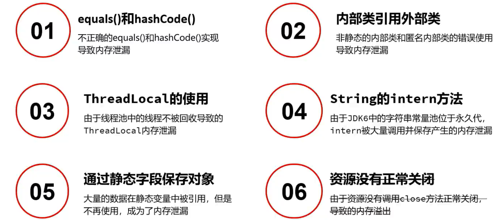
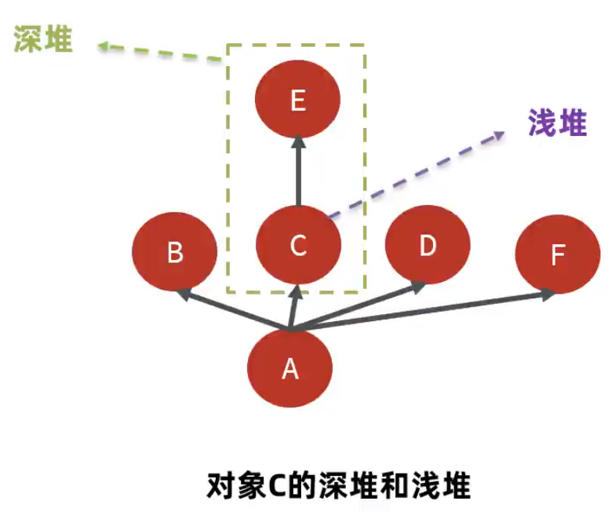
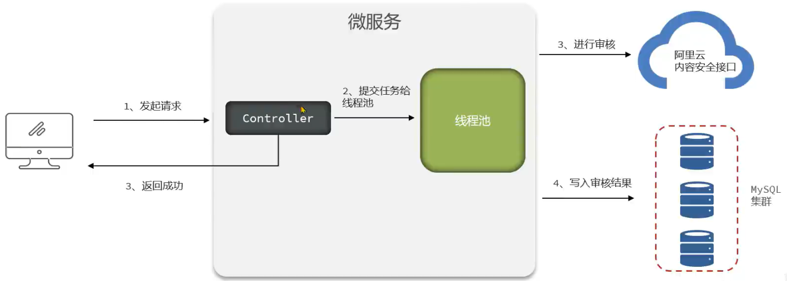
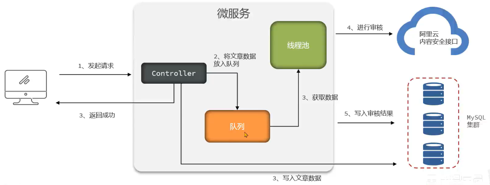
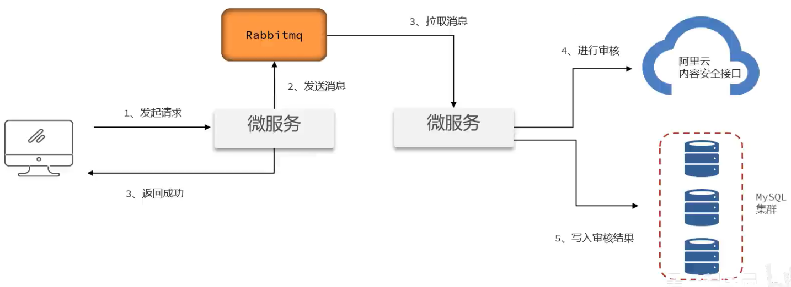
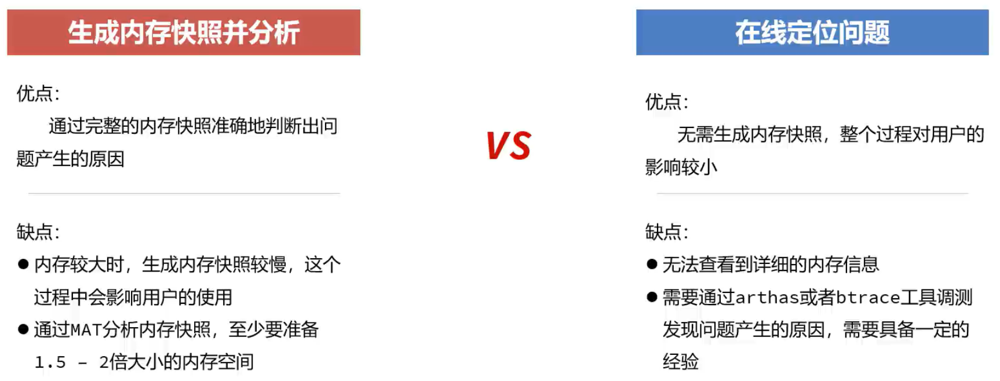
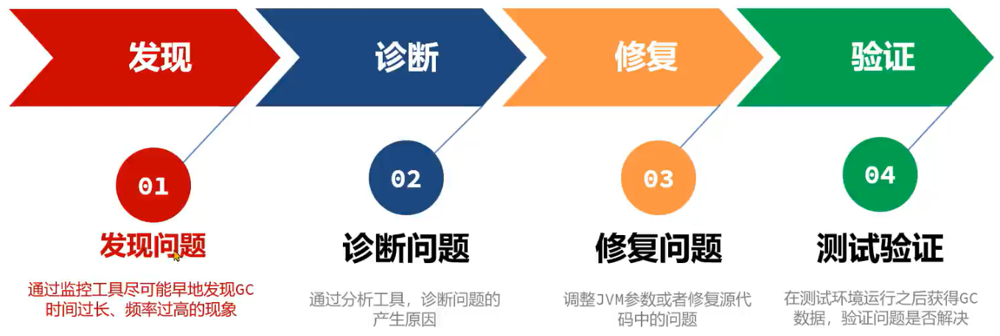
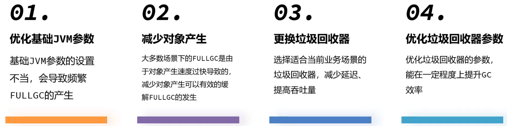
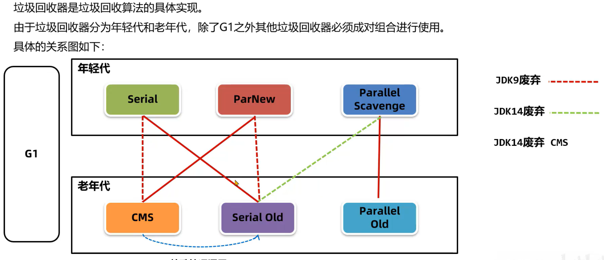
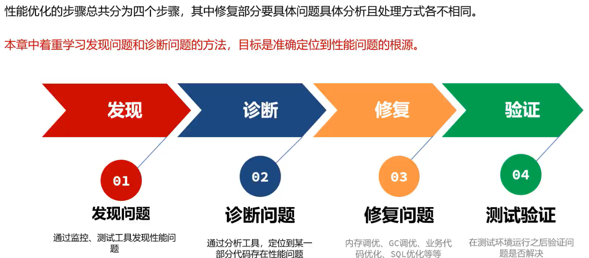

# Java 虚拟机实战

## 1. 内存调优

- 什么是内存泄漏
- 监控 Java 内存的常用工具
- 内存泄漏的常见场景
- 内存泄漏的解决方案

### 1.1 内存溢出和内存泄漏

- 内存泄漏 (memory leak)：在 Java 中如果不再使用一个对象，但是该对象依然在 GC Root 的引用链上，这个对象就不会被垃圾回收器回收，这种情况就称之为内存泄漏。
- 内存泄漏绝大多数情况都是由堆内存泄漏引起的，后续没有特别说明都默认为堆内存泄漏。
- 少量的内存泄漏可以容忍，但是如果发生持续的内存泄漏，最终导致的结果就是内存溢出，但是产生内存溢出的原因并不是只有内存泄漏这一种。

内存泄漏的常见场景

- 内存泄漏导致溢出的常见场景是大型的 Java 后端应用中，在处理用户的请求之后，没有及时将用户的数据删除。随着用户请求数量越来越多，内存泄漏的对象占满了堆内存最终导致内存溢出。

  这种内存溢出会直接导致用户请求无法处理，影响用户的正常使用。重启可以恢复应用使用，但是在运行一段时间之后依然会出现内存溢出。

- 第二种常见场景是分布式任务调度系统如 Elastic-job、Quartz 等进行任务调度时，被调度的 Java 应用在调度任务结束中出现了内存泄漏，最终导致多次调度之后内存溢出。

  这种内存溢出会导致应用无法执行下次的调度任务。同样重启可以恢复应用使用，但是在调度执行一段时间之后依然会出现内存溢出。

  

### 1.2 解决内存溢出的方法

思路

解决内存溢出的步骤总共分为四个步骤，其中前两个步骤是最核心的：

1. 发现问题：通过监控工具尽可能早地发现内存慢慢变大的现象
2. 诊断原因：通过分析工具，诊断问题的产生原因，定位到出现问题的源代码
3. 修复问题：修复源代码的问题
4. 测试验证：在测试环境验证问题解决，最后发布上线

#### 1.2.1 发现问题

##### top 命令

- top 命令是 linux 下用来查看系统信息的一个命令，它提供给我们去实时查看系统的资源，比如执行时的进程、线程和系统参数等信息。
- 进程使用的内存为 RES (常驻内存) - SHR (共享内存)

##### VisualVM

- VisualVM 是多功能合一的 Java 故障排除工具并且是一款可视化工具，整合了命令行 JDK 工具和轻量级分析功能，非常强大。
- 这款软件在 Oracle JDK 6~8 版本中发布，在 Oracle JDK 9 之后不在 JDK 安装目录下需要单独下载。下载地址：https://visualvm.github.io/

优点：

- 功能丰富，实时监控 CPU、内存、线程等详细信息
- 支持 Idea 插件，开发过程中也可以使用

缺点：

- 对大量集群化部署的 Java 进程需要手动进行管理

##### Arthas

- Arthas 是一款线上监控诊断产品，通过全局视角实时查看应用 load、内存、gc、线程的状态信息，并能在不修改应用代码的情况下，对业务问题进行诊断，包括查看方法调用的出入参、异常，监测方法执行耗时，类加载信息等，大大提升线上问题排查效率。

优点：

- 功能强大，不止于监控基础的信息，还能监控单个方法的执行耗时等细节内容。
- 支持应用的集群管理。

缺点：

- 部分高级功能使用门槛较高。


Arthas tunnel 管理集群

步骤：

1. 在 SpringBoot 程序中添加 arthas 的依赖 (只支持 SpringBoot2)，在配置文件中添加 tunnel 服务端的地址，便于 tunnel 去监控所有的程序。
1. 将 tunnel 服务端程序部署在某台服务器上并启动。
1. 启动 java 程序。
1. 打开 tunnel 的服务端页面，查看所有的进程列表，并选择进程进行 arthas 的操作。


##### Prometheus + Grafana

- Prometheus + Grafana 是企业运维常用的监控方案，其中 Prometheus 用来采集系统或者应用的相关数据，同时具备警告功能。Grafana 可以将 Prometheus 采集到的数据以可视化的方式进行展示。
- Java 开发者要学会如何读懂 Grafana 展示的 Java 虚拟机相关的参数。

优点：

- 支持系统级别和应用级别的监控，比如 linux 操作系统、Redis、MySQL、Java 进程。
- 支持告警并允许自定义告警指标，通过邮件、短信等方式尽早通过相关人员进行处理。

缺点：

- 环境搭建较为复杂，一般由运维人员完成。


##### 堆内存状况的对比

正常情况

- 处理业务时会出现上下起伏，业务对象频繁创建内存会升高，触发 Minor GC 之后内存会降下来。
- 手动执行 Full GC 之后，内存大小会骤降，而且每次降完之后的大小是接近的。
- 长时间观察内存曲线应该是在一个范围内的。

出现内存泄漏

- 处于持续增长的情况，即时 Minor GC 也不能把大部分对象回收。
- 手动 Full GC 之后的内存量每一次都在增长。
- 长时间观察内存曲线持续增长。


#### 1.2.2 内存溢出的原因一：代码中的内存泄漏



##### equals() 和 hashCode() 导致的内存泄漏

问题

- 在定义新类时没有重写正确的 equals() 和 hashCode() 方法。在使用 HashMap 的场景下，如果使用这个类对象作为 key，HashMap 在判断 key 是否已经存在时会使用这些方法，如果重写方式不正确，会导致相同的数据被保存多份。

  测试代码

  ```java
  public class Demo {
      public static long count = 0;
      public static Map<Student, Long> map = new HashMap<>();
      public static void main(String[] args) throws InterruptedException {
          while (true) {
              if (count++ % 100 == 0) {
                  Thread.sleep(10);
              }
              Student student = new Student();
              student.setId(1);
              student.setName("张三");
              map.put(student, 1L);
          }
      }
  }
  
  public class Student {
      private Sring name;
      private Integer id;
      private byte[] bytes = new byte[1024];
      // Getter and Setter ...
      
      // 没有重写 equals 和 hashCode 方法
  }
  ```

  使用 visualvm 监控内存情况。

正常情况：

1. 以 JDK8 为例，首先调用 hash 方法计算 key 的哈希值，hash 方法中会使用到 key 的 hashCode 方法。根据 hash 方法的结果决定存放的数组中位置。
2. 如果没有元素，直接放入。如果 有元素，先判断 key 是否相等，会用到 equals 方法，如果 key 相等，直接替换  value；key 不相等，走链表或者红黑树查找逻辑，其中也会使用 equals 比对是否相同。

异常情况：

1. hashCode 方法实现不正确，会导致相同 id 的学生对象计算出来的 hash 值不同，可能会被分到不同的槽中。
2. equals 方法实现不正确，会导致 key 在比对时，即便学生对象的 id 是相同的，也被认为是不同的 key。
3. 长时间运行之后 HashMap 中会保存大量相同 id 的学生数据。

解决方案：

1. 在定义新实体时，始终重写 equals() 和 hashCode() 方法。
2. 重写时一定要确定使用了唯一标识去区分不同的对象，比如用户的 id 等。
3. hashmap 使用时尽量使用编号 id 等数据作为 key，不要将整个实体类对象作为 key 存放。


##### 内部类引用外部类

问题：

1. 非静态的内部类默认会持有外部类，尽管代码上不再使用外部类，只要内部类对象被保留了，外部类对象也会被保留，所以如果有地方引用了这个非静态内部类，会导致外部类也被引用，垃圾回收时无法回收这个外部类。

   测试代码

   ```java
   public class Outer {
       private byte[] bytes = new byte[1024]; // 外部类持有数据
       private String name = "测试";
       class Inner {
           private String name;
           public Inner() {
               this.name = Outer.this.name;
           }
       }
   
       public static void main(String[] args) throws InterruptedException {
           int count = 0;
           ArrayList<Inner> inners = new ArrayList<>();
           while (true) {
               if (count++ % 100 == 0) {
                   Thread.sleep(10);
               }
               System.out.println(++count);
               inners.add(new Outer().new Inner());
           }
       }
   }
   ```

   使用 visualvm 采样观察。

   使用静态类和静态变量可以解决这种内存溢出，修改为以下代码继续测试

   ```java
   public class Outer {
       private byte[] bytes = new byte[1024]; // 外部类持有数据
       private static String name = "测试";
       static class Inner {
           private String name;
           public Inner() {
               this.name = Outer.name;
           }
       }
   
       public static void main(String[] args) throws InterruptedException {
           int count = 0;
           ArrayList<Inner> inners = new ArrayList<>();
           while (true) {
               if (count++ % 100 == 0) {
                   Thread.sleep(10);
               }
               System.out.println(++count);
               inners.add(new Inner());
           }
       }
   }
   ```

   使用 visualvm 查看内存情况。

2. 匿名内部类对象如果在非静态方法中被创建，会持有调用者对象，垃圾回收时无法回收调用者。

   测试代码

   ```java
   public class Outer {
       private byte[] bytes = new byte[1024];
       public List<String> newList() {
           List<String> list = new ArrayList<String>() {{
               add("1");
               add("2");
           }};
           return list;
       }
   
       public static void main(String[] args) throws IOException {
           System.in.read();
           int count = 0;
           ArrayList<Object> objects = new ArrayList<>();
           while (true) {
               System.out.println(++count);
               objects.add(new Outer().newList());
           }
       }
   }
   ```

   使用 visualvm 采样观察。

   同样使用静态修饰符可以解决此类问题

   ```java
   public class Outer {
       private final byte[] bytes = new byte[1024];
       public static List<String> newList() {
           List<String> list = new ArrayList<String>() {{
               add("1");
               add("2");
           }};
           return list;
       }
   
       public static void main(String[] args) throws IOException {
           System.in.read();
           int count = 0;
           ArrayList<Object> objects = new ArrayList<>();
           while (true) {
               System.out.println(++count);
               objects.add(newList());
           }
       }
   }
   ```


解决方案：

1. 这个案例中，使用内部类的原因是可以直接获取到外部类中的成员变量值，简化开发。如果不想持有外部类对象，应该使用静态内部类。
2. 使用静态方法，可以避免匿名内部类持有调用者对象。


##### ThreadLocal 的使用(高频)

问题：如果仅仅使用手动创建的线程，就算没有调用 ThreadLocal 的 remove 方法清理数据，也不会产生内存泄漏。因为当线程被回收时，ThreadLocal 也同样被回收。但是如果使用线程池就不一定了。

以下代码是没有产生内存泄漏的

```java
public class ThreadLocalDemo {
    public static ThreadLocal<Object> threadLocal = new ThreadLocal<>();

    public static void main(String[] args) throws InterruptedException {
        while (true) {
            new Thread(() -> {
                threadLocal.set(new byte[1024 * 1024 * 10]);
            }).start();
            Thread.sleep(10);
        }
    }
}
```

使用线程池则不一定，线程池里的线程回收完全取决于线程池的参数，如果即没有回收，又没有调用 threadlocal 的 remove 方法，就会产生内存泄漏。

以下是使用了线程池的代码

```java
public class ThreadPoolDemo {
    public static ThreadLocal<Object> threadLocal = new ThreadLocal<>();

    public static void main(String[] args) throws InterruptedException {
        ThreadPoolExecutor threadPoolExecutor = new ThreadPoolExecutor(Integer.MAX_VALUE, Integer.MAX_VALUE,
                0, TimeUnit.DAYS, new SynchronousQueue<>());
        int count = 0;
        while (true) {
            System.out.println(++count);
            threadPoolExecutor.execute(() -> {
                threadLocal.set(new byte[1024 * 1024]);
                // threadLocal.remove();
            });
            Thread.sleep(10);
        }
    }
}
```


解决方案：线程方法执行完，一定要调用 ThreadLocal 中的 remove 方法清理对象。


##### String 的 intern 方法

问题：JDK6 中字符串常量池位于堆内存中的 Perm Gen 永久代中，如果不同字符串的 intern 方法被大量调用，字符串常量池会不停地变大，超过永久代上限之后就会产生内存溢出问题。

这里需要在 JDK6 环境下测试会遇到此问题，在 JDK8 环境下测试则是堆内存的溢出。

```java
public class InternDemo {
    public static void main(String[] args) {
        List<String> list = new ArrayList<>();
        int i = 0;
        while (true) {
            list.add(String.valueOf(i++).intern());
        }
    }
}
```

解决方案：

1. 注意代码中的逻辑，尽量不要将随机生成的字符串加入字符串常量池
2. 增大永久代空间的大小，根据实际的测试/估算结果进行设置 `-XX:MaxPermSize=256M`


##### 通过静态字段保存对象(高频)

问题：如果大量的数据在静态变量中被长期引用，数据就不会被释放，如果这些数据不再使用，就会出现内存泄漏。

解决方案：

1. 尽量避免将对象长时间地保存在静态变量中，如果不再使用，必须将对象删除 (比如在集合中) 或者将静态被变量设置为 null。

2. 使用单例模式时，尽量使用懒加载，而不是立即加载。

   设置最大堆内存为 500M `-Xmx500m`，如果不使用懒加载这个程序是无法成功启动的。

   ```java
   @Lazy // 懒加载
   @Component
   public class TestLazy {
       private byte[] bytes = new byte[1024 * 1024 * 1024];
   }
   ```

   如果使用懒加载，并且这个类没有被使用，那么这个类的对象就不会创建，占用的内存空间就可以节省，程序可以成功启动。如果代码中使用了这个类，则还是会因为空间不够而启动失败。

   ```java
   @SpringBootApplication
   public class Application {
       public static void main(String[] args) {
           ConfigurableApplicationContext context = SpringApplication.run(Application.class, args);
           LazyTest bean = context.getBean(LazyTest.class);
       }
   }
   ```

3. Spring 的 Bean 中不要长期存放大对象，如果是缓存用于提升性能，尽量设置过期时间定期失效。

   测试代码，该代码的缓存没有及时回收导致内存溢出，指定过期时间就可以解决这类问题。

   ```java
   // -Xmx100m
   public class CaffeineDemo {
       public static void main(String[] args) throws InterruptedException {
           Cache<Object, Object> build = Caffeine.newBuilder()
                  // .expireAfterWrite(Duration.ofMillis(100))
                   .build();
           int count = 0;
           while (true) {
               build.put(count++, new byte[1024 * 1024 * 10]);
               Thread.sleep(100L);
           }
       }
   }
   ```


##### 资源没有正常关闭

问题：连接和流这些资源会占用内存，如果使用完之后没有关闭，这部分内存**不一定**会出现内存泄漏，但是会导致 close 方法不被执行。

解决方案：

1. 为了防止出现这类的资源对象泄漏问题，必须在 finally 块中关闭不再使用的资源。
2. 从 Java 7 开始，使用 try-with-resources 语法可以用于自动关闭资源。


#### 1.2.3 内存溢出的原因而：并发请求问题(高频)

- 并发请求问题指的是用户通过发送请求向 Java 应用获取数据，正常情况下 Java 应用将数据返回之后，这部分数据就可以在内存中被释放掉。
- 但是由于用户的并发请求量有可能很大，同时处理数据的时间很长，导致大量的数据存在于内存中，最终超过了内存的上限，导致内存溢出。
- 默认情况下，springboot 提供的 tomcat 线程池里面的线程最多只有 200 个，所以同一时间只能处理 200 个请求。导致内存溢出需要满足以下三个条件
  - 同时并发的请求量比较大。
  - 每一次请求内存中加载的数据比较多。
  - 每一个请求的处理时间比较长。

- 这类问题的处理思路和内存泄漏类似，首先要定位到对象产生的根源。


##### 模拟并发请求

- 使用 Apache Jmeter 软件可以进行并发请求测试。
- Apache Jmeter 是一款开源的测试软件，使用 Java 语言编写，最初是为了测试 Web 程序，目前已经发展成支持数据库、消息队列、邮件协议等不同类型内容的测试工具。
- Apache Jmeter 支持插件扩展，生成多样化的测试结果。


使用 Jmeter 进行并发测试，发现内存溢出问题

步骤：

1. 安装 Jmeter 软件，添加线程组。
2. 在线程组中增加 Http 请求，添加随机参数。
3. 在线程组中添加监听器 - 聚合报告，用来展示最终结果。
4. 启动程序，运行线程组并观察程序是否出现内存溢出。


#### 1.2.4 解决内存溢出的思路

##### 诊断 - 内存快照

- 当堆内存溢出时，需要在堆内存溢出时将整个堆内存保存下来，生成内存快照 (Heap Profile) 文件。

- 生成内存快照的 Java 虚拟机参数：

  `-XX:+HeapDumpOnOutOfMemoryError`：当发生 OutOfMemory 错误时，自动生成 hprof 内存快照文件。

  `-XX:HeapDumpPath=<path>`：指定 hprof 文件的输出路径。

- 使用 MAT 打开 hprof 文件，并选择内存泄漏检测功能，MAT 会自行根据内存快照中保存的数据分析内存泄漏的根源。

  MAT 下载地址：https://eclipse.dev/mat/downloads.php

##### MAT 内存泄漏检测的原理 - 支配树

- MAT 提供了称为支配树 (Dominator Tree) 的对象图。支配树展示的是对象实例间的支配关系。在对象引用图中，所有指向对象 B 的路径都经过对象 A，则认为对象 A 支配对象 B。

- 支配树中对象本身占用的空间称之为浅堆 (Shallow Heap)。

- 支配树中对象的子树就是所有被该对象支配的内容，这些内容组成了对象的深堆 (Retained Heap)，也称之为保留集 (Retained Set)。深堆的大小表示该对象如果可以被回收，能释放多大的内存空间。

  

- 使用如下代码生成内存快照，并分析 TestClass 对象的深堆和浅堆。

  如何在不内存溢出的情况下生成堆内存快照？`-XX:+HeapDumpBeforeFullGC` 可以在 Full GC 之前就生成内存快照。

- 使用 jol 框架可以查看对象的具体组成

  ```java
  public class StringSize {
      public static void main(String[] args) {
          // 使用 JOL 打印 String 对象
          System.out.println(ClassLayout.parseClass(String.class).toPrintable());
      }
  }
  ```


MAT 内存泄漏检测的原理

- MAT 就是根据支配树，从叶子节点向根节点遍历，如果发现深堆的大小超过整个堆内存的一定比例阈值，就会将其标记成内存泄漏的“嫌疑对象”。


##### 导出运行中系统的内存快照并进行分析

背景：通过内存快照分析增长的原因，由于并未产生内存溢出所以不能通过 HeapDumpOutOfMemoryError 参数生成内存快照。

思路：导出运行中系统的内存快照，比较简单的方式有两种，注意只需要对出标记为存活的对象：

1. 通过 JDK 自带的 jmap 命令导出，格式为：

   ```bash
   jmap -dump:live,format=b,file=文件路径和文件名 进程ID
   ```

2. 通过 arthas 的 headdump 命令导出，格式为：

   ```bash
   heapdump --live 文件路径和文件名
   ```

MAT 在打开当前的堆内存快照时，需要把堆内存里面的所有内容全部读入到内存中，如果服务器的内存比较大，那么产生的堆内存快照就有可能很大。要打开这种堆内存快照，需要具备足够的内存大小，使用 MAT 打开快照预计占用内存是快照的 1.5 倍左右，即打开一个 10G 的堆内存快照，至少需要 15G 的内存。

分析超大堆的内存快照

- 在开发的机器内存范围之内的快照文件，直接使用 MAT 打开分析即可。但是经常会遇到服务器程序占用内存较大达到 10G 以上，开发机无法正常打开此类内存快照，此时需要下载服务器操作系统对应的 MAT。

- 通过 MAT 中的脚本生成分析报告：

  ```bash
  ./ParseHeapDump.sh 快照文件路径 org.eclipse.mat.api:suspects org.eclipse.mat.api:overview org.eclipse.mat.api:top_components
  ```

  > 需要先用 jmap 或 arthas 生成对应的快照文件，然后在 MAT 命令中指定对应的快照文件。
  >
  > 以上命令会生成体积较小的报告压缩包文件，里面包含了 html 等文件，可以解压查看报告。

  注意：默认 MAT 分析时只使用了 1G 的堆内存，如果快照文件超过 1G，需要修改 MAT 目录下的 MemoryAnalyzer.ini 配置文件调整最大堆内存。


### 1.3 案例实战

修复问题

修复内存溢出问题，要具体问题具体分析，问题总共可以分成三类：

代码中的内存泄漏

从代码层面解决即可。


并发引起内存溢出 - 参数不当

由于参数设置不当，比如堆内存设置过小，导致并发量增加之后超过堆内存的上限。

解决方案：调整参数。


并发引起内存溢出 - 设计不当

系统的方案设计不当，比如：

- 从数据库获取超大数据量的数据
- 线程池设计不当
- 生产者 - 消费者模型，消费者消费性能问题

解决方案：优化设计方案


#### 1.3.1 查询大量数据导致的内存溢出

步骤：

1. 服务出现 OOM 内存溢出时，生成内存快照。
2. 使用 MAT 分析内存快照，找到内存溢出的对象。
3. 尝试在开发环境中重现问题，分析代码中问题产生的原因。
4. 修改代码。
5. 测试并验证结果。

##### 案例1：分页查询文章接口的内存溢出

问题根源：文章微服务中的分页接口没有限制最大单次访问条数，并且单个文章对象占用的内存量较大，在业务高峰期并发量较大时这部分从数据库获取到内存之后会占用大量的内存空间。

解决思路：

1. 与产品设计人员沟通，限制最大的单次访问条数。
2. 分页接口如果只是为了展示文章列表，不需要获取文章内容，可以大大减少对象的大小。
3. 在高峰期对微服务进行限流保护。


##### 案例2：Mybatis 导致的内存溢出

```xml
<select>
    select * from article where
    <if test="ids != null and ides.size() >0">
        id in
        <foreach collection="ids" item="item" open"(" close=")" separator=",">
            #{item}
        </foreach>
    </if>
</select>
```

这里的 `ids` 如果数量很大，这里的 sql 执行会占用很大空间。

问题根源：Mybatis  在使用 foreach 进行 sql 拼接时，会在内存中创建对象，如果 foreach 处理的数组或者集合元素个数过多，会占用大量的内存空间。

解决思路：

1. 限制参数中最大的 id 个数。
2. 将 id 缓存到 redis 或者内存缓存中，通过缓存进行校验。


##### 案例3：导出大文件内存溢出

背景：一个管理系统支持几十万条数据的 excel 文件导出，但是如果有几十个人并行进行大量数据的导出，会出现内存溢出。

问题根源：Excel 文件导出如果使用 POI 的 XSSFWorkbook，在大数据量 (几十万) 的情况下会占用大量的内存。

解决思路：

1. 使用 poi 的 SXSSFWorkbook (XSSFWorkbook 的优化版，但还是建议使用其他更好的方案)。
2. hutool 提供的 BigExcelWriter 减少内存开销。
3. 使用 easy excel，对内存进行了大量的优化，但是耗时会比前面两种方案大。


##### 案例4：ThreadLocal 使用时占用大量内存

tomcat 定制线程池，`min-spare` 指定的线程数是固定不会回收的线程数

```yaml
server:
  tomcat:
    threads:
      min-spare: 100
      max: 500
```

ThreadLocalDemoController 请求处理，触发异常

```java
@RestController
@RequestMapping("/threadLocal")
public class ThreadLocalDemoController {
    @GetMapping
    public void test() {
        error();
    }

    private void error() {
        throw new RuntimeException("出错了");
    }
}
```

UserDataContextHandler 模拟用户数据

```java
public class UserDataContextHandler {
    public static ThreadLocal<UserData> userData = new ThreadLocal<>();

    public static class UserData {
        byte[] data = new byte[1024 * 1024 * 10]; // 模拟保存 10m 的用户数据
    }
}
```

UserInterceptor 进行 ThreadLocal 的调用和清理

```java
public class UserInterceptor implements HandlerInterceptor {
    @Override
    public boolean preHandle(HttpServletRequest request, HttpServletResponse response, Object handler) throws Exception {
        UserDataContextHandler.userData.set(new UserDataContextHandler.UserData());
        return true;
    }

    @Override
    public void postHandle(HttpServletRequest request, HttpServletResponse response, Object handler, ModelAndView modelAndView) throws Exception {
        UserDataContextHandler.userData.remove();
    }

    @Override
    public void afterCompletion(HttpServletRequest request, HttpServletResponse response, Object handler, Exception ex) throws Exception {
        HandlerInterceptor.super.afterCompletion(request, response, handler, ex);
    }
}
```

这里的 `remove` 方法写在 `postHandle` 里是有问题的，因为 `postHandle` 不一定会执行，比如在接口方法出现异常时，`postHandle` 方法就不会执行，ThreadLocal 也就无法回收。

正常情况下，应该在 `afterCompletion` 方法中进行 ThreadLocal 的清理。

> 在 springboot 3 中无法复现此问题


问题根源和解决思路：很多微服务会选择在拦截器 `preHandle` 方法中去解析请求头中的数据，并放入一些数据到 ThreadLocal 中方便后续使用。在拦截器的 `afterCompletion` 方法中，必须要将 ThreadLocal 中的数据清理掉。


##### 案例5：文章内容审核接口的内存问题

背景：文章微服务中的提供了文章审核接口，会调用阿里云的内容安全接口进行文章中文字和图片的审核，在自测过程中出现内存占用较大的问题。

**设计1：使用 SpringBoot 中的 @Async 注解进行异步的审核。(不推荐)**



ArticleDemoController 请求接口

```java
@RestController
@RequestMapping
public class ArticleDemoController {

    @Autowired
    private ArticleService articleService;

    @PostMapping("/demo1/{id}")
    public void article1(@PathVariable("id") long id, @RequestBody ArticleDto article) {
        article.setId(id);
        articleService.asyncSaveArticle(article);
    }
}
```

ArticleDto

```java
@Data
@AllArgsConstructor
@NoArgsConstructor
public class ArticleDto {
    private Long id;
    private String title;
    private String content;
}
```

ArticleService 实现

```java
@Service
public class ArticleServiceImpl implements ArticleService {
    
    @Autowired
    private AliYunUtil aliyunUtil;

    @Override
    @Async("asyncTaskExecutor")
    public void asyncSaveArticle(ArticleDto article) {
        aliyunUtil.verify(article.getTitle() + ". " + article.getContent());
    }
}
```

审核工具类模拟第三方审核

```java
@Component
public class AliYunUtil {

    public void verify(String content) {
        try {
            /**
             * 调用第三方接口审核数据，但是此时网络出现问题，
             * 第三方接口长时间没有响应，此处使用休眠来模拟 30 秒
             */
            Thread.sleep(30 * 1000);
        } catch (InterruptedException e) {
            e.printStackTrace();
        }
    }
}
```

AsyncThreadPoolTaskConfig 异步线程池配置

```java
@Configuration
@EnableAsync
public class AsyncThreadPoolTaskConfig {
    // 核心线程数 (默认线程数)
    private static final int corePoolSize = 50;
    // 最大线程数
    private static final int maxPoolSize = 100;
    // 允许线程空闲时间 单位默认为秒
    private static final int keepAliveTime = 10;
    // 缓冲队列数
    private static final int queueCapacity = 200;
    // 线程池名前缀
    private static final String threadNamePrefix = "Async-Task-";

    @Bean("asyncTaskExecutor")
    public ThreadPoolTaskExecutor getAsyncExecutor() {
        ThreadPoolTaskExecutor executor = new ThreadPoolTaskExecutor();
        executor.setCorePoolSize(corePoolSize);
        executor.setMaxPoolSize(Integer.MAX_VALUE);
        //executor.setMaxPoolSize(maxPoolSize);
        executor.setQueueCapacity(queueCapacity);
        executor.setKeepAliveSeconds(keepAliveTime);
        executor.setThreadNamePrefix(threadNamePrefix);
        // 线程池对拒绝任务的处理策略
        executor.setRejectedExecutionHandler(new ThreadPoolExecutor.AbortPolicy());
        // 初始化
        executor.initialize();
        return executor;
    }
}
```

使用 Jmeter 进行并发测试，使用 visualVM 观察内存和线程情况。

测试发现会出现大量无法回收的线程，因为前面异步线程池设置了最大线程数为 `Integer.MAX_VALUE`，这样会导致线程数不可控，应该使用一个适合的值 (比如 100) 限制最大线程数。

但是这样当 100 个线程都在工作，同时缓冲队列已经充满了 200 个任务之后，再有新的任务添加进来，这个任务就会被拒绝。因此使用线程池的方式来进行异步处理是有风险的。


存在问题：

1. 线程池参数设置不当，会导致大量线程的创建或者队列中保存大量的数据。
2. 任务没有持久化，一旦走线程池的拒绝策略或者服务宕机、服务器掉电等情况很有可能会丢失任务。


**设计2：使用生产者和消费者模型进行处理，队列数据可以实现持久化到数据库。**



相比于第一种设计，这里首先通过 controller 接收到请求之后，会先把文章的数据放入到队列中，此时在 controller 中就可以把这部分数据写到 MySQL 中进行持久化以解决之前数据丢失的问题，然后可以通过线程池从队列中不停地获取数据来进行审核，并写入审核结果。

ArticleDemoController 

```java
@RestController
@RequestMapping("/article")
public class ArticleDemoController {

    @Autowired
    private ArticleService articleService;

    @PostMapping("/demo2/{id}")
    public void article2(@PathVariable("id") long id, @RequestBody ArticleDto article) {
        article.setId(id);
        articleService.saveArticle(article);
    }
}
```

ArticleService 实现

```java
@Service
public class ArticleServiceImpl implements ArticleService {

    @Autowired
    private AliYunUtil aliyunUtil;

    @Override
    public void saveArticle(ArticleDto article) {
        BUFFER_QUEUE.add(article);
        int size = BUFFER_QUEUE.size();
        if (size > 0 && size % 10000 == 0) {
            System.out.println(size);
        }
    }
}
```

ThreadPoolTaskConfig 线程池配置，这里 `BUFFER_QUEUE` 不指定参数的话，默认容量为 int 类型的最大值

```java
@Configuration
@EnableAsync
public class ThreadPoolTaskConfig {
    public static final BlockingQueue<ArticleDto> BUFFER_QUEUE = new LinkedBlockingDeque<>();
    // 核心线程数 (默认线程数)
    private static final int corePoolSize = 50;
    // 最大线程数
    private static final int maxPoolSize = 100;
    // 允许线程空闲时间 单位默认为秒
    private static final int keepAliveTime = 10;
    // 缓冲队列数
    private static final int queueCapacity = 200;
    // 线程池名前缀
    private static final String threadNamePrefix = "Async-Service-";

    @Bean("tTaskExecutor")
    public ThreadPoolTaskExecutor getAsyncExecutor() {
        ThreadPoolTaskExecutor executor = new ThreadPoolTaskExecutor();
        executor.setCorePoolSize(corePoolSize);
        executor.setMaxPoolSize(Integer.MAX_VALUE);
        //executor.setMaxPoolSize(maxPoolSize);
        executor.setQueueCapacity(queueCapacity);
        executor.setKeepAliveSeconds(keepAliveTime);
        executor.setThreadNamePrefix(threadNamePrefix);
        // 线程池对拒绝任务的处理策略
        executor.setRejectedExecutionHandler(new ThreadPoolExecutor.AbortPolicy());
        // 初始化
        executor.initialize();
        return executor;
    }
}
```

ArticleSaveTask 模拟审核任务，调用 50 个线程不停地死循环，从队列中获取数据。(这里的线程数对应线程池的核心线程数)

```java
@Component
public class ArticleSaveTask {

    @Autowired
    @Qualifier("tTaskExecutor")
    private ThreadPoolTaskExecutor threadPoolTaskExecutor;

    @PostConstruct
    public void pullArticleTask() {
        for (int i = 0; i < 50; i++) {
            threadPoolTaskExecutor.submit((Runnable) () -> {
                while (true) {
                    try {
                        ArticleDto data = BUFFER_QUEUE.take();
                        /**
                         * 获取到队列中的数据之后，调用第三方接口审核数据，但是此时网络出现问题
                         * 第三方接口长时间没有响应，此处休眠模拟 30 秒
                         */
                        Thread.sleep(30 * 1000);
                    } catch (InterruptedException e) {
                        e.printStackTrace();
                    }
                }
            });
        }
    }
}
```

使用 Jmeter 进行并发测试，使用 visualVM 观察内存和线程情况。

测试发现内存增长较快，在控制台打印的当前任务数量持续增长。本质是因为大量的并发请求放入队列，但是线程池获取队列数据来审核的时间比较长，就导致队列中任务被消化的速度很慢，队列中出现了大量的任务的积压。最简单的方案就是在这个队列初始化的时候指定容量上限，比如指定最多只能存放 2000 条数据

```java
public static final BlockingQueue<ArticleDto> BUFFER_QUEUE = new LinkedBlockingDeque<>(2000);
```

但是超过 2000 条数据时，就需要实现一套机制，把多的任务放到数据库中，同时在将来定期地把数据库中的数据放到到队列中，保证数据不会丢失。


存在问题：

1. 队列参数设置不正确，会保存大量的数据。
2. 实现复杂，需要自行实现持久化的机制，否则数据会丢失。


**设计3：使用 mq 消息队列进行处理，由 mq 来保存文章的数据。发送消息的服务和拉去消息的服务可以是同一个，也可以不是同一个。(推荐)**



可以把前面第二种设计的中转队列使用 MQ 的消息队列来进行处理。RabbitMQ 是单独进行部署的，而且具备持久化的机制。

用户发起请求到微服务，微服务把消息发送给 MQ 之后，MQ 就会返回处理成功给用户。MQ 会负责将消息投递给消费者，同时会负责将消息进行持久化保存，微服务就可以从 MQ 中拉取消息 (拉取消息的微服务可以和发送消息的微服务是同一个，也可以单独进行部署，提升处理效率)，在这个微服务中进行文章内容的审核同时写入到 MySQL 集群中。

RabbitMQ 的优势：

1. 消息单独存放，不会占用微服务内存。
2. 在消费过程中可以使用多线程并行进行消费，消费效率较高。
3. 微服务在消费过程中即使出现了问题，也可以重新投递消息，保证消费的可靠性。


启动 RabbitMQ，默认端口为 15672，默认用户名和密码都是 guest

添加一个 exchanges，名称为 jvm-test，类型为 fanout 广播

添加一个 queue，名称为 jvm-test-q1，绑定 jvm-test

ArticleDemoController 发送消息

```java
@RestController
@RequestMapping("/article")
public class ArticleDemoController {

    @Autowired
    private RabbitTemplate rabbitTemplate;
    @Autowired
    private ObjectMapper objectMapper;
    @PostMapping("/demo3/{id}")
    public void article3(@PathVariable("id") long id, @RequestBody ArticleDto article) throws JsonProcessingException {
        article.setId(id);
        rabbitTemplate.convertAndSend("jvm-test", null, objectMapper.writeValueAsString(article));
    }
}
```

消费者实现，`queues` 指定队列名称，当该队列有消息时会主动调用此方法接收消息，`concurrency` 指定并发处理量

```java
@Component
public class SpringRabbitListener {

    @RabbitListener(queues = "jvm-test-q1", concurrency = "10")
    public void listenSimpleQueue(String msg) throws InterruptedException {
        System.out.println(msg);
        Thread.sleep(30 * 1000);
    }
}
```

使用 Jmeter 进行并发请求测试，同时使用 visulVM 和 RabbitMQ 网页控制台查看情况。


问题根源和解决思路：

在项目中如果要使用异步进行业务处理，或者实现生产者 - 消费者的模型，如果在 Java 代码中实现，会占用大量的内存去保存中间数据。

推荐尽量使用 MQ 消息队列，可以很好地将中间数据单独进行保存，不会占用 Java 的内存。同时也可以将生产者和消费者拆分成不同的微服务。


#### 1.3.2 诊断和解决问题 - 两种方案



给 Jmeter 安装插件，使其支持响应时间图形可视化。

插件管理器下载：https://jmeter-plugins.org/install/Install/

将插件管理器放在 Jmeter 安装目录的 `lib/ext` 下，重启 Jmeter 后可以在 “选项” 处访问 “Plugins Manager”，下载安装 “3 Basic Graphs” 图形插件。

启动项目并发测试，同时使用 jmap 等工具生成快照。

在使用 jmap 等工具生成快照时，服务器会暂时无法响应请求，对用户的使用体验有一定影响。而且使用 mat 需要开发机器具备足够大的内存，否则就需要手动生成内存检测报告。

在线分析问题，则不需要生成内存快照，但是只能给出一个大致情况，并且需要一定的判断经验。

##### 在线定位问题

步骤：

1. 使用 `jmaq -histo:live 进程ID > 文件名` 命令将内存中存活对象以直方图的形式保存到文件中，这个过程会影响用户的时间，但是时间比较短暂。
2. 分析内存占用最多的对象，一般这些对象就是造成内存泄漏的原因。
3. 使用 arthas 的 stack 命令，追踪对象创建的方法被调用的调用路径，找到对象创建的根源，也可以使用 btrace 工具编写脚本追踪方法执行的过程。

btrace：

- BTrace 是一个在 Java 平台上执行的追踪工具，可以有效地用于线上运行系统的方法追踪，具有侵入性小、对性能的影响微乎其微等特点。
- 项目中可以使用 btrace 工具，打印出方法被调用的栈信息。

使用方法：

1. 下载 btrace 工具，官方地址：https://github.com/btraceio/btrace/releases
2. 编写 btrace 脚本，通常是一个 java 文件
3. 将 btrace 工具和脚本上传到服务器，在服务器上运行 `btrace 进程ID 脚本文件名`
4. 观察执行结果

BTrace 的使用模式与通常的库或框架依赖有所不同。BTrace 设计用于在运行时动态附加到 Java 应用程序上进行性能分析或调试，而不是作为应用程序代码的一部分直接编译进去。

maven 引入 BTrace 时需要手动指定 BTrace 的本地 jar 包

```xml
<dependency>
    <groupId>org.openjdk.btrace</groupId>
    <artifactId>btrace-agent</artifactId>
    <version>2.2.4</version>
    <scope>system</scope>
    <systemPath>/path/to/btrace-agent.jar</systemPath>
</dependency>
<dependency>
    <groupId>org.openjdk.btrace</groupId>
    <artifactId>btrace-boot</artifactId>
    <version>2.2.4</version>
    <scope>system</scope>
    <systemPath>/path/to/btrace-boot.jar</systemPath>
</dependency>
<dependency>
    <groupId>org.openjdk.btrace</groupId>
    <artifactId>btrace-client</artifactId>
    <version>2.2.4</version>
    <scope>system</scope>
    <systemPath>/path/to/btrace-client.jar</systemPath>
</dependency>
```

编写的脚本如下

```java
@BTrace
public class TracingUserEntity {
    @OnMethod(
            clazz = "com.entropy.entity.UserEntity.java",
            method = "/.*/"
    )
    public static void traceExecute() {
        jstack();
    }
}
```

将 btrace 的工具包和脚本上传到服务器，设置 btrace 的环境变量，找到 Java 程序的进程 ID，执行脚本监控 Java 进程。

使用 Jmeter 进行并发请求测试，观察控制台输出。


### 1.4 总结

#### 1. 什么是内存溢出，什么是内存泄漏？

- 内存泄漏 (memory leak)：在 Java 中如果不再使用一个对象，但是该对象依然在 GC Root 的引用链上，这个对象就不会被垃圾回收器回收，这种情况就称之为内存泄漏。
- 内存溢出指的是内存的使用量超过了 Java 虚拟机可以分配的上限，最终产生了内存溢出 OutOfMemory 的错误。

#### 2. 内存溢出有哪几种产生的原因？

1. 持续的内存泄漏：内存泄漏持续发生，不可被回收的对象越来越多，最终内存被消耗完没有办法为对象分配更多的内存，导致内存溢出。
2. 并发请求问题：用户通过发送请求向 Java 后端程序获取数据，正常情况下 Java 应用将数据返回之后，这部分数据就可以在内存中被释放掉。但是由于用户的并发请求量有可能很大，同时处理数据的时间很长，导致大量的数据存在于内存中，最终超过了内存的上限，导致内存溢出。

#### 3. 解决内存泄漏问题的方法是什么？

1. 发现问题，通过监控工具尽可能早地发现内存持续上升的现象。
2. 诊断问题，通过分析内存快照或者在线分析方法调用过程，诊断问题产生的根源，定位到出现问题的源代码。
3. 修复源代码中的问题，如代码 bug、技术方案不合理、业务设计不合理等等。
4. 在测试环境中验证问题是否已经解决，最后发布上线。


## 2. GC 调优

- 学习如何分析 GC 日志
- 解决生产环境由于频繁 Full GC 导致的系统僵死问题

GC 调优

- GC 调优指的是对垃圾回收 (Garbage Collection) 进行调优。GC 调优的主要目标是避免由垃圾回收引起程序性能下降。

GC 调优的核心分成三部分：

1. 通用 JVM 参数的设置。
2. 特定垃圾回收器的 JVM 参数的设置。
3. 解决由频繁的 Full GC 引起的程序性能问题。

GC 调优没有唯一的标准，如何调优与硬件、程序本身、使用情况均有关系，重点学习调优的工具和方法。

### 2.1 GC 调优的核心指标

判断 GC 是否需要调优，需要从三方面来考虑，与 GC 算法的评判标准类似：

1. 吞吐量 (Throughput) 吞吐量分为业务吞吐量和垃圾回收吞吐量

   业务吞吐量指的是在一段时间内，程序需要完成的业务数量。比如企业中对于吞吐量的要求可能是这样的：

   - 支持用户每生成 10000 笔订单
   - 在晚上 8 点到 10 点，支持用户查询 50000 条商品信息

   保证高吞吐量的常规手段有两条：

   1. 优化业务执行性能，减少单次业务的执行时间
   2. 优化垃圾回收吞吐量 

   回顾：

   垃圾吞吐量指的是 CPU 用于执行用户代码的时间与  CPU 总执行时间的比值，即吞吐量 = 执行用户代码时间 / (执行用户代码时间 + GC 时间)。吞吐量数值越高，垃圾回收的效率就越高，允许更多的 CPU 时间去处理用户的业务，相应的业务吞吐量也就越高。

2. 延迟 (Latency)

   延迟指的是从用户发起一个请求到收到响应这其中经历的时间。比如企业中对于延迟的要求可能是这样的：

   - 所有的请求必须在 5 秒内返回给用户结果

   延迟 = GC 延迟 + 业务执行时间，所以如果 GC 时间过长，会影响到用户的体验。

3. 内存使用量

   内存使用量指的是 Java 应用占用系统内存的最大值，一般通过 JVM 参数调整，在满足上述两个指标的前提下，这个值越小越好。

   

### 2.2 GC 调优的方法

GC 调优总共分为四个步骤：



#### 2.2.1 发现问题

##### Jstat 工具

- Jstat 工具是 JDK 自带的一款监控工具，可以提供各种垃圾回收、类加载、编译信息等不同的数据。
- 使用方法为：`jstat -gc 进程ID 每次统计的间隔(毫秒) 统计次数`
- C 代表 Capacity 容量，U 代表 Used 使用量
- S - 幸存者区，E - 伊甸园区，O - 老年代，M - 元空间
- YGC、YGT：年轻代 GC 次数和 GC 耗时 (单位：秒)
- FGC、FGCT：Full GC 次数和 Full GC 耗时
- GCT：GC 总耗时

优点：操作简单，无额外的软件安装

缺点：无法精确到 GC 产生的时间，只能用于判断 GC 是否存在问题


##### visualVM 插件

- visualVM 中提供了一款 visual tool 插件，实时监控 Java 进程的堆内存结构、堆内存变化趋势以及垃圾回收时间的变化趋势，同时还可以监控对象晋升的直方图。

优点：适合开发使用，能直观地看到堆内存和 GC 的变化趋势

缺点：对程序运行性能有一定影响，且生产环境下一般没有权限进行操作。


##### Prometheus + Grafana

- Prometheus + Grafana 是企业中运维常用的监控方案，其中 Prometheus 用来采集系统或者应用的相关数据，同时具备告警功能。Grafana 可以将 Prometheus 采集到的数据以可视化的方式进行展示。
- Java 开发者要学会如何读懂 Grafana 展示的 Java 虚拟机相关的参数。

优点：

- 支持系统级别和应用级别的监控，比如 linux 操作系统、Redis、MySQL、Java 进程。
- 支持告警并允许自定义告警指标，通过邮件、短信等方式尽早通过相关人员进行处理。

缺点：环境搭建较为复杂，一般由运维人员完成。


##### GC 日志

- 通过 GC 日志，可以更好地看到垃圾回收细节上的数据，同时也可以根据每款垃圾回收器的不同特点更好地发现存在的问题。
- 使用方法 (JDK8 及以下)：`-XX:+PrintGCDetails -Xloggc:输出目录`
- 使用方法 (JDK9+)：`-Xlog:gc*:file=输出目录`
- `-verbose:gc` 是将日志直接输出到控制台，配置上面任一参数之后，GC 日志只会保存到文件中，不会输出到控制台。

##### GC Viewer

- GC Viewer 是一个将 GC 日志转换成可视化图表的小工具，github 地址：https://github.com/chewiebug/GCViewer
- 使用方法：`java -jar gcviewer_[verion].jar 日志文件.log`

##### GCeasy

- GCeasy 是业界首款使用 AI 机器学习技术在线进行 GC 分析和诊断的工具。定位内存泄漏、GC 延迟高的问题，提供 JVM 参数优化建议，支持在线的可视化工具图表展示。
- 官方网站：https://gceasy.io/


##### 常见的 GC 模式

**一、正常情况**

特点：呈现锯齿状，对象创建之后内存上升，一旦发生垃圾回收之后下降到底部，并且每次下降之后的内存大小接近，存留的对象较少。

**二、缓存对象过多**

特点：呈现锯齿状，对象创建之后内存上升，一旦发生垃圾回收之后下降到底部，并且每次下降之后的内存大小接近，处于比较高的位置。

问题产生原因：程序中保存了大量的缓存对象，导致 GC 之后无法释放，可以使用 MAT 或者 HeapHero 等工具分析内存占用高的原因。

**三、内存泄漏**

特点：呈现锯齿状，每次垃圾回收之后下降到的内存位置越来越高，最后由于垃圾回收无法释放空间导致对象无法分配产生 OutOfMemory 的错误。

问题产生原因：程序中保存了大量的内存泄漏对象，导致 GC 之后无法释放，可以使用 MAT 或者 HeapHero 等工具分析是哪些对象产生了内存泄漏。

**四、持续的 Full GC**

特点：在某个时间点产生多次 Full GC，CPU 使用率同时飙升，用户请求基本无法处理。一段时间之后恢复正常。

问题产生原因：在该时间范围请求量激增，程序开始生成更多对象，同时垃圾回收无法跟上对象创建速率，导致持续的 Full GC。

**五、元空间不足导致的 Full GC**

特点：堆内存的大小并不是特别大，但是持续发生 Full GC。

问题产生原因：元空间大小不足，导致持续 Full GC 回收元空间的数据。


#### 2.2.2 解决 GC 问题的手段

解决 GC 问题的手段中，前三种是比较推荐的手段，第四种仅在前三种无法解决时选用：



##### 解决问题 - 优化基础 JVM 参数

- 参数1：-Xmx 和 -Xms

-Xmx 参数设置的是最大堆内存，但是由于程序是运行在服务器或者容器上，计算可用内存时，要将元空间、操作系统、其它软件占用的内存排除掉。

案例：服务器内存 4G，操作系统+元空间最大值+其它软件占用共 1.5G，-Xmx 可以设置为 2G。

最合理的设置方式应该是根据最大并发量估算服务器的配置，然后再根据服务器配置计算最大堆内存的值。

> 设置 -Xmx 的使用不能使用非整数，但是可以使用单位换算，例如 -Xmx2.5g 相当于 -Xmx2560m

-Xms 用来设置初始堆大小，建议将 -Xms 设置的和 -Xmx 一样大，有以下几点好处：

- [x] 运行时性能更好，堆的扩容是需要向操作系统申请内存的，这样会导致程序性能短期下降。

- [x] 可用性问题，如果在扩容其他程序正在使用大量内存，很容易因为操作系统内存不足分配失败。

- [x] 启动速度更快。

  > Oracle 官方文档原话翻译：如果初始堆太小，Java 应用程序启动会变得很慢，因为 JVM 被迫频繁执行垃圾回收，直到堆增长到更合理的大小。为了获取最佳启动性能，请将初始堆大小设置为与最大堆大小相同。

- 参数2：-MaxMetaspaceSize 和 -MetaspaceSize

`-XX:MaxMetaspaceSize=值` 参数指的是最大元空间大小，默认值比较大，如果出现元空间内存泄漏会让操作系统可用内存不可控，建议根据测试情况设置最大值，一般设置为 256m。

`-XX:MetaspaceSize=值` 参数指的是达到这个值之后会触发 Full GC，后续什么时候再触发 JVM 会自行计算。如果设置为和 MaxMetaspaceSize 一样大，就不会 Full GC，但是对象也无法回收。

- 参数3：-Xss 虚拟机栈大小

如果不指定栈的大小，JVM 将创建一个具有默认大小的栈。大小完全取决于操作系统和计算机的体系结构。比如 Linux x86_64 位默认 1MB。如果不需要用到这么大的栈内存，完全可以将此值调小节省内存空间，合理值为 256k - 1m 之间。

使用：-Xss256k

- 参数4：不建议手动设置的参数

由于 JVM 底层的设计极为复杂，一个参数的调整也许让某个接口得益，但同样有可能影响其他更多接口。

- -Xmn 年轻代的大小，默认值为整个堆的 1/3，可以根据峰值流量计算最大的年轻代大小，尽量让对象只存放在年轻代，不进入老年代。但是实际的场景中，接口的响应时间、创建对象的大小、程序内部还会有一些定时任务等不确定因素都会导致这个值的大小并不能仅凭计算得出，如果设置该值要进行大量的测试。G1 垃圾回收器尽量不要设置该值，G1 会动态调整年轻代的大小。
- -XX:SurvivorRatio 伊甸园区和幸存者区的大小比例，默认值为 8。
- -XX:MaxTenuringThreshold 最大晋升阈值，年龄大于此值之后，会进入老年代。另外 JVM 有动态年龄判断机制：将年龄从小到大的对象占据的空间加起来，如果大于  survivor 区域的 50%，然后把等于或大于该最大年龄的对象放入到老年代。


其他参数

- -XX:+DisableExplicitGC

  禁止在代码中使用 `System.gc()`，`System.gc()` 可能会引起 Full GC，在代码中尽量不要使用。使用 DisableExplicitGC 参数可以禁止使用 `System.gc()` 方法调用。

- -XX:+HeapDumpOnOutOfMemoryError

  发生 OutOfMemoryError 错误时，自动生成 hprof 内存快照文件。

  -XX:HeapDumpPath=path：指定 hprof 文件的输出路径。

- 打印 GC 日志

  JDK8 及之前：-XX:PrintGCDetails -XX:PrintGCDateStamps -Xloggc:文件路径

  JDK9 及之后：-Xlog:gc*:file=文件路径


JVM 参数模板：

```bash
-Xms1g
-Xmx1g
-Xss256k
-XX:MaxMetaspaceSize=512m
-XX:+DisableExplicitGC
-XX:+HeapDumpOnOutOfMemoryError
-XX:HeapDumpPath=/opt/logs/my-service.hprof
-XX:+PrintGCDetails
-XX:+PrintGCDateStamps
-Xloggc:文件路径
```

注意：JDK9 及之后 gc 日志输出修改为 -Xlog:gc*:file=文件名。

堆内存大小和栈内存大小根据实际情况灵活调整。


##### 解决问题 - 减少对象产生

可参考前面内存调优部分，对代码进行优化。


##### 解决问题 - 更换垃圾回收器

背景：程序在高峰期遇到了性能瓶颈，团队从业务代码入手优化了多次也取得了不错的效果，这次希望能采用更合理的垃圾回收器优化性能。

思路：

1. 编写 Jmeter 脚本对程序进行压测，同时添加 RT 响应时间、每秒钟的事务数等指标进行监控。

2. 选择不同的垃圾回收器进行测试，并发量分别设置 50、100、200，观察数据的变化情况。

3. JDK8 下：

   - ParNew + CMS 组合：-XX:+UseParNewGC -XX:+UseConcMarkSweepGC

   - 默认组合：PS + PO

   - 使用 g1：-XX:+UseG1GC

   JDK11 默认 g1

> 复习 - 垃圾回收器的组合关系

测试代码

```java
@RestController
@RequestMapping("/fullgc")
public class FullGcController {
    private Cache cache = Caffeine.newBuilder().weakKeys().softValues().build();
    private List<Object> objs = new ArrayList<>();

    private static final int _1MB = 1024 * 1024;

    // FullGC 测试
    // -Xms8g -Xmx8g -Xss256k -XX:MaxMetaspaceSize=512m -XX:+DisableExplicitGC -XX:+HeapDumpOnOutOfMemoryError
    // -XX:HeapDumpPath=my-service.hprof -XX:+PrintGCDetails -XX:+PrintGCDateStamps -Xloggc:文件路径

    // ps + po
    // 50并发：xxx 100并发：xxx 200并发：xxx
    // cms -XX:+UseParNewGC -XX:+UseConcMarkSweepGC
    // 50并发：xxx 100并发：xxx 200并发：xxx
    // g1 jdk11
    // 50并发：xxx 100并发：xxx 200并发：xxx
    @GetMapping("/1")
    public void test() {
        cache.put(RandomStringUtils.randomAlphabetic(8), new byte[10 * _1MB]);
    }

    @GetMapping("/2")
    public void bigData() {
        ArrayList<Object> objects = new ArrayList<>();
        for (int i = 0; i < 1024; i++) {
            objects.add(new byte[3 * _1MB]);
        }
    }
}
```

使用 Jmeter 进行并发测试，观察响应时间变化。

测试下来，ParNew + CMS 会比 ps + po 延迟更低，但是总体 gc 时间较长。g1 既保证了在高并发情况下接口延迟低，同时在大对象产生时的整体停顿时间也在一个比较小的范围内波动，不会出现很高的峰值。

所以这种情况下，如果需要让程序拥有更好的性能可以在 JDK8 下使用 ParNew + CMS 或 G1 的垃圾回收器。如果需要追求性能最大化，最好是将 JDK 版本升级。


##### 解决问题 - 优化垃圾回收器参数

这部分优化效果未必出色，仅当前面的三个手段都无效时才考虑。

案例：

CMS 的并发模式失败 (concurrent mode failure) 现象。由于 CMS 的垃圾清理线程和用户线程是并行进行的，如果并发清理的过程中老年代的空间不足以容纳放入老年代的对象，会产生并发模式失败。

并发模式失败会导致 Java 虚拟机使用 Serial Old 单线程进行 Full GC 回收老年代，出现长时间的停顿。

> 阿里 JDK 、谷歌 JDK 都是对这部分内容进行了一定的优化，比如使用并行垃圾回收器去进行回收，提升效率。但是 Oracle JDK 中还是存在这部分问题。

解决方案：

1. 减少对象的产生以及对象的晋升。

2. 增加堆内存大小。

3. 优化垃圾回收器的参数，比如 `-XX:CMSInitiatingOccupancyFraction=值`，当老年代大小到达该阈值时，会自动进行 CMS 垃圾回收，通过控制这个参数提前进行老年代的垃圾回收，减少其大小。

   JDK8 中默认这个参数值为 -1，根据其他几个参数计算出阈值：

   ((100 - MinHeapFreeRatio) + (double)(CMSTriggerRatio * MinHeapFreeRatio) / 100.0)

   该参数设置完是不会生效的，必须开启 -XX:+UseCMSInitiatingOccupancyOnly 参数。


### 2.3 案例实战

#### 2.3.1 内存调优 + GC 调优

背景：程序在高峰期经常会出现接口调用时间特别长的现象，希望能优化程序性能。

思路：

1. 生成 GC 报告，通过 GCeasy 工具进行分析，判断是否存在 GC 问题或者内存问题。
2. 存在内存问题，通过 jmap 或者 arthas 将堆内存快照保存下来。
3. 通过 MAT 或者在线的 heaphero 工具分析内存问题的原因。
4. 修复问题，并发布上线进行测试。

测试代码

DemoController 模拟业务接口

```java
@RestController
@RequestMapping("/gc")
public class DemoController {
    private static final int _1MB = 1024 * 1024;

    @GetMapping
    public void test() {
        Random random = new Random();
        new Thread(() -> {
            final byte[] bytes = new byte[2 * _1MB];
            try {
                Thread.sleep(random.nextInt(2500));
            } catch (InterruptedException e) {
                e.printStackTrace();
            }
        }).start();
    }
}
```

UserTask 模拟缓存数据

```java
@Component
public class UserTask {
    private static final int _1MB = 1024 * 1024;

    @Scheduled(fixedRate = 200L)
    public void processUserData() {
        Random random = new Random();
        for (int i = 0; i < random.nextInt(10); i++) {
            new Thread(() -> {
                final byte[] bytes = new byte[20 * _1MB];
                try {
                    Thread.sleep(random.nextInt(500));
                } catch (InterruptedException e) {
                    e.printStackTrace();
                }
            }).start();
        }
    }
}
```

Application 启用定时任务

```java
@SpringBootApplication
@EnableScheduling
public class Application {
    public static void main(String[] args) {
        SpringApplication.run(Application.class, args);
    }
}
```

使用 Jmeter 并发请求，使用 visualVM 监控内存情况。

问题1：发生了连续的 Full GC，堆内存 1G 如果没有请求的情况下，内存大小在 200 - 300mb 之间。

分析：在没有请求的情况下，内存大小并没有处于很低，符合缓存对象过多的 GC 模式，怀疑内存中缓存了很多数据，需要将堆内存快照保存下来进行分析。

问题2：堆内存快照保存到本地之后，使用 MAT 打开，发现只有几十兆的内存。

分析：有大量的对象不在 GC Root 引用链上，可以被回收，可以使用 MAT 查看这些对象。

问题3：由于这些对象已经不在引用链上，无法通过支配树等手段分析创建的位置。

分析：在不可达对象列表中，除了发现大量的 byte[] 还发现了大量的线程，可以考虑跟踪线程的栈信息来判断对象在哪里创建。

问题产生原因：在定时任务中通过线程创建了大量的对象，导致堆内存一直处于比较高的位置。

解决方案：暂时先将这段代码注释掉，测试效果。由于这个服务本身的内存压力比较大，可以将这段定时任务移动到专门的定时服务中。

问题4：修复之后内存基本上处于 100m 左右，但是当请求发生时，依然有频繁的 Full GC 发生。

分析：并发请求需要的内存大小比当前最大堆内存大，就只能尝试执行 Full GC。可以选择配置更高的服务器，将 -Xmx 和 -Xms 参数调大一些。


案例总结：

1. 在压力比较大的服务中，尽量不要存放大量大量的缓存或者定时任务，会影响到服务的内存使用。
2. 通过内存分析发现有大量线程创建时，可以使用 visualVM 导出线程栈来查看线程的运行情况。
3. 如果请求确实占用了大量的内存，超过了内存上限，只能考虑减少请求时创建的对象，或者使用内存更大的服务器或容器。
4. 推荐使用 g1 垃圾回收器，并且使用较新版本的 JDK 可以获得更好的性能。


#### 2.3.2 GC 调优的核心流程

1. 监控是否出现连续的 Full GC 或者单次 GC 时间过长。
2. 诊断并解决，一般通过四种途径解决：
   - [x] 优化基础 JVM 参数
   - [x] 减少对象的产生
   - [x] 更换垃圾回收器
   - [x] 优化垃圾回收参数
3. 在测试环境验证问题是否已经解决，最后发布上线。


## 3. 性能调优

- 学习如何使用 JMH 性能测试框架进行性能测试
- 精准定位线上系统性能问题的根源，进行性能调优

性能优化




### 3.1 性能调优解决的问题

应用程序在运行过程中经常会出现性能问题，比较常见的性能问题现象是：

1. 通过 top 命令查看到 CPU 占用率过高，接近 100 甚至多核 CPU 下超过 100。
2. 请求单个服务处理时间特别长，多服务使用 skywalking 等监控系统来判断是哪一个环节性能低下。
3. 程序启动之后运行正常，但是运行一段时间之后无法处理任何的请求 (内存和 GC 正常)。

### 3.2 性能调优的方法

#### 3.2.1 性能调优 - 线程转储的查看方式

线程转储 (Thread Dump) 提供了对所有运行中的线程当前状态的快照。线程转储可以通过 jstack、visualVM 等工具获取。其中包含了线程名、优先级、线程 ID、线程状态、线程栈信息等等内容，可以用来解决 CPU 占用率高、死锁等问题。

线程转储 (Thread Dump) 中的几个核心内容：

- 名称：线程名称，通过给线程设置合适的名称更容易理解
- 优先级 (prio)：线程的优先级
- Java ID (tid)：JVM 中线程的唯一 ID
- 本地 ID (nid)：操作系统分配给线程的唯一 ID
- 状态：线程的状态，分为：
  - NEW - 新创建的线程，尚未开始执行
  - RUNNABLE - 正在运行或准备执行
  - BLOCKED - 等待获取监视器锁以进入或重新进入同步块/方法
  - WAITING - 等待其他线程执行特定操作，没有时间限制
  - TIMED_WAITING - 等待其他线程在指定时间内执行特定操作
  - TERMINATED - 已完成执行
- 栈追踪：显示整个方法的栈帧信息

线程转储的可视化在线分析平台：

1. https://jstack.review/
2. https://fastthread.io/


#### 案例1：CPU 占用率高问题的解决方案

问题：监控人员通过 prometheus 的告警发现 CPU 占用率一直处于很高的情况，通过 top 命令看到是由于 Java 程序引起的，希望能快速定位到是哪一部分代码导致了性能问题。

解决思路：

1. 通过 top -c 命令找到 CPU 占用率高的进行，获取它的进程 ID。
2. 使用 `top -p 进程ID` 单独监控某个进程，按 H 可以查看到所有的线程以及线程对应的 CPU 使用率，找到 CPU 使用率特别高的线程。
3. 使用 `jstack 进程ID` 命令可以查看到所有线程正在执行的栈信息。使用 `jstack 进程ID > 文件名` 保存到文件中方便查看。
4. 找到 nid 线程 ID 相同的栈信息，需要将之前记录下的十进制线程号转换成 16 进制。通过 `print '%x\n' 线程ID` 命令直接获得16 进制下的线程 ID。
5. 找到栈信息对应的源代码，并分析问题产生原因。

测试代码

```java
@RestController
@RequestMapping("/performance")
public class PerformanceController {
    @GetMapping("/1")
    public void test1() {
        while (true) {

        }
    }
}
```

使用 jps 命令找到进程 ID，用 jstack 生成 tdump 转储文件，再通过 top 找到 CPU 占用率最高的线程 ID，在转储文件中搜索到相应的线程 ID，最后定位到具体的代码位置。

遗留问题：如果方法中嵌套方法比较多，如何确定栈信息中哪一个方法性能较差？ 下文给出答案。


案例补充：在定位 CPU 占用率高的问题时，主要关注的就是状态为 RUNNABLE 的线程。但有一些线程执行本地方法时并不会消耗 CPU，而只是等待。但 JVM 仍然会将它们标识为 “RUNNABLE” 状态。


#### 案例2：接口响应时间很长的问题

问题：在程序运行过程中，发现有几个接口的响应时间特别长，需要快速定位到是哪一个方法的代码执行过程中出现了性能问题。

解决思路：已经确定是某个接口性能出现了问题，但是由于方法嵌套比较深，需要借助于 arthas 定位到具体的方法。

##### Arthas 的 trace 命令

使用 arthas 的 trace 命令，可以展示出整个方法的调用路径以及每一个方法的执行耗时。

格式：`trace 类名 方法名`

- 添加 `--skipJDKMethod false` 参数可以输出 JDK 核心包中的方法及耗时。
- 添加 `'#cost > 毫秒值'` 参数，只会显示耗时超过该毫秒值的调用。
- 添加 `-n 数值` 参数，最多显示该数值条数的数据。
- 所有监控都结束之后，输入 stop 结束监控，重置 arthas 增强的对象。

测试代码

```java
@RestController
@RequestMapping("/performance")
public class PerformanceController {
    private static final Random random = new Random();

    @GetMapping("/slow")
    public void a(@RequestParam("i") int i) throws InterruptedException {
        if (i <= 0) {
            return;
        }
        Thread.sleep(random.nextInt(2000));
        b();
    }

    private void b() throws InterruptedException {
        Thread.sleep(random.nextInt(1000));
    }
}
```

启动 arthas 连接进程，使用 trace 命令监控 PerformanceController 的 a 接口。

访问 http://localhost:8881/performance/slow?i=1，查看 arthas 控制台输出。

访问 http://localhost:8881/performance/slow?i=0，查看 arthas 控制台输出。

对于耗时在合理范围内的请求不希望被 arthas 监控，可以在命令后面添加 `'#cost > 1000'` 参数，表示只有耗时超过 1 秒的方法调用会记录下来。

对于存在大量循环的代码，

```java
@GetMapping("/slow2")
public void slow2() {
    for (int i = 0; i < 1000000; i++) {
        random.nextInt(1000);
    }
}
```

使用 arthas 测试时应该尽量降低循环次数，否则会导致 arthas 在监控方法时产生的性能损失过大，影响到测试。

最后使用 stop 命令释放 arthas 增强的对象，这样就不会对当前的内存和性能产生影响。


trace 命令不能看到当前方法的参数以及返回值，所以为了更好地监控当前方法，arthas 还提供了另外一个命令。

##### Arthas 的 watch 命令

在使用 trace 定位到性能较低的方法之后，使用 watch 命令监控该方法，可以获得更为详细的方法信息。

格式：`watch 类名 方法名 '{params, returnObj}' '#cost > 毫秒值' -x 2`

- '{params, returnObj}' 代表打印参数和返回值。
- -x 2 代表打印的结果中如果有嵌套 (比如对象里有属性)，最多只展开 2 层。允许设置的最大值为 4，值越大性能损失越大。


##### 总结

1. 通过 arthas 的 trace 命令，首先找到性能较差的具体方法，如果访问量比较大，建议设置最小的耗时，精确地找到耗时比较高的调用。
2. 通过 watch 命令，查看此调用的参数和返回值，重点是参数，这样就可以在开发环境或者测试环境模拟类似的现象，通过 debug 找到具体的问题根源。
3. 使用 stop 命令将所有增强的对象恢复。


#### 案例3：定位偏底层的性能问题

问题：有一个接口中使用了 for 循环向 ArrayList 中添加数据，但是最终发现执行时间比较长，需要定位是由于什么原因导致的性能低下。

解决思路：Arthas 提供了性能火焰图的功能，可以非常直观地显示所有方法中哪些方法执行时间比较长。

测试代码

```java
@GetMapping("/profile1")
public void profile1() {
    ArrayList<Object> objects = new ArrayList<>();
    for (int i = 0; i < 20000000; i++) {
        objects.add(i);
    }
}
```

使用 Jmeter 请求测试，观察响应时间。

Arthas 的 profiler 命令

使用 arthas 的 profiler 命令，生成性能监控的火焰图。

命令1：`profiler start` 开始监控方法执行性能

命令2：`profiler stop --format html` 以 html 的方式生成火焰图

火焰图中一般找绿色部分，Java 中栈顶上比较平的部分，很可能就是性能的瓶颈。


优化代码，指定初始容量，避免频繁扩容

```java
@GetMapping("/profile2")
public void profile2() {
    ArrayList<Integer> integers = new ArrayList<>(20000000);
    for (int i = 0; i < 200000000; i++) {
        integers.add(i);
    }
}
```


总结：

偏底层的性能问题，特别是由于 JDK 中某些方法被大量调用导致的性能低下，可以使用火焰图非常直观地找到原因。

这个案例中是由于创建 ArrayList 时没有手动指定容量，导致使用了默认的容量而在添加对象过程中发生了多次的扩容，扩容需要将原来数组中的元素复制到新的数组中，消耗了大量的时间。

通过火焰图可以看到大量的调用，修复完成之后节省了 20% ~ 30% 的时间。


#### 案例4：线程被耗尽问题

问题：程序在启动运行一段时间之后，就无法接受任何请求了。将程序重启之后继续运行，依然会出现相同的情况。

解决思路：

线程耗尽问题，一般是由于执行时间过长，分析方法分成两布

1. 检测是否有死锁产生，无法自动解除的死锁会将线程永远阻塞。
2. 如果没有死锁，再使用案例1的打印线程栈的方法检测线程正在执行哪个方法，一般这些大量出现的方法就是慢方法。

死锁：两个或以上的线程因为争夺资源而造成相互等待的现象。

测试代码

```java
private Object obj1 = new Object();
private Object obj2 = new Object();

@GetMapping("/deadlock1")
public String deadlock1() throws InterruptedException {
    synchronized (obj1) {
        Thread.sleep(5000);
        synchronized (obj2) {
            return "返回成功";
        }
    }
}

@GetMapping("/deadlock2")
public String deadlock2() throws InterruptedException {
    synchronized (obj2) {
        Thread.sleep(5000);
        synchronized (obj1) {
            return "返回成功";
        }
    }
}
```

解决方案：

线程死锁可以通过三种方法定位问题：

1. 在生产环境中使用 `jstack -l 进程ID > 文件名` 将线程栈保存到本地，在文件中搜索 deadlock 即可找到死锁位置。

2. 在开发环境中使用 visualVM 或者 Jconsole 工具，都可以检测出死锁。使用线程快照生成工具就可以看到死锁的根源。生产环境的服务一般不会允许使用这两种工具连接。

3. 使用 fastthread 自动检测线程问题。https://fastthread.io/

   Fastthread 和 GCeasy 类似，是一款在线的 AI 自动线程问题检测工具，可以提供线程分析报告。通过报告查看是否存在死锁问题。

修改后的代码，使用可重入锁进行有限时间的等待。

```java
private Object obj1 = new Object();
private Object obj2 = new Object();
private Lock lock1 = new ReentrantLock();
private Lock lock2 = new ReentrantLock();

@GetMapping("/deadlock1")
public String deadlock1() throws InterruptedException {
    boolean b1 = lock1.tryLock(1, TimeUnit.SECONDS);
    if (b1) {
        try {
            Thread.sleep(5000);
            boolean b2 = lock2.tryLock(1, TimeUnit.SECONDS);
            if (b2) {
                try {
                    return "返回成功";
                } finally {
                    lock2.unlock();
                }
            }
        } finally {
            lock1.unlock();
        }
    }
    return "返回失败";
}

@GetMapping("/deadlock2")
public String deadlock2() throws InterruptedException {
    boolean b2 = lock2.tryLock(1, TimeUnit.SECONDS);
    if (b2) {
        try {
            Thread.sleep(5000);
            boolean b1 = lock1.tryLock(1, TimeUnit.SECONDS);
            if (b1) {
                try {
                    return "返回成功";
                } finally {
                    lock1.unlock();
                }
            }
        } finally {
            lock2.unlock();
        }
    }
    return "返回失败";
}
```


#### 更精细化的性能测试

##### 面试题：你是如何判断一个方法需要耗时多少时间的？

通常回答：在方法上打印开始时间和结束时间，它们的差值就是方法的执行耗时。手动通过 postman 或者 jmeter 发起请求，在控制台上看输出时间。

反驳：这样做是不准确的。第一，测试时有些对象创建是懒加载的，所以会影响第一次的请求时间；第二，因为虚拟机中 JIT 即时编译器和会优化代码，所以这个测试得出的时间并不一定是最终用户处理的时间。


##### JIT 对程序性能的影响

Java 程序在于运行过程中，JIT 即时编译器会实时对代码进行性能优化，所以仅凭少量的测试是无法真实反映运行系统最终给用户提供的性能。随着执行次数的增加，程序性能会逐渐优化。


##### 正确地测试代码性能

OpenJDK 中提供了一款叫 JMH (Java Microbenchmark Harness) 的工具，可以准确地对 Java 代码进行基准测试，量化方法的执行性能。

官网地址：https://github.com/openjdk/jmh

JMH 首先会执行预热过程，确保 JIT 对代码进行优化之后再进行真正的迭代测试，最后输出测试的结果。


##### JMH 环境搭建

- 创建基准测试项目，在终端窗口中，使用以下命令创建 JMH 环境项目

  ```bash
  $ mvn archetype:generate \
  	-DinteractiveMode=false \
  	-DarchetypeGroupId=org.openjdk.jmh \
  	-DarchetypeArtifactId=jmh-java-benchmark-archetype \
  	-DgroupId=org.sample \
  	-DartifactId=test \
  	-Dversion=1.0
  ```

- 根据实际情况修改 pom 文件中的 JDK 版本号和 JMH 版本号。

- 测试代码

  ```java
  // 预热次数及时间
  @Warmup(iterations = 5, time = 1)
  // 启动多少个进程
  @Fork(value = 1, jvmArgsAppend = {"-Xms1g", "-Xmx1g"})
  // 指定显示结果 AverageTime平均时间  Throughput吞吐量  All所有结果
  @BenchmarkMode(Mode.AverageTime)
  // 指定显示结果单位
  @OutputTimeUnit(TimeUnit.NANOSECONDS)
  // 变量共享范围 Benchmark整个过程共享  Thread单线程共享
  @State(Scope.Benchmark)
  public class MyBenchmark {
  
      @Benchmark
      public int testMethod() {
          // This is a demo/sample template for building your JMH benchmarks. Edit as needed.
          // Put your benchmark code here.
          int i = 0;
          i++;
          return i;
      }
  
  }
  ```

  如果觉得每次打包成 jar 包测试会比较麻烦可以修改代码如下，直接通过 main 方法进行测试，但是推荐使用 jar 包的方式能更好地测试性能。

  ```java
  // 预热次数及时间
  @Warmup(iterations = 5, time = 1)
  // 启动多少个进程
  @Fork(value = 1, jvmArgsAppend = {"-Xms1g", "-Xmx1g"})
  // 指定显示结果 AverageTime平均时间  Throughput吞吐量  All所有结果
  @BenchmarkMode(Mode.AverageTime)
  // 指定显示结果单位
  @OutputTimeUnit(TimeUnit.NANOSECONDS)
  // 变量共享范围 Benchmark整个过程共享  Thread单线程共享
  @State(Scope.Benchmark)
  public class MyBenchmark {
  
      @Benchmark
      public int testMethod() {
          int i = 0;
          i++;
          return i;
      }
  
      public static void main(String[] args) throws RunnerException {
          Options options = new OptionsBuilder()
              .include(MyBenchmark.class.getSimpleName())
              .forks(1)
              .build();
          new Runner(options).run();
      }
  
  }
  ```

- 编写测试方法，几个需要注意的点：

  - 死代码问题

    死代码指的是在方法执行过程中可能使用了一些变量，而这些变量中间会经历一部分的处理，但是如果这些变量没有实际使用到 (例如没有返回变量)，JIT 即时编译器很可能认为这些变量没有被使用，相关的代码就会被自动优化。

    当变量过多无法全部返回时，可以使用黑洞的功能。

  - 黑洞的用法

    在方法参数中添加一个 Blackhole，JMH 会自动将该对象交给开发者。在拿到该对象后，就可以使用里面的 consume 方法，避免 JIT 自动优化这些变量。

    ```java
    @Benchmark
    public void testMethod(Blackhole bh) {
        int i = 0;
        i++;
    
        int j = 0;
        j++;
    
        // 黑洞消费，避免死代码产生
        bh.consume(i);
        bh.consume(j);
    }
    ```
    

- 通过 maven 的 verify 命令，检测代码问题并打包成 jar 包。通过 `java -jar  target/benchmarks.jar` 命令执行基准测试。

- 测试结果可以通过 https://jmh.morethan.io/ 生成可视化的结果。

  将测试结果保存为 json 文件可以在 OptionsBuilder 中使用 resultFormat 方法。

  ```java
  public static void main(String[] args) throws RunnerException {
      Options options = new OptionsBuilder()
          .include(MyBenchmark.class.getSimpleName())
          .forks(1)
          .resultFormat(ResultFormatType.JSON)
          .build();
      new Runner(options).run();
  }
  ```


#### 案例：日期格式化方法性能测试

问题：在 JDK8 中，可以使用 Date 进行日期的格式化，也可以使用 LocalDateTime 进行格式化，使用 JMH 对比这两种格式化的性能。

解决思路：

1. 搭建 JMH 测试环境。
2. 编写 JMH 测试代码。
3. 进行测试。
4. 比对测试结果。

测试代码

```java
// 预热次数及时间
@Warmup(iterations = 5, time = 1)
// 启动多少个进程
@Fork(value = 1, jvmArgsAppend = {"-Xms1g", "-Xmx1g"})
// 指定显示结果 AverageTime平均时间  Throughput吞吐量  All所有结果
@BenchmarkMode(Mode.AverageTime)
// 指定显示结果单位
@OutputTimeUnit(TimeUnit.NANOSECONDS)
// 变量共享范围 Benchmark整个过程共享  Thread单线程共享
@State(Scope.Benchmark)
public class DateBenchmark {

    private static final String format = "yyyy-MM-dd HH:mm:ss";
    private Date date = new Date();
    private LocalDateTime localDateTime = LocalDateTime.now();
    @Benchmark
    public void testDate(Blackhole bh) {
        SimpleDateFormat simpleDateFormat = new SimpleDateFormat(format);
        String str = simpleDateFormat.format(date);
        bh.consume(str);
    }

    @Benchmark
    public void testLocalDateTime(Blackhole bh ) {
        String str = localDateTime.format(DateTimeFormatter.ofPattern(format));
        bh.consume(str);
    }

    public static void main(String[] args) throws RunnerException {
        Options options = new OptionsBuilder()
                .include(DateBenchmark.class.getSimpleName())
                .forks(1)
                .resultFormat(ResultFormatType.JSON)
                .build();
        new Runner(options).run();
    }

}
```

testDate 还可以进一步优化代码。SimpleDateFormat 在每次执行方法时都会创建，存在一定性能损失。如果可以让这个对象实现共享，只需要创建一次，那性能就可以提升。

不过 SimpleDateFormat 类本身是线程不安全的，无法多线程复用。要使每一个线程能拥有一个独立的 SimpleDateFormat 对象，可以使用 ThreadLocal 进行线程隔离。

对于 LocalDateTime 也同样可以类似地优化，不过 LocalDateTime 本身就是线程安全的，就不需要使用 ThreadLocal。

完整的测试代码

```java
// 预热次数及时间
@Warmup(iterations = 5, time = 1)
// 启动多少个进程
@Fork(value = 1, jvmArgsAppend = {"-Xms1g", "-Xmx1g"})
// 指定显示结果 AverageTime平均时间  Throughput吞吐量  All所有结果
@BenchmarkMode(Mode.AverageTime)
// 指定显示结果单位
@OutputTimeUnit(TimeUnit.NANOSECONDS)
// 变量共享范围 Benchmark整个过程共享  Thread单线程共享
@State(Scope.Benchmark)
public class DateBenchmark {

    private static final String format = "yyyy-MM-dd HH:mm:ss";
    private Date date = new Date();
    private LocalDateTime localDateTime = LocalDateTime.now();
    private static ThreadLocal<SimpleDateFormat> simpleDateFormatThreadLocal = new ThreadLocal<>();
    private static final DateTimeFormatter formatter = DateTimeFormatter.ofPattern(format);

    // 初始化方法
    @Setup
    public void setUp() {
        SimpleDateFormat simpleDateFormat = new SimpleDateFormat(format);
        simpleDateFormatThreadLocal.set(simpleDateFormat);
    }

    // 每次创建SimpleDateFormat对象，测试date格式化
    @Benchmark
    public void testDate(Blackhole bh) {
        SimpleDateFormat simpleDateFormat = new SimpleDateFormat(format);
        String str = simpleDateFormat.format(date);
        bh.consume(str);
    }

    // 使用ThreadLocal保存SimpleDateFormat对象，测试date格式化
    @Benchmark
    public void testDateThreadLocal(Blackhole bh) {
        String str = simpleDateFormatThreadLocal.get().format(date);
        bh.consume(str);
    }

    // 每次创建DateTimeFormatter对象，测试localDateTime
    @Benchmark
    public void testLocalDateTime(Blackhole bh ) {
        String str = localDateTime.format(DateTimeFormatter.ofPattern(format));
        bh.consume(str);
    }

    // 共享DateTimeFormatter对象，测试localDateTime
    @Benchmark
    public void testLocalDateTimeSave(Blackhole bh ) {
        String str = localDateTime.format(formatter);
        bh.consume(str);
    }

    public static void main(String[] args) throws RunnerException {
        Options options = new OptionsBuilder()
            .include(DateBenchmark.class.getSimpleName())
            .forks(1)
            .resultFormat(ResultFormatType.JSON)
            .build();
        new Runner(options).run();
    }
}
```


#### 总结：日期格式化方法性能测试

1. Date 对象使用的 SimpleDateFormatter 是线程不安全的，所以每次需要重新创建对象或者将对象放入 ThreadLocal 中进行保存。其中每次重新创建对象性能比较差，将对象放入 ThreadLocal 之后性能相对有所提升。
2. LocalDateTime 对象使用的 DateTimeFormatter 线程安全，并且性能较好，如果能将 DateTimeFormatter 对象保存使用，性能可以得到进一步提升。


### 3.3 案例实战

#### 性能调优综合实战

问题：项目中有一个获取用户信息的接口性能比较差，希望能对这个接口在代码中进行彻底的优化，提升性能。

10000 数据量下，平均执行时间从原来的 217ms 优化至 2ms。

100000 数据量下，平均执行时间从原来的 57 秒优化至 18ms。

解决思路：

1. 使用 trace 分析性能瓶颈。
2. 优化代码，反复使用 trace 测试性能提升的情况。
3. 使用 JMH 在 SpringBoot 环境中进行测试。
4. 比对测试结果。

##### 环境搭建

controller 代码

```java
@RestController
@RequestMapping("/puser")
public class UserController {
    @Autowired
    private UserService userService;

    @GetMapping
    public List<UserVO> user1() {
        //1.从数据库获取前端需要的详情数据
        List<UserDetails> userDetails = userService.getUserDetails();

        //2.获取缓存中的用户数据
        List<User> users = userService.getUsers();

        SimpleDateFormat simpleDateFormat = new SimpleDateFormat("yyyy-MM-dd HH:mm:ss");
        //3.遍历详情集合，从缓存中获取用户名，生成VO进行填充
        ArrayList<UserVO> userVOS = new ArrayList<>();
        for (UserDetails userDetail : userDetails) {
            UserVO userVO = new UserVO();
            // 可以使用BeanUtils对象拷贝
            userVO.setId(userDetail.getId());
            userVO.setRegister(simpleDateFormat.format(userDetail.getRegister2()));
            // 填充name
            for (User user : users) {
                if (user.getId().equals(userDetail.getId())) {
                    userVO.setName(user.getName());
                }
            }
            // 加入集合
            userVOS.add(userVO);
        }
        return userVOS;
    }
}
```

VO 代码

```java
@Data
@AllArgsConstructor
@NoArgsConstructor
public class UserVO {
    private Long id;
    private String name;
    private String register;
}
```

entity 代码

```java
@Data
@AllArgsConstructor
public class UserDetails {
    private Long id;
    private LocalDateTime register;
    private Date register2;
}
```

```java
@Data
@AllArgsConstructor
@NoArgsConstructor
public class User {
    private Long id;
    private String name;
}
```

service 实现代码

```java
@Service
public class UserServiceImpl implements UserService {

    private List<User> users = new ArrayList<>();

    @PostConstruct
    public void init() {
        // 初始化时生成数据
        for (int i = 0; i < 10000; i++) {
            users.add(new User((long) i, RandomStringUtils.randomAlphabetic(10)));
        }
    }

    @Autowired
    private UserDao userDao;

    @Override
    public List<UserDetails> getUserDetails() {
        return userDao.findUsers();
    }

    @Override
    public List<User> getUsers() {
        return users;
    }
}
```

dao 实现代码

```java
@Repository
public class UserDaoImpl implements UserDao {

    // 提前准备好数据
    private List<UserDetails> users = new ArrayList<>();

    @PostConstruct
    public void init() {
        // 初始化时生成数据
        for (int i = 0; i < 10000; i++) {
            users.add(new UserDetails((long) i, LocalDateTime.now(), new Date()));
        }
    }

    /*
        模拟数据库查询接口，主要是只优化Java相关代码，屏蔽SQL相关内容
     */
    @Override
    public List<UserDetails> findUsers() {
        return users;
    }
}
```

项目配置

```yaml
server:
  port: ${random.int(2000,8000)}
```

这里使用随机端口是为了方便后续 JMH 测试时避免端口重复。


##### 监控测试

使用 arthas 的 trace 方法监控接口，用 postman 请求时发现耗时过长，这是因为代码中存在大量的循环，这时就可以考虑先降低数据量进行测试。例如将 dao 和 service 中的两个循环从 10000 调整到 1000。

通过 arthas 测试的结果来看，在 controller 的双重循环中耗时最大，由于双重循环导致在UserDetails 中获取相应 User 的信息并封装为 UserVO 需要 1000000 的循环次数。

循环次数过大的原因是因为当前的 User 缓存是一个集合，需要先遍历外层的 UserDetails 再从 User 集合中寻找对应的用户 ID。

可以把内层循环去掉，只遍历 UserDetails 集合。代码的目的是为了根据用户的 ID 直接获取对应的名字，这种 key - value 的数据结构可以使用 hashmap 实现。

```java
@GetMapping
// 使用HashMap存放用户名字
public List<UserVO> user2() {
    //1.从数据库获取前端需要的详情数据
    List<UserDetails> userDetails = userService.getUserDetails();

    //2.获取缓存中的用户数据
    List<User> users = userService.getUsers();
    // 将list转换成hashmap
    HashMap<Long, User> map = new HashMap<>();
    for (User user : users) {
        map.put(user.getId(), user);
    }

    SimpleDateFormat simpleDateFormat = new SimpleDateFormat("yyyy-MM-dd HH:mm:ss");
    //3.遍历详情集合，从缓存中获取用户名，生成VO进行填充
    ArrayList<UserVO> userVOS = new ArrayList<>();
    for (UserDetails userDetail : userDetails) {
        UserVO userVO = new UserVO();
        // 可以使用BeanUtils对象拷贝
        userVO.setId(userDetail.getId());
        userVO.setRegister(simpleDateFormat.format(userDetail.getRegister2()));
        // 填充name
        userVO.setName(map.get(userDetail.getId()).getName());
        // 加入集合
        userVOS.add(userVO);
    }
    return userVOS;
}
```

这段代码，将双重循环优化为两个单层循环，使用 hashmap 查询数据，循环次数大大下降。

---

继续使用 arthas 监控接口，用 postman 请求测试。这次发现 SimpleDateFormat 日期格式化的耗时较长，可以使用 LocalDateTime 配合 DateTimeFormatter 优化

```java
private final DateTimeFormatter formatter = DateTimeFormatter.ofPattern("yyyy-MM-dd HH:mm:ss");

@GetMapping
// 优化日期格式化
public List<UserVO> user3() {
    //1.从数据库获取前端需要的详情数据
    List<UserDetails> userDetails = userService.getUserDetails();

    //2.获取缓存中的用户数据
    List<User> users = userService.getUsers();
    // 将list转换成hashmap
    HashMap<Long, User> map = new HashMap<>();
    for (User user : users) {
        map.put(user.getId(), user);
    }


    //3.遍历详情集合，从缓存中获取用户名，生成VO进行填充
    ArrayList<UserVO> userVOS = new ArrayList<>();
    for (UserDetails userDetail : userDetails) {
        UserVO userVO = new UserVO();
        // 可以使用BeanUtils对象拷贝
        userVO.setId(userDetail.getId());
        userVO.setRegister(userDetail.getRegister().format(formatter));
        // 填充name
        userVO.setName(map.get(userDetail.getId()).getName());
        // 加入集合
        userVOS.add(userVO);
    }
    return userVOS;
}
```

使用 arthas 监控接口，用 postman 请求测试下来，接口的耗时相比最开始已经有了明显的改善。

这个时性能优化的应该已经差不多了，但实际上还可以进一步优化，比如在 JDK8 中可以并行的 stream 流来优化当前的 for 循环，这样在多核 CPU 下就可以并行地去处理当前 for 循环的业务。

```java
// 使用stream流改写for循环
public List<UserVO> user4() {
    //1.从数据库获取前端需要的详情数据
    List<UserDetails> userDetails = userService.getUserDetails();

    //2.获取缓存中的用户数据
    List<User> users = userService.getUsers();
    // 将list转换成hashmap
    Map<Long, User> map = users.stream().collect(Collectors.toMap(User::getId, o -> o));

    //3.遍历详情集合，从缓存中获取用户名，生成VO进行填充
    return userDetails.stream().map(userDetail -> {
        UserVO userVO = new UserVO();
        // 可以使用BeanUtils对象拷贝
        userVO.setId(userDetail.getId());
        userVO.setRegister(userDetail.getRegister().format(formatter));
        // 填充name
        userVO.setName(map.get(userDetail.getId()).getName());
        return userVO;
    }).collect(Collectors.toList());
}

// 使用并行流改写优化性能
public List<UserVO> user5() {
    //1.从数据库获取前端需要的详情数据
    List<UserDetails> userDetails = userService.getUserDetails();

    //2.获取缓存中的用户数据
    List<User> users = userService.getUsers();
    // 将list转换成hashmap
    Map<Long, User> map = users.parallelStream().collect(Collectors.toMap(User::getId, o -> o));

    //3.遍历详情集合，从缓存中获取用户名，生成VO进行填充
    return userDetails.parallelStream().map(userDetail -> {
        UserVO userVO = new UserVO();
        // 可以使用BeanUtils对象拷贝
        userVO.setId(userDetail.getId());
        userVO.setRegister(userDetail.getRegister().format(formatter));
        // 填充name
        userVO.setName(map.get(userDetail.getId()).getName());
        return userVO;
    }).collect(Collectors.toList());
}
```

目前的性能优化在 postman 里面测试的效果已经不是很明显了，这里最好还是使用 JMH 进行精准测试。

pom.xml

```xml
<dependency>
    <groupId>org.openjdk.jmh</groupId>
    <artifactId>jmh-core</artifactId>
    <version>1.37</version>
    <scope>test</scope>
</dependency>
<dependency>
    <groupId>org.openjdk.jmh</groupId>
    <artifactId>jmh-generator-annprocess</artifactId>
    <version>1.37</version>
    <scope>test</scope>
</dependency>
```

测试代码

```java
// 执行5轮预热，每次持续1秒
@Warmup(iterations = 5, time = 1, timeUnit = TimeUnit.SECONDS)
// 执行一次测试
@Fork(value = 1, jvmArgsAppend = {"-Xms1g", "-Xmx1g"})
// 显示平均时间，单位豪秒
@BenchmarkMode(Mode.AverageTime)
@OutputTimeUnit(TimeUnit.MILLISECONDS)
@State(Scope.Benchmark)
public class BenchmarkTest {

    private UserController userController;
    private ApplicationContext context;

    // 初始化将Springboot容器启动，端口号随机
    @Setup
    public void setUp() {
        this.context = new SpringApplication(Application.class).run();
        userController = this.context.getBean(UserController.class);
    }

    // 启动测试用例进行测试
    @Test
    public void executeJmhRunner() throws RunnerException {
        new Runner(new OptionsBuilder()
                   .shouldDoGC(true)
                   .forks(0)
                   .resultFormat(ResultFormatType.JSON)
                   .shouldFailOnError(true)
                   .build()).run();
    }

    // 使用黑洞消费，避免JIT消除代码
    @Benchmark
    public void test1(final Blackhole bh) {
        bh.consume(userController.user1());
    }
    @Benchmark
    public void test2(final Blackhole bh) {
        bh.consume(userController.user2());
    }
    @Benchmark
    public void test3(final Blackhole bh) {
        bh.consume(userController.user3());
    }
    @Benchmark
    public void test4(final Blackhole bh) {
        bh.consume(userController.user4());
    }
    @Benchmark
    public void test5(final Blackhole bh) {
        bh.consume(userController.user5());
    }
}
```

执行测试代码，测试下来，不同优化阶段的代码性能都相比最初的代码有显著提升。


#### 总结：性能调优综合实战

1. 本案例中性能问题产生的原因是两层 for 循环导致的循环次数过多，处理时间在循环次数变大的情况下变得非常长，考虑将一层循环拆出去，创建 HashMap 用来查询以提升性能。
2. 使用 LocalDateTime 替代 SimpleDateFormat 进行日期的格式化。
3. 使用 stream 流改造代码，这一步可能会导致性能下降，主要是为了第四次优化准备。
4. 使用并行流利用多核 CPU 的优势并行执行提升性能。


### 3.4 总结

#### 问题1：CPU 占用率高的问题

解决方案：通过 top 命令找到进程和线程 -> 使用 jstack 打印线程快照 -> 找到线程快照正在执行的方法，并优化性能。

#### 问题2：接口响应时间特别长

解决方案1：通过 arthas 的 trace 和 watch 命令，监控方法的执行耗时和参数、返回值等信息，定位性能瓶颈，并优化性能。

解决方案2：通过 arthas 的 profiler 火焰图功能，找到火焰图中顶部较平的方法，一般就是性能问题产生的根源，并优化性能。

#### 问题3：线程不可用问题

解决方案：通过 jstack、visualVM、fastthread.io 等工具，找到线程死锁的原因，解决死锁问题。

#### 面试题：你是如何判断一个方法需要耗时多少时间的？

可以使用 OpenJDK 中的 jmh 基准测试框架对某些特定的方法比如加密算法、日期格式化进行基准测试，jmh 可以完全模拟运行环境中的 Java 虚拟机参数，同时支持预热功能，可以通过 JIT 执行优化后的代码获得更为准确的测试数据。这样获取的方法执行耗时才是准确的。


