#  Java 虚拟机总结

## 1. 什么是 JVM？

1. 定义：JVM 指的是 Java 虚拟机 (Java Virtual Machine)。JVM 本质上是一个运行在计算机上的程序，它的职责是运行 Java 字节码文件，Java 虚拟机上可以运行 Java、Kotlin、Scala、Groovy 等语言。

2. 作用：为了支持 Java 中 Write Once, Run Anywhere 编写一次，到处运行的跨平台特性。

3. 功能
   1. 解释和运行：对字节码文件中的指令，实时地解释成机器码，让计算机执行。
   2. 内存管理：自动为对象、方法等分配内存；自动的垃圾回收机制，回收不再使用的对象。
   3. 即时编译：对热点代码进行优化，提升执行效率。

4. 组成

   类加载子系统，包含类加载器，加载 class 字节码信息到内存中。

   运行时数据区，包含堆、本地方法栈/虚拟机栈、方法区、程序计数器，用于管理 JVM 使用到的内存。

   执行引擎，包含解释器、即时编译器、垃圾回收器，用于解释执字节码指令，自动垃圾回收。

   本地接口，调用本地已经编译的方法，比如虚拟机中提供的 C/C++ 的方法。

   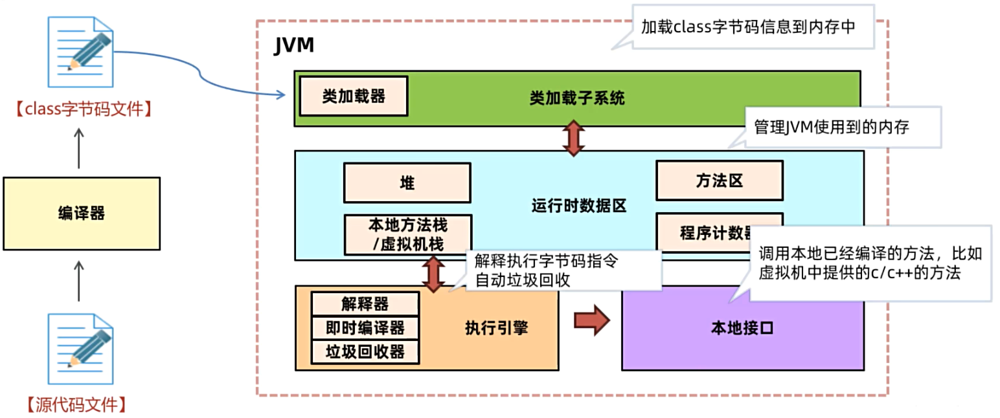

5. 常见的 JVM

   最常用的 JVM：Oracle 提供的 Hotspot、OpenJDK 的 Hotspot

   有 JVM 二次开发需求：OpenJDK 的 Hotspot

   云原生架构高性能需求：Oracle 的 GraalVM、IBM 的 OpenJ9

   电商物流金融高性能需求：GraalVM、阿里 DragonWell 龙井

### 总结

1. JVM 指的是 Java 虚拟机，本质上是一个运行在计算机上的程序，它的职责是运行 Java 字节码文件，作用是为了支持跨平台特性。
2. JVM 的功能有三项：第一是解释执行字节码指令；第二是管理内存中对象的分配，完成自动的垃圾回收；第三是优化热点代码提升执行效率。
3. JVM 组成分为类加载子系统、运行时数据区、执行引擎、本地接口这四部分。
4. 常用的 JVM 是 Oracle 提供的 Hotspot 虚拟机，也可以选择 GraalVM、龙井、OpenJ9 等虚拟机。


## 2. 了解过字节码文件的组成吗？

回答路径

- [x] 查看字节码文件的常用工具 (本地/远程)

- [x] 字节码文件的组成
- [x] 应用场景：工作中一般不直接查看字节码文件，主要是为了深入学习 JVM 基础

### 2.1 查看字节码文件的常用工具

字节码本质上是一个二进制的文件，无法直接用记事本等工具打开阅读其内容，需要通过专业的工具打开。

1. 开发环境使用 jclasslib 插件
2. 服务器环境使用 `javap -v 字节码文件名` 命令

### 2.2 字节码文件的组成

一个字节码文件有以下几部分内容：

基本信息：魔数、字节码文件对应的 Java 版本号，访问标识 (public、final 等等)，父类和接口

常量池：保存了字符串常量、类或接口名、字段名，主要在字节码指令中使用

字段：当前类或接口声明的字段信息

方法：当前类或接口声明的方法信息，字节码指令

属性：类的属性，比如源码的文件名，内部类的列表等

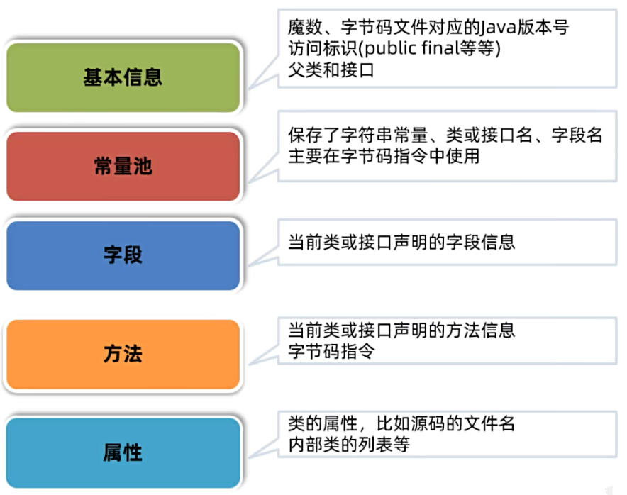

 

## 3. 什么是运行时数据区

回答路径

- [x] 程序计数器
- [x] 栈
- [x] 堆
- [x] 方法区
- [ ] 直接内存 (可选，不属于运行时数据区，但会存储一部分数据)

运行时数据区指的是 JVM 所管理的内存区域，其中分成两大类：

线程共享 - 方法区、堆；线程不共享 - 本地方法栈、虚拟机栈、程序计数器

直接内存主要是 NIO 使用，由操作系统直接管理，不属于 JVM 内存。

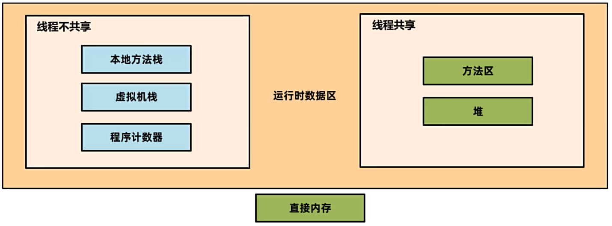

### 3.1 程序计数器

程序计数器 (Program Counter Register) 也叫 PC 寄存器，每个线程会通过程序计数器记录当前要执行的字节码指令的地址。主要有两个作用：

1. 程序计数器可以控制程序指令的进行，实现分支、跳转、异常等逻辑。
2. 在多线程执行情况下，Java 虚拟机需要通过程序计数器记录 CPU 切换前解释执行到哪一句指令并继续解释执行。

### 3.2 栈 - Java 虚拟机栈

Java 虚拟机栈采用栈的数据结构来管理方法调用中的基本数据，先进先出，每一个方法的调用使用一个栈帧来保存。每个线程都会包含一个自己的虚拟机栈，它的生命周期和线程相同。

#### Java 虚拟机栈 - 栈帧

栈帧主要包含三部分内容：

1. 局部变量表，在方法执行过程中存放所有的局部变量。
2. 操作数栈，虚拟机在执行指令过程中用来存放临时数据的一块区域。
3. 帧数据，主要包含动态链接、方法出口、异常表等内容。

动态链接：方法中要用到其它类的属性和方法，这些内容在字节码文件中是以编号保存的，运行过程中需要替换成内存中的地址，这个编号到内存地址的映射关系就保存在动态链接中。

方法出口：方法调用完需要弹出栈帧，回到上一个方法，程序计数器要切换到上一个方法的地址继续执行，方法出口保存的就是这个地址。

异常表：存放的是代码中异常的处理信息，包含了异常捕获的生效范围以及异常发生后跳转到的字节码指令位置。

### 3.3 本地方法栈

Java 虚拟机存储了 Java 方法调用时的栈帧，而本地方法栈存储的是 native 本地方法的栈帧。

在 Hotspot 虚拟机中，Java 虚拟机和本地方法栈实现上使用了同一个栈空间。本地方法栈会在栈内存上生成一个栈帧，临时保存方法的参数同时方便出现异常时也把本地方法的栈信息打印出来。

### 3.4 堆

一般 Java 程序中堆内存是空间最大的一块内存区域，创建出来的对象都存在于堆上。

栈上的局部变量表中，可以存放堆上对象的引用。静态变量也可以存放堆对象的引用，通过静态变量就可以实现对象在线程之间共享。

堆是垃圾回收最主要的部分，堆结构更详细的划分与垃圾回收器有关。

### 3.5 方法区

方法区是 Java 虚拟机规范中提出来的一个虚拟机概念，在 Hotspot 不同版本中会用永久代或者元空间来实现。方法区主要存放的是基础信息，包含：

1. 每一个加载的类的元信息 (基础信息)。
2. 运行时常量池，保存了字节码文件中的常量池内容，避免常量内容重复创建，减少内存开销。
3. 字符串常量池，存储字符串的常量。

### 3.6 直接内存

直接内存并不在《Java虚拟机规范》中存在，所以并不属于 Java 运行时的内存区域。在 JDK1.4 中引入了 NIO 机制，由操作系统直接管理这部分内容，主要为了提升读写数据的性能。在网络编程框架如 Netty 中被大量使用。

要创建直接内存上的数据，可以使用 ByteBuffer。

语法：`ByteBuffer directBuffer = ByteBuffer.allocateDirect(size);`


### 总结

**什么是运行时数据区？**

运行时数据区指的是 JVM 所管理的内存区域，其中分成两大类：

线程共享 - 方法区、堆

方法区存放了每一个加载的类的元信息、运行时常量池、字符串常量池。

堆存放了创建出来的对象。

线程不共享 - 本地方法栈、虚拟机栈、程序计数器

本地方法栈和虚拟机栈都存放了线程中执行方法时需要使用的基础数据。

程序计数器存放了当前线程执行的字节码指令在内存中的地址。

直接内存主要是 NIO 使用，由操作系统直接管理，不属于 JVM 内存。


## 4. 哪些区域会出现内存溢出，会有什么现象？

内存溢出指的是内存中某一块区域的使用量超过了允许使用的最大值，从而使用内存时因空间不足而失败，虚拟机一般会抛出指定的错误。

在 Java 虚拟机中，只有程序计数器不会出现内存溢出的情况，因为每个线程的程序计数器只保存一个固定长度的地址。

### 4.1 堆内存溢出

堆内存溢出指的是在堆上分配的对象空间超过了堆的最大大小，从而导致内存溢出。堆的最大大小使用 `-Xmx` 参数进行设置，如 `-Xmx10m` 代表最大堆内存大小为 10m。

溢出之后会抛出 OutOfMemoryError，并提示是 Java heap Space 导致的。

### 4.2 栈内存溢出

栈内存溢出指的是所有栈帧空间的占用内存超过了最大值，最大值使用 `-Xss` 进行设置，比如 `-Xss256k` 代表所有栈帧占用内存大小加起来不能超过 256k。

溢出之后会抛出 StackOverflowError。

### 4.3 方法区溢出

方法区溢出指的是方法区中存放的内容比如类的元信息超过了方法区内存的最大值，JDK7 及之前的版本方法区使用永久代 (`-XX:MaxPermSize=值`) 来实现，JDK8 及之后使用元空间 (`-XX:MaxMetaspaceSize=值`) 来实现。

### 4.4 直接内存溢出

直接内存溢出指的是申请的直接内存空间大小超过了最大值，使用 `-XX:MaxDirectMemorySize=值` 设置最大值。

溢出之后会抛出 OutOfMemoryError。


### 总结

**哪些区域会出现内存溢出，会有什么现象？**

内存溢出指的是内存中某一块区域的使用量超过了允许使用的最大值，从而使用内存时因空间不足而失败，虚拟机一般会抛出指定的错误。

堆：溢出之后会抛出 OutOfMemoryError，并提示是 Java heap Space 导致的。

栈：溢出之后会抛出 StackOverflowError。

方法区：溢出之后会抛出 OutOfMemoryError，JDK7 及之前提示永久代，JDK8 及之后提示元空间。

直接内存：溢出之后会抛出 OutOfMemoryError。


## 5. JVM 在 JDK6-8 之间在内存区域上有什么不同

两个方面：

1. 方法区的实现
2. 字符串常量池的位置

### 5.1 方法区的实现

方法区是《Java虚拟机规范》中设计的虚拟概念，每款 Java 虚拟机在实现上都各不相同。Hotspot 设计如下：

- JDK7 及之前的版本将方法区存放在堆区域中的永久代空间，堆的大小由虚拟机参数来控制。
- JDK8 及之后的版本将方法区存放在元空间中，元空间位于操作系统维护的直接内存中，默认情况下只要不超过操作系统承受的上限，可以一直分配。也可以手动设置最大大小。

使用元空间替换永久代的原因：

1. 提高内存上限：元空间使用的是操作系统内存，而不是 JVM 内存。如果不设置上限，只要不超过操作系统内存上限，就可以持续分配。而永久代在堆中，可使用的内存上限是有限的。所以使用元空间可以有效减少 OOM 情况的出现。
2. 优化垃圾回收的策略：永久代在堆上，垃圾回收机制一般使用老年代的垃圾回收方式，不够灵活。使用元空间之后单独设计了一套适合方法区的垃圾回收机制。

### 5.2 字符串常量池的位置

早期设计时，字符串常量池是属于运行时常量池的一部分，它们存储的位置也是一致的。后续做出了调整，将字符串常量池和运行时常量池做了拆分。

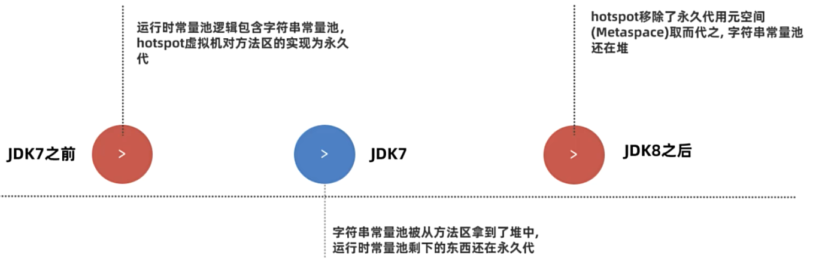

字符串常量池从方法区移动到堆的原因：

1. 垃圾回收优化：字符串常量池的回收逻辑和对象的回收逻辑类似，内存不足的情况下，如果字符串常量池中的常量不被使用就可以被回收；方法区中的类的元信息回收逻辑更复杂一些。移动到堆之后，就可以利用对象的垃圾回收器，对字符串常量池进行回收。
2. 让方法区大小更可控：一般在项目中，类的元信息不会占用特别大的空间，所以会给方法区设置一个比较小的上限。如果字符串常量池在方法区中，会让方法区的空间大小变得不可控。
3. intern 方法的优化：JDK6 版本中 intern() 方法会把第一次遇到的字符串实例复制到永久代的字符串常量池中。JDK7 及之后版本中由于字符串常量池在堆上，就可以进行优化。字符串保存在堆上，把字符串的引用放入字符串常量池，减少了复制的操作。


### 总结

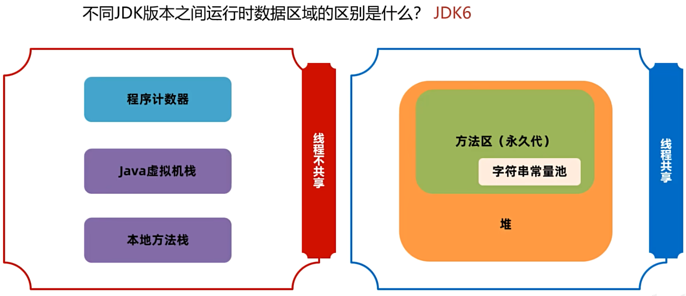

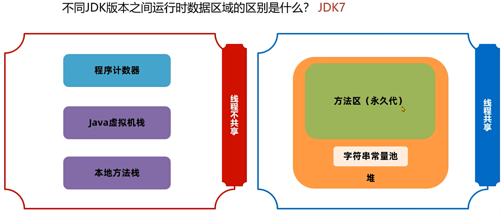

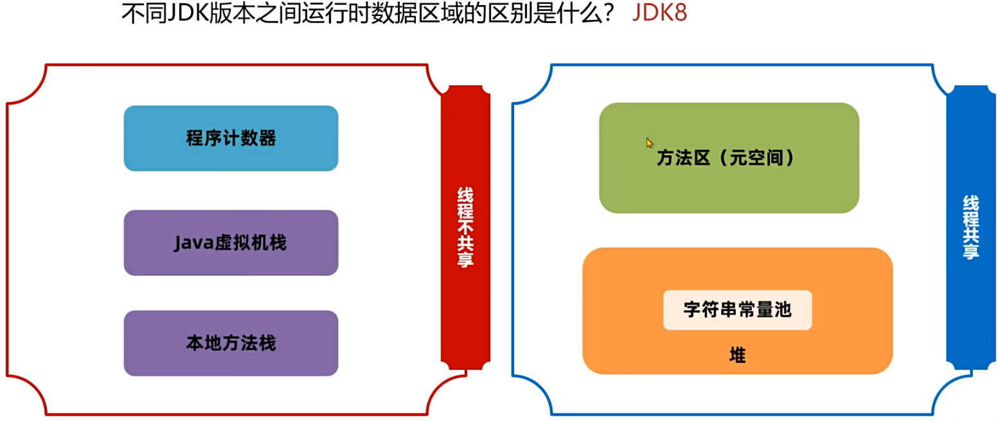


## 6. 类的生命周期

回答路径

- [x] 加载
- [x] 连接 (验证、准备、解析)
- [x] 初始化
- [x] 卸载

### 6.1 加载阶段

1. 加载阶段 (Loading) 阶段第一步是类加载器根据类的全限定名通过不同的渠道以二进制流的方式获取字节码信息。
2. 类加载器在加载完类之后，Java 虚拟机会将字节码中的信息保存到内存的方法区。在方法区生成一个 InstanceKlass 对象，保存类的所有信息。
3.  在堆中生成一份与方法区中数据类似的 java.lang.Class 对象，作用是在 Java 代码中去获取类的信息。

### 6.2 连接阶段

连接 (Linking) 阶段的第一个环节是验证，验证的主要目的是检测 Java 字节码文件是否遵循了《Java虚拟机规范》中的约束。这个阶段一部不需要程序员参与。

约束主要包含如下四部分：

1. 文件格式验证，比如文件是否以 0xCAFEBABE 开头，主次版本号是否满足当前 Java 虚拟机版本要求。
2. 元信息验证，例如类必须有父类 (super 不能为空)。
3. 验证程序执行指令的语义，比如方法内的指令执行到一半强行跳转到其它方法中去。
4. 符号引用验证，例如是否访问了其它类中 private 的方法等。

准备阶段为静态变量 (static) 分配内存并设置初值。如果是 final 修饰的基本数据类型的静态变量，准备阶段会直接将代码中的变量进行赋值。

解析阶段主要是将常量池中的符号引用替换为直接引用。符号引用就是在字节码文件中使用编号来访问常量池中的内容。直接引用不再使用编号，而是使用内存中的地址访问具体的数据。

### 6.3 初始化阶段

初始化阶段会执行静态代码块中的代码，并为静态变量赋值。

初始化阶段会执行字节码文件中 clinit 部分的字节码指令。

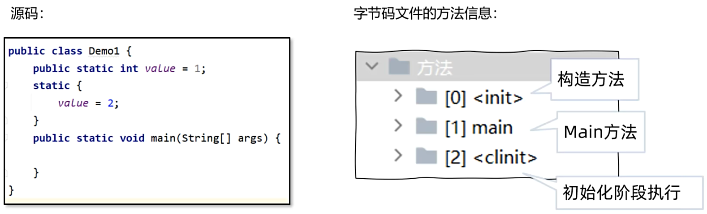

### 6.4 类的卸载

判断一个类可以被卸载，需要同时满足下面三个条件：

1. 此类所有实例对象都已经被回收，在堆中不存在任何该类的实例对象以及子类对象。
2. 加载该类的类加载器已经被回收。
3. 该类对应的 java.lang.Class 对象没有在任何地方被引用。


### 总结

1. 加载：根据类的全限定类名把字节码文件的内容加载并转换成合适的数据放入内存中，存放在方法区和堆上

2. 连接 - 验证：魔数、版本号等验证，一般不需要程序员关注

   连接 - 准备：为静态变量分配内存并设置初值

   连接 - 解析：将常量池中的符号引用 (编号) 替换为直接引用 (内存地址)

3. 初始化：执行静态代码块和静态变量的赋值


## 7. 什么是类加载器

回答路径

- [x] 类加载器的作用
- [x] 启动类加载器
- [x] 扩展/平台类加载器
- [x] 应用程序类加载器
- [x] 自定义类加载器

### 7.1 什么是类加载器，有哪些常见的类加载器

类加载器负责在类的加载过程中将字节码信息以流的方式获取并加载到内存中。JDK8 及之前如下：

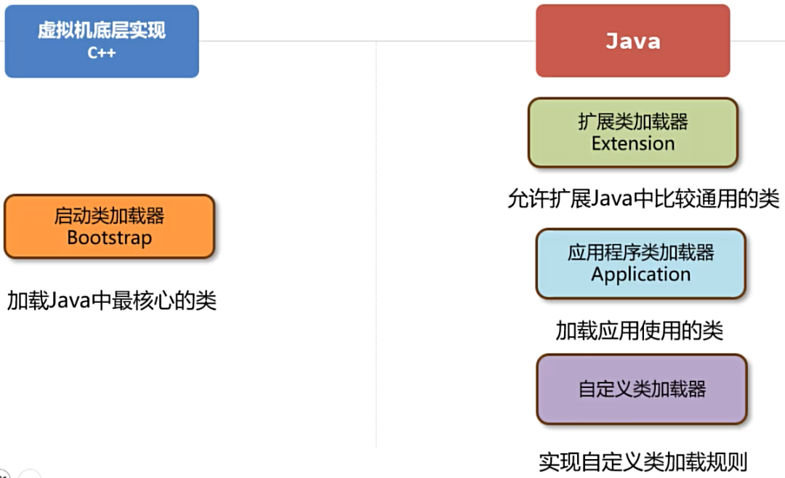

JDK9 之后均由 Java 实现：

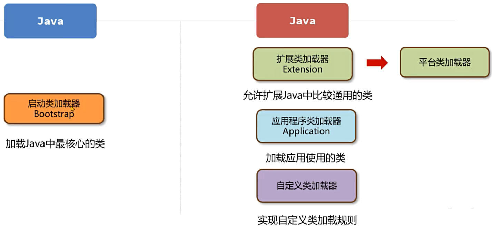

启动类加载器

- 启动类加载器 (Bootstrap ClassLoader) 是由 Hotspot 虚拟机提供的类加载器，JDK9 之前使用 C++ 编写、JDK9 之后使用 Java 编写。
- 默认加载 Java 安装目录 /jre/lib 下的类文件，比如 rt.jar，tools.jar，resources.jar 等。

扩展类加载器

- 扩展类加载器 (Extension ClassLoader) 是 JDK 中提供的、使用 Java 编写的类加载器。JDK9 之后由于采用了模块化，改名为 Platform 平台类加载器。
- 默认加载 Java 安装目录 /jre/lib/ext 下的类文件。

应用程序类加载器

- 应用程序类加载器 (Application ClassLoader) 是 JDK 中提供的、使用 Java 编写的类加载器。默认加载应用程序 classpath 下的类。

自定义类加载器

- 自定义类加载器允许用户自行实现类加载的逻辑，可以从网络、数据库等来源加载类信息。自定义类加载器需要继承自 ClassLoader 抽象类，重写 findClass 方法。


### 总结

有几种类加载器？

1. 启动类加载器 (Bootstrap ClassLoader) 加载核心类
2. 扩展类加载器 (Extension ClassLoader) 加载扩展类
3. 应用程序类加载器 (Application ClassLoader) 加载应用程序 classpath 中的类
4. 自定义类加载器，重写 findClass 方法

JDK9 及之后扩展类加载器 (Extension ClassLoader) 变成了平台类加载器 (Platform ClassLoader)


## 8. 什么是双亲委派机制

回答路径

- [x] 类加载器和父类加载器
- [x] 什么是双亲委派机制
- [x] 双亲委派机制的作用


什么是双亲委派机制

类加载有层级关系，上一级是下一级的父类加载器。

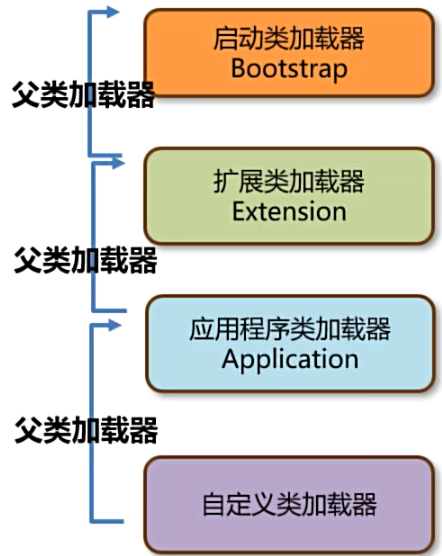

双亲委派机制指的是当一个类加载器接收到加载类的任务时，会向上查找是否加载过，再由顶向下进行加载。


类加载器的双亲委派机制

每个类加载器都有一个父类加载器，在类加载的过程中，每个类加载器都会先检查是否已经加载了该类，如果已经加载则直接返回，否则会将加载请求委派给父类加载器。


双亲委派机制的作用

1. 保证类加载的安全性

   通过双亲委派机制避免恶意代码替换 JDK 中的核心类库，比如 java.lang.String，确保核心类库的完整性和安全性。

2. 避免重复加载

   双亲委派机制可以避免同一个类被多次加载。


### 总结

什么是双亲委派机制？

双亲委派机制指的是当一个类加载器接收到加载类的任务时，会向上交给父类加载器查找是否加载过，再由顶向下进行加载。

双亲委派机制的作用：保证类加载的安全性，避免重复加载。


## 9. 如何打破双亲委派机制

打破双亲委派机制

ClassLoader 中包含 4 个核心方法：

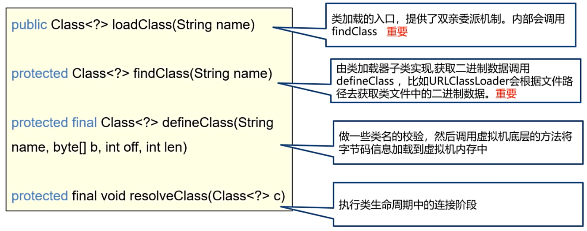

它们的调用关系如下：

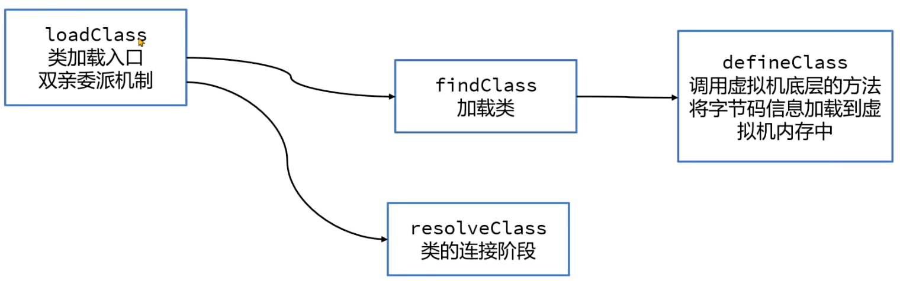

打破双亲委派机制的唯一方法就是实现自定义类加载器，并且重写 loadClass 方法，将其中的双亲委派机制代码去掉。


## 10. Tomcat 的自定义类加载器

Tomcat 中，实现了一套自定义的类加载器。这里以目前应用比较广泛的 Tomcat9 (9.0.84) 源码进行分析。

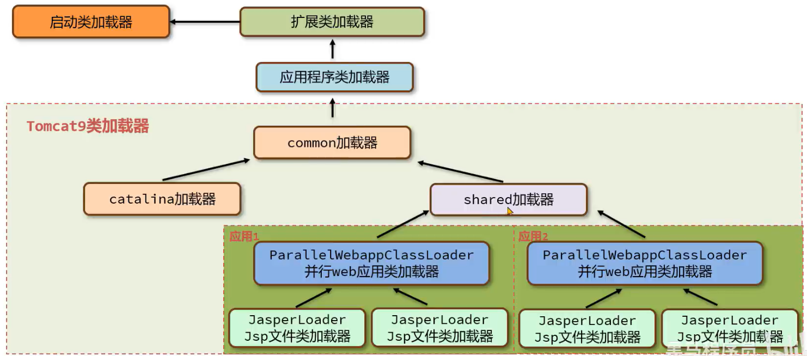

- common 类加载器主要加载 tomcat 自身使用以及应用使用的 jar 包，默认配置在 catalina.properties 文件中。

  `common.loader="${catalina.base}/lib","${catalina.base}/lib/*.jar"`

- catalina 类加载器主要加载 tomcat 自身使用的 jar 包，不让应用使用，默认配置在 catalina.properties 文件中。

  `server.loader=  ` 配置默认为空，为空时 catalina 加载器和 common 加载器是同一个类加载器。

- shared 类加载器主要加载应用使用的 jar 包，tomcat 本身是不使用这些 jar 包的，默认配置在 catalina.properties 文件中。

  `shared.loader=  `  配置默认为空，为空时 shared 加载器和 common 加载器是同一个类加载器。

- ParallelWebappClassLoader 类加载器可以多线程并行加载应用中使用到的类，每个应用都拥有一个自己的类加载器。

  为什么每个应用会拥有一个独立的 ParallelWebappClassLoader 类加载器呢？

  同一个类加载器，只能加载一个同名的类。要求两个应用中相同名称的类都必须要加载，只有一个类加载器是无法加载这两个同名类的。因此让每个应用都拥有一个独立的并行 web 应用类加载器就能分别加载各自的类，相互之间是独立加载的。


ParallelWebappClassLoader 的执行流程：

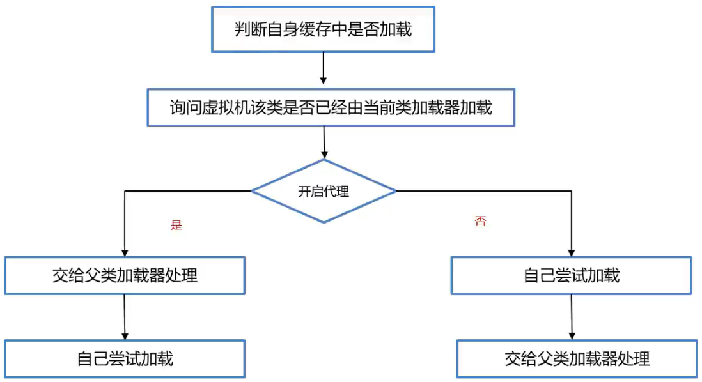

默认情况下，没有开启代理的执行流程就打破了双亲委派机制，应用中的类如果没有加载过，会先从当前类加载器加载，然后再交给父类加载器通过双亲委派机制加载。

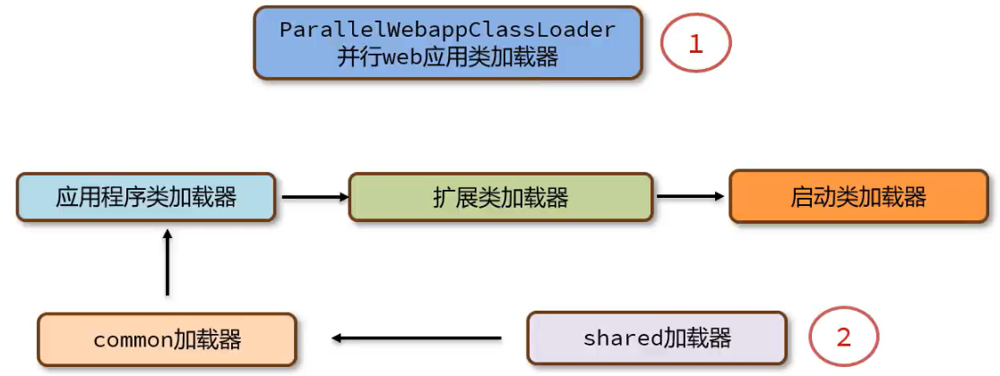


- JasperLoader 类加载器负责加载 JSP 文件编译出来的 class 字节码文件，为了实现热部署 (不需要重启让修改的 jsp 生效)，每一个 jsp 文件都由一个独立的 JasperLoader 负责加载。


### 总结

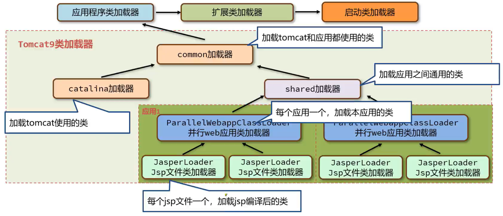


## 11. 如何判断堆上的对象有没有被引用？

回答路径

- [x] 引用计数法
- [x] 可达性分析法
- [x] 使用可达性分析法分析原因


如何判断堆上的对象有没有被引用？

常见的有两种判断方法：引用计数法和可达性分析法。

引用计数法会为每个对象维护一个引用计数器，当对象被引用时加 1，取消引用时减 1。


引用计数法的缺点 - 循环引用

引用计数法的优点是实现简单，缺点有两点：

1. 每次引用和取消引用都需要操作计数器，对系统性能会有一定的影响
2. 存在循环引用问题，所谓循环引用就是当 A 引用 B，B 同时引用 A 时会出现对象无法回收的问题。

Hotspot 虚拟机并没有采用这种方式。


可达性分析算法

Java 使用的是可达性分析算法来判断对象是否可以被回收。可达性分析将对象分为两类：垃圾回收的根对象 (GC Root) 和普通对象，对象与对象之间存在引用关系。

下图中 A 到 B 再到 C 和 D，形成了一个引用链，可达性分析算法指的是如果从某个对象到 GC Root 对象是可达的，那对象就不可被回收。

哪些对象被称之为 GC Root 对象？

- 线程 Thread 对象，引用线程栈帧中的方法参数、局部变量等。
- 系统类加载器加载的 java.lang.Class 对象，引用类中的静态变量。
- 监视器对象，用来保存同步锁 synchronized 关键字持有的对象。
- 本地方法调用时使用的全局对象。


### 总结

如何判断堆上的对象有没有被引用？

引用计数法会为每个对象维护一个引用计数器，当对象被引用时加 1，取消引用时减 1。因为存在循环引用问题，所以 Hotspot 虚拟机并没有采用这种方式。

Java 使用的是可达性分析算法来判断对象是否可以被回收。可达性分析将对象分为两类：垃圾回收的根对象 (GC Root) 和普通对象。

可达性分析算法指的是如果从某个对象到 GC Root 对象是可达的，那对象就不可被回收。最常见的问题是 GC Root 对象会引用栈上的局部变量和静态变量导致对象不可回收。


## 12. JVM 中都有哪些引用类型

回答路径

- [x] 强引用
- [x] 软引用
- [x] 弱引用
- [x] 虚引用
- [x] 终结器引用


JVM 中都有哪些引用类型

- 强引用，JVM 中默认引用关系就是强引用，即对象被局部变量、静态变量等 GC Root 关联的对象引用，只要这层关系存在，普通对象就不会被回收。
- 软引用，软引用相对于强引用是一种比较弱的引用关系，如果一个对象只有软引用关联到它，当程序内存不足时，就会将软引用中的数据进行回收。软引用主要在缓存框架中使用。
- 弱引用，弱引用的整体机制和软引用基本一致，区别在于弱引用包含的对象在垃圾回收时，不管内存够不够都会直接被回收，弱引用主要在 ThreadLocal 中使用。
- 虚引用 (幽灵引用/幻影引用)，不能通过虚引用对象获取到包含的对象。虚引用唯一的用途是当对象被垃圾回收器回收时可以接收到对应的通知。直接内存中为了及时知道直接内存对象不再使用，从而回收内存，使用了虚引用来实现。
- 终结器引用，终结器引用指的是在对象需要被回收时，终结器引用会关联对象并放置在 Finalizer 类中的引用队列中，在稍后由 FinalizerThread 线程从队列中获取对象，然后执行对象的 finalize 方法，在对象第二次被回收时，该对象才真正被回收。


## 13. ThreadLocal 中为什么要使用弱引用？

ThreadLocal 可以在线程中存放线程的本地变量，保证数据的线程安全。

ThreadLocaL 是这样保存对象的：

1. 在每个线程中，存放了一个 ThreadLocalMap 对象，本质上就是一个数组实现的哈希表，里面存放多个 Entry 对象。
2. 每个 Entry 对象继承自弱引用，内部存放 ThreadLocal 对象。同时有强引用，引用保存的 ThreadLocal 对应的 value 值。

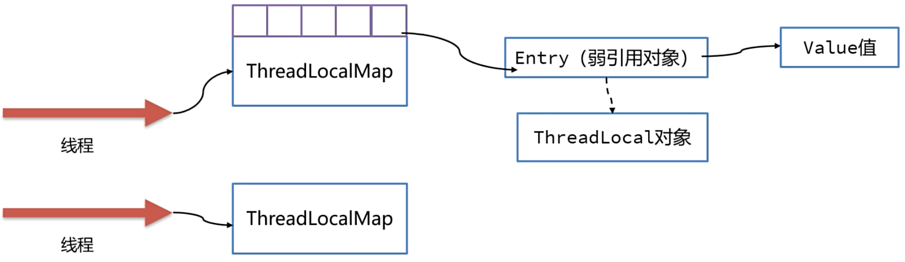

`threadLocal.set(new User(1, "main线程对象"));`

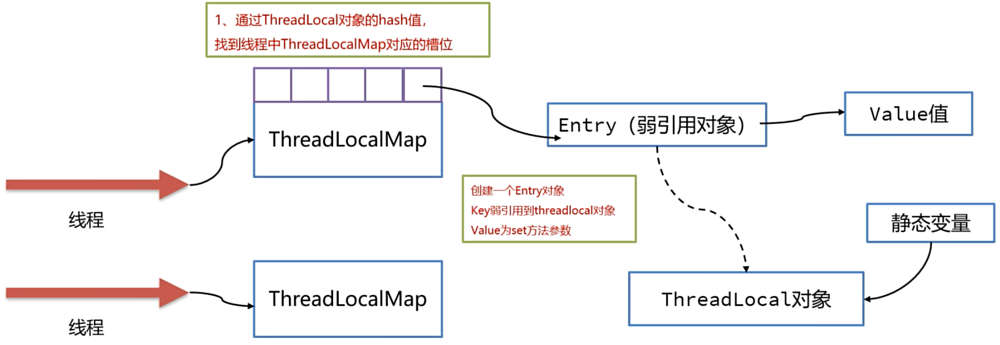

`User user = threadLocal.get();`

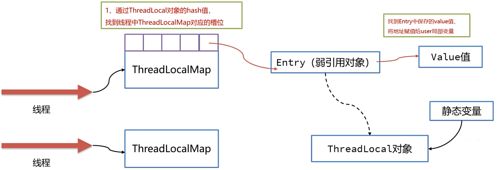

​	

不再使用 ThreadLocal 对象时，`threadLocal = null;` 由于是弱引用，那么在垃圾回收之后，ThreadLocal 对象就可以被回收。如果不使用弱引用，使用强引用，那这里的 ThreadLocal 对象就无法回收，就产生了内存泄漏。

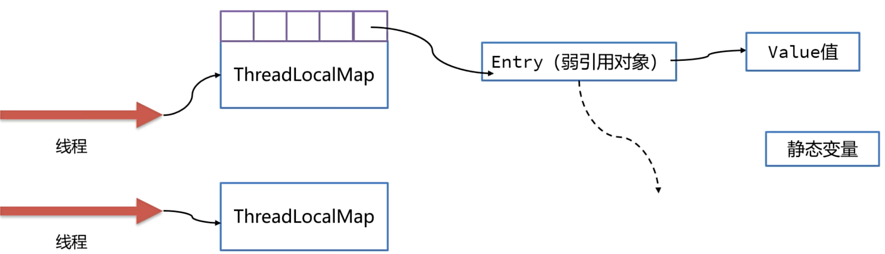

此时还有 Entry 对象和 Value 对象没有被回收。ThreadLocal 类的 set、get、remove 方法在满足某些特定条件的情况下，会主动删除这两个对象。

如果一直不调用 set、get、remove 方法或者调用了但没有满足条件，这部分对象就会出现内存泄漏。强烈建议在 ThreadLocal 不再使用时，调用 remove 方法，将 Entry 对象的引用关系去除掉，这样就可以回收这两个对象了。


### 总结

ThreadLocal 中为什么要使用弱引用？

当 threadlocal 对象不再使用时，使用弱引用可以让对象被回收。只有弱引用没有强引用的情况下，对象是可以被回收的。

弱引用并没有完全解决掉对象回收的问题，Entry 对象和 Value 值无法被回收，所以合理的做法是手动调用 remove 方法进行回收，然后再将 threadlocal 对象的强引用解除。


## 14. 有哪些常见的垃圾回收算法？

回答路径

垃圾回收算法的机制、优缺点

- [x] 标记清除
- [x] 标记整理
- [x] 复制
- [x] 分代 GC

有哪些常见的垃圾回收算法？

- 1960 年 John McCarthy 发布了第一个 GC 算法，标记 - 清除算法。
- 1963 年 Marvin L. Minsky 发布了复制算法。

本质上后续所有的垃圾回收算法，都是在上述两种算法的基础上优化而来。


### 标记清除算法

标记清除算法的核心思想分为两个阶段：

1. 标记阶段，将所有存活的对象进行标记。Java 中使用可达性分析算法，从 GC Root 开始通过引用链遍历出所有存活对象。
2. 清除阶段，从内存中删除没有被标记也就是非存活对象。

优点：实现简单，只需要在第一阶段给每个对象维护标志位，第二阶段删除对象即可。

缺点：

1. 碎片化问题

   由于内存是连续的，所以在对象被删除之后，内存中会出现很多细小的可用内存单元。如果新对象需要一个比较大的空间，很有可能这些内存单元的大小过小无法进行分配。

2. 分配速度慢

   由于内存碎片的存在，需要维护一个空闲链表，极有可能发生每次需要遍历到链表的最后才能获得合适的内存空间。


### 复制算法

复制算法的核心思想是：

1. 准备两块空间 From 空间和 To 空间，每次在对象分配阶段，只能使用其中一块空间 (From 空间)。
2. 在垃圾回收 GC 阶段，将 From 中存活对象复制到 To 空间。
3. 将两块空间的 From 和 To 名字互换。


### 标记整理算法

标记整理算法也叫标记压缩算法，是对标记清理算法中容易产生内存碎片问题的一种解决方案。

核心思想分为两个阶段：

1. ，将所有存活的对象进行标记。Java 中使用可达性分析算法，从 GC Root 开始通过引用链遍历出所有存活对象。
2. 整理阶段，将存活对象移动到堆的一端。清理掉存活对象的内存空间。

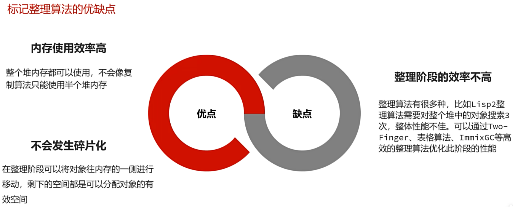


### 分代垃圾回收算法

现代优秀的垃圾回收算法，会将上述描述的垃圾回收算法组合进行使用，其中应用最广泛的就是分代垃圾回收算法 (Generational GC)。

分代垃圾回收算法将整个内存区域划分为年轻代和老年代。

分代回收时，创建出来的对象，首先会被放入 Eden 伊甸园区。

随着对象在 Eden 区越来越多，如果 Eden 区满，新创建的对象已经无法放入，就会触发年轻代的 GC，称为 Minor GC 或者 Young GC。

Minor GC 会把 eden 和 from 中需要回收的对象回收，把没有回收的对象放入 To 区。

接下来 S0 会变成 To 区，S1 变成 From 区。当 eden 区满时再往里放入对象，依然会发生 Minor GC。

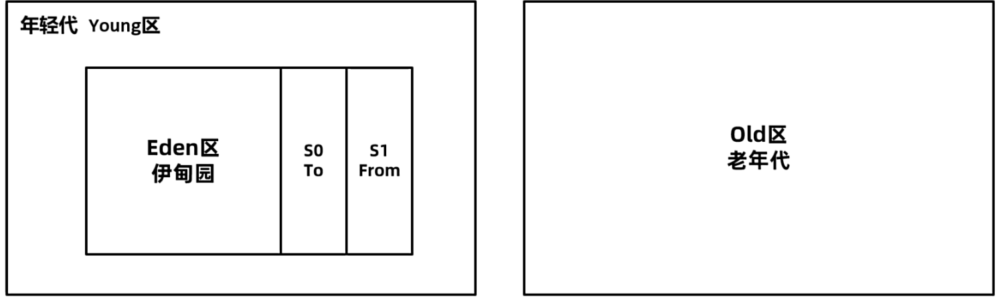

此时回收 eden 区和 S1 (from) 中的对象，并把 eden 和 from 区中剩余的对象放入 S0。

注意：每次 Minor GC 中都会为对象记录它的年龄，初始值为 0，每次 GC 完加 1。

如果 Minor GC 后对象的年龄达到阈值 (最大 15，默认值和垃圾回收器有关)，对象就会被晋升至老年代。

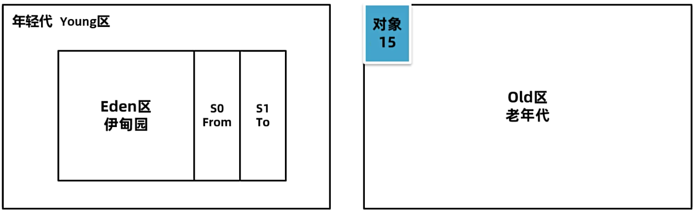

当老年代中空间不足，无法放入新的对象时，先尝试 minor gc，如果还是不足，就会触发 Full GC，Full GC 会对整个堆进行垃圾回收。

如果 Full GC 依然无法回收掉老年代的对象，那么当对象继续放入老年代时，就会抛出 Out Of Memory 异常。


分代垃圾回收算法优缺点：

程序中大部分对象都是朝生暮死，在年轻代创建并且回收，只有少量对象会长期存活进入老年代。分代垃圾回收的优点有：

1. 可以通过调整年轻代和老年代的比例来适应不同类型的应用程序，提高内存的利用率和性能。
2. 新生代和老年代使用不同的垃圾回收算法，新生代一般选择复制算法，效率高、不会产生内存碎片，老年代可以选择标记 - 清除和标记 - 整理算法，由程序员来选择，灵活度较高。
3. 分代的设计中允许只回收新生代 (minor gc)，如果能满足对象分配的要求就不需要对整个对进行回收 (full gc)，STW (Stop The World) 由垃圾回收引起的停顿时间就会减少。

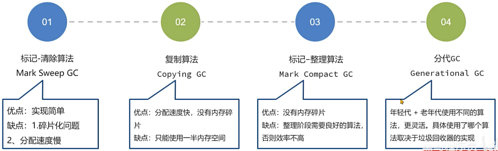


## 15. 有哪些常用的垃圾回收器

回答路径

- [x] Serial 垃圾回收器 + SerialOld 垃圾回收器
- [x] ParNew + CMS
- [x] PS + PO
- [x] G1
- [x] Shenandoah 和 ZGC


有哪些常用的垃圾回收器

垃圾回收器是垃圾回收算法的具体实现。

由于垃圾回收器分为年轻代和老年代，除了 G1 之外其他垃圾回收器必须成对组合进行使用。


### Serial 垃圾回收器 + SerialOld 垃圾回收器

Serial 是一种单线程串行回收年轻代的垃圾回收器。

`-XX:+UseSerialGC` 新生代、老年代都使用串行回收器。


### Parallel Scavenge 垃圾回收器 + Parallel Old 垃圾回收器

PS + PO 是 JDK8 默认的垃圾回收器多线程并行回收，关注的是系统的吞吐量，具备自动调整堆内存大小的特点。


### ParNew 垃圾回收器 + CMS 垃圾回收器

#### 年轻代 - ParNew 垃圾回收器

ParNew 垃圾回收器本质上是对 Serial 在多线程 CPU 下的优化，使用多线程进行垃圾回收

`-XX:+UseParNewGC` 新生代使用 ParNew 垃圾回收器，老年代使用串行回收器。


#### 老年代 - CMS (Cocurrent Mark Sweep) 垃圾回收器

CMS 垃圾回收器关注的是系统的暂停时间，允许用户线程和垃圾回收线程在某些步骤中同时执行，减少了用户线程的等待时间。

`-XX:+UseConcMarkSweepGC` 启用 CMS 垃圾回收器


CMS 垃圾回收器存在的问题

1. CMS 使用了标记 - 清除算法，在垃圾回收结束之后会出现大量的内存碎片，CMS 会在 Full GC 时进行碎片的整理。这样会导致用户线程暂停，可以使用 `-XX:CMSFullGCsBeforeCompaction=N` 参数 (默认 N=0) 调整 N 次 Full GC 之后再整理。
2. 无法处理在并发清理过程中产生的“浮动垃圾”，不能做到完全的垃圾回收。
3. 如果老年代内存不足无法分配对象，CMS 会退化成 Serial Old 单线程去回收老年代。
4. 并发阶段会影响用户线程执行的性能。

### G1 - Garbage First 垃圾回收器

`-XX:+UseG1GC` 启用 G1，JDK9 之后默认使用 G1。

`-XX:MaxGCPauseMillis=毫秒值` 设置最大暂停时间。


### Shenandoah

Shenandoah 是由 Red Hat 开发的一款低延迟的垃圾回收器，Shenandoah 并发执行大部分 GC 的工作，包括并发的整理，堆大小对 STW 的时间基本没有影响。

### ZGC

ZGC 是一种可扩展的低延迟垃圾回收器。ZGC 在垃圾回收过程中，STW 的时间不会超过一毫秒，适合需要低延迟的应用。支持几百兆到 16TB 的堆大小，堆大小对 STW 的时间基本没有影响。


### 总结

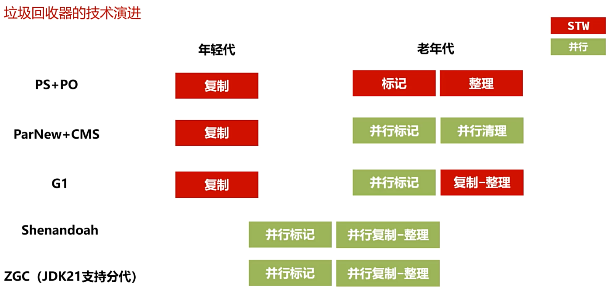

垃圾回收器的组合关系虽然很多，但是针对几个特定的版本，比较推荐的组合如下

JDK8 及之前：ParNew + CMS (暂停时间短)、Parallel Scavenge + Parallel Old (高吞吐量)、G1 (JDK8 之前不建议使用，较大堆且关注暂停时间)

JDK9 及之后：G1 (默认)

从 JDK9 之后，由于 G1 日趋成熟，JDK 默认的垃圾回收器已经修改为 G1，所以强烈建议在生产环境上使用 G1。

如果对低延迟有较高的要求，可以使用 Shenandoah 或者 ZGC。


## 16. 如何解决内存泄漏问题

回答路径

- [x] 内存泄漏和内存溢出
- [x] 解决内存泄漏问题的思路
- [x] 常用的工具


### 什么是内存泄漏，如何解决内存泄漏问题？

内存泄漏 (memory leak)：在 Java 中如果不再使用一个对象，但是该对象依然在 GC Root 的引用链上，这个对象就不会被垃圾回收器回收，这种情况称之为内存泄漏。

少量的内存泄漏可以容忍，但是如果发生持续的内存泄漏，最终导致的结果就是内存溢出。


### 解决内存泄漏问题的思路

解决内存泄漏问题总共分为四个步骤，其中前两个步骤是最核心的

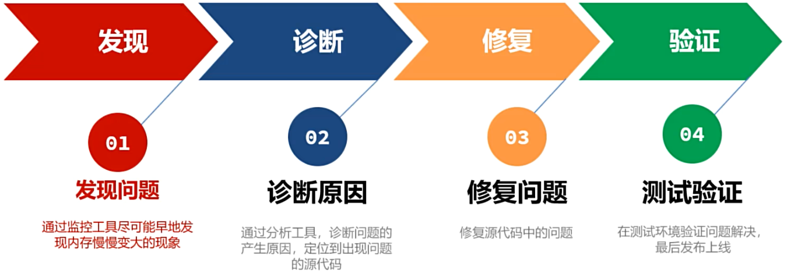

#### 发现问题

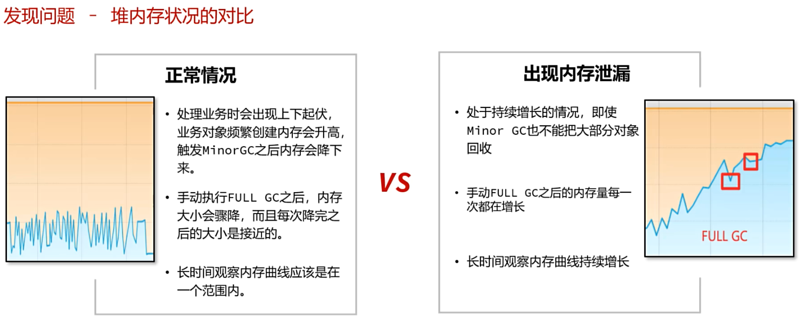

生产环境可以通过运维提供的 Prometheus + Grafana 等监控平台查看。

开发、测试环境通过 visualVM 查看。


#### 诊断 - 生成堆内存快照

当堆内存泄漏时，需要在堆内存溢出时将整个堆内存保存下来，生成内存快照 (Heap Profile) 文件。

生成方式有两种

1. 内存溢出时自动生成，添加生成快照的 Java 虚拟机参数

   `-XX:+HeapDumpOnOutOfMemoryError` 发生 OutOfMemoryError 错误时，自动生成 hprof 内存快照文件。

   `-XX:HeapDumpPath=<path>` 指定 hprof 文件的输出路径。

2. 导出运行中系统的内存快照，比较简单的方式有两种，注意只需要导出标记为存活的对象

   通过 JDK 自带的 jmap 命令导出，格式为：

   ```bash
   jmap -dump:live,format=b,file=文件路径和文件名 进程ID
   ```

   通过 arthas 的 heapdump 命令导出，格式为：

   ```bash
   heapdump --live 文件路径和文件名
   ```

#### 诊断 - MAT 定位问题

使用 MAT 打开 hprof 文件，并选择内存泄漏检测功能，MAT 会自行根据内存快照中保存的数据分析内存泄漏的根源。


#### 修复问题

修改内存溢出的问题要具体问题具体分析，问题总共可以分成三类：


### 常用的 JVM 工具

JDK 自带的命令行工具

- jps 查看 java 进程，打印 main 方法所在类名和进程 id
- jmap 生成堆内存快照，打印类的直方图

第三方工具

- VisualVM 监控
- Arthas 综合性工具
- MAT 堆内存分析工具

监控平台：Prometheus + Grafana


## 17. 常见的 JVM 参数

回答路径

- [x] 最大堆内存参数
- [x] 最大栈内存参数
- [x] 最大元空间内存参数
- [x] 日志参数
- [x] 堆内存快照参数
- [x] ~~垃圾回收器参数~~
- [x] ~~垃圾回收器调优参数~~


### 常见的 JVM 参数

`-Xmx` 和 `-Xms`

`-Xmx` 参数设置的是最大堆内存，但是由于程序是运行在服务器或者容器上，计算可用内存时，要将元空间、操作系统、其它软件占用的内存排除掉。

案例：服务器内存 4G，操作系统 + 元空间最大值 + 其它软件占用 1.5G，-Xmx 可以设置为 2G。

最合理的设置方式应该是根据最大并发量估算服务器的配置，然后再根据服务器配置计算最大堆内存的值。

建议将 `-Xms` 设置的和 `-Xmx` 一样大，运行过程中不再产生扩容的开销。

---

`-XX:MaxMetaspaceSize` 和 `-Xss`

`-XX:MaxMetaspaceSize=值` 参数指的是最大元空间大小，默认值比较大，如果出现元空间内存泄漏会让操作系统可用内存不可控，建议根据测试情况设置最大值，一般设置为 256m。

`-Xss256k` 栈内存大小，如果不指定栈的大小，JVM 将创建一个具有默认大小的栈。大小取决于操作系统和计算机的体系结构。比如 Linux x86_64 是 1MB 大小的默认栈。如果不需要用到这么大的栈内存，完全可以将此值调小，节省内存空间，合理值为 256k - 1m 之间。

---

`-Xmn`

年轻代的大小，默认值为整个堆的 1/3，可以根据峰值流量计算最大的年轻代大小，尽量让对象只存放在年轻代，不进入老年代。但是实际的场景中，接口的响应时间、创建对象的大小、程序内部的一些定时任务等不确定因素都会导致这个值的大小并不能仅凭计算得出，如果设置该值要进行大量的测试。G1 垃圾回收器尽量不要设置该值，G1 会动态调整年轻代的大小。

---

打印 GC 日志

JDK8 及之前：`-XX:+PrintGCDetails -XX:+PrintGCDateStamps -Xloggc:文件路径`

JDK9 及之后：`-Xlog:gc*:file=文件路径`

---

`-XX:+DisableExplicitGC`

禁止在代码中使用`System.gc()`，`System.gc()` 可能会引起 Full GC，在代码中尽量不要使用。`DisableExplicitGC` 参数可以阻止 `System.gc()` 方法调用。

---

`-XX:+HeapDumpOnOutOfMemoryError`：发生 OutOfMemoryError 错误时，自动生成 hprof 内存快照文件。

`-XX:HeapDumpPath=<path>`：指定 hprof 文件的输出路径。


### 优化基础 JVM 参数

JVM 参数模板

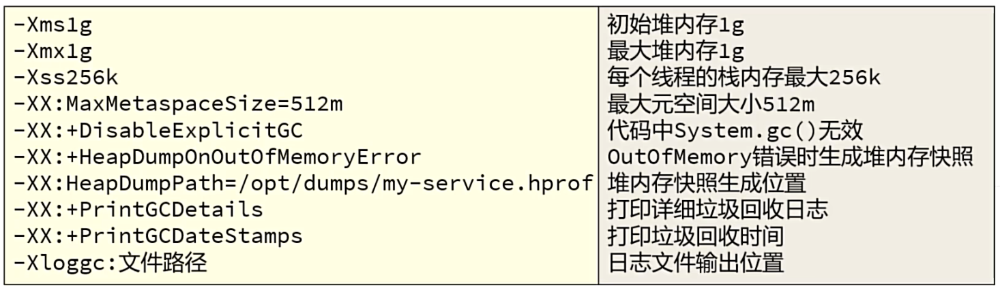

注意：

JDK9 及之后 gc 日志输出修改为 `-Xlog:gc*:file=文件名`

堆内存大小和栈内存大小根据实际情况灵活调整。
