# Java 虚拟机高级

## 1. GraalVM

### 1.1 什么是 GraalVM

- GraalVM 是 Oracle 官方推出的一款高性能 JDK，使用它享受比 OpenJDK 或者 OracleJDK 更好的性能。
- GraalVM 的官方地址：https://www.graalvm.org/
- 官方标语：Build faster, smaller, leaner applications.
  - [x] 更低的 CPU、内存占用率
  - [x] 更快的启动速度，无需预热即可获得最好的性能
  - [x] 更好的安全性、更小的可执行文件
  - [x] 支持多种框架 SpringBoot、Microaut、Helidon 和 Quarkus
  - [x] 多家云平台支持
  - [x] 通过 Truffle 框架运行 JS、Python、Ruby 等其他语言

GraalVM 的版本

- GraalVM 分为社区版 (Community Edition) 和企业版 (Enterprise Edition)。企业版相比较社区版，在性能上有更多的优化。

GraalVM 社区版环境搭建

需求：搭建 Linux 下的 GraalVM 社区版环境。

步骤：

1. 查看 Linux 架构
2. 根据架构下载社区版的 GraalVM https://www.graalvm.org/downloads/
3. 安装 GraalVM，安装方式与安装 JDK 相同。
4. 使用 java -version 和 Hello World 测试 GraalVM。


### 1.2 GraalVM 的两种运行模式

- JIT (Just-In-Time) 模式，即时编译模式

  JIT 模式的处理方式与 Oracle JDK 类似，满足两个特点：

  - [x] Write Once, Run Anywhere -> 一次编写，到处运行。
  - [x] 预热之后，通过内置的 Graal 即时编译器优化热点代码，生成比 Hotspot JIT 更高性能

  GraalVM 性能测试

  需求：分别在 JDK8、JDK21、GraalVM 21 (开启 Graal 即时编译器)、GraalVM 21 (不开启 Graal 即时编译器) 运行 Jmh 性能测试用例，对比其性能。

  步骤：

  1. 从 https://github.com/graalvm/graalvm-demos 下载 GraalVM 的案例代码，将 java-simple-stream-benchmark 目录下的代码使用 maven 打包成 jar 包。
  2. 使用不同的 JDK 测试 jar 包，对比结果。

  注意：使用 `-XX:-UseJVMCICompiler` 参数可以关闭 GraalVM 中的 Graal 编译器。

- AOT (Ahead-Of-Time) 模式，提前编译模式

  AOT 编译器通过源代码，为特定平台创建可执行文件。比如，在 Windows 下编译完成之后会生成 exe 文件。通过这种方式，达到启动之后获得最高性能的目的，但是不具备跨平台特性，不同平台使用需要单独编译。

  这种模式生成的文件称之为 Native Image 本地镜像。

  GraalVM AOT 模式

  需求：使用 GraalVM AOT 模式制作本地镜像并运行。

  步骤：

  1. 安装 Linux 环境本地镜像制作需要的依赖库

     https://www.graalvm.org/latest/reference-manual/native-image/#prerequisites

  2. 使用 `native-image 类名` 制作本地镜像。

  3. 运行本地镜像可执行文件。

  注意：使用 native-image 制作本地镜像需要先在本地查找字节码文件，然后根据字节码文件才能编译成可执行文件。因此需要先将源代码编译成字节码文件，再制作本地镜像。

GraalVM 不同模式和版本的性能对比

社区版的 GraalVM 使用本地镜像模式性能不如 Hotspot JVM 的 JIT 模式，但是企业版的性能相对会高很多。


### 1.3 应用场景

#### GraalVM 存在的问题

GraalVM 的 AOT 模式虽然在启动速度、内存和 CPU 开销上非常有优势，但是使用这种技术会带来几个问题：

1. 跨平台问题，在不同平台下运行需要编译多次。编译平台的依赖库等环境要与运行平台保持一致。
2. 使用框架之后，编译本地镜像的时间比较长，同时也需要消耗大量的 CPU 和内存。
3. AOT 编译器在编译时，需要知道运行时所有可访问的所有类。但是 Java 中有一些技术可以在运行时创建类，例如反射、动态代理等。这些技术在很多框架中大量使用，所以框架需要对 AOT 编译器进行适配解决类似的问题。

解决方案：

1. 使用公有云的 Docker 等容器化平台进行在线编译，确保编译环境和运行环境是一致的，同时解决了编译资源问题。
2. 使用 SpringBoot3 等整合了 GraalVM AOT 模式的框架版本。


#### 案例1：使用 SpringBoot3 搭建 GraalVM 环境

需求：SpringBoot3 对 GraalVM 进行了完整的适配，所以编写 GraalVM 服务推荐使用 SpringBoot3。

步骤：

1. 使用 https://start.spring.io/ 在线生成器构建项目。
2. 编写业务代码。
3. 执行 `mvn -Pnative clean native:compile` 命令生成本地镜像。
4. 运行本地镜像。


#### 问题：什么场景下需要使用 GraalVM

1. 对性能要求比较高的场景，可以选择使用收费的企业版提升性能。
2. 公有云的部分服务是按照 CPU 和内存使用量进行计费的，使用 GraalVM 可以有效地降低费用。


#### GraalVM 企业级应用 - Serverless 架构

传统的系统架构中，服务器等基础设施的运维、安全、高可用等工作都需要企业自行完成，存在两个主要问题：

1. 开销大，包括了人力的开销、机房建设的开销。
2. 资源浪费，面对一些突发的流量冲击，比如秒杀等活动，必须提前规划好容量准备好大量的服务器，这些服务器在其他时候会处于闲置的状态，造成大量的浪费。

Serverless 架构

随着虚拟化技术、云原生技术的愈发成熟，云服务商提供了一套称为 Serverless 无服务器化的架构。企业无需进行服务器的任何配置和部署，完全由云服务商提供。比较典型的有亚马逊 AWS、阿里云等。

无需配置、部署服务器，可自动扩容，按价值付费，高可用与容错。

Serverless 架构 - 函数计算

Serverless 架构中第一种常见的服务是函数计算 (Function as a Service)，将一个应用拆分成多个函数，每个函数会以事件驱动的方式触发。典型代表有 AWS 的 Lambda、阿里云的 FC。

函数计算主要应用场景有如下几种：

1. 小程序、API 服务中的接口，此类接口的调用频率不高，使用常规的服务器架构容易产生资源浪费，使用 Serverless 就可以实现按需付费降低成本，同时支持自动伸缩，能应对流量的突发情况。
2. 大规模任务的处理，比如音视频文件转码、审核等，可以利用事件机制当文件上传之后，自动触发对应的任务。

函数计算的计费标准中包含 CPU 和内存使用量，所以使用 GraalVM AOT 模式编译出来的本地镜像可以节省更多的成本。


#### 案例2：将程序部署到阿里云函数计算

步骤：

1. 在项目中编写 Dockerfile 文件。
2. 使用服务器制作镜像，这一步会消耗大量的 CPU 和内存资源。
3. 使用函数计算将 Docker 镜像转换成函数服务。
4. 绑定域名并进行测试。

Dockerfile 参考

```dockerfile
FROM container-registry.oracle.com/graalvm/native-image:21 AS builder

WORKDIR /build

COPY . /build

RUN chmod 777 ./mvnw

RUN ./mvnw --no-transfer-progress native:compile -Pnative

FROM container-registry.oracle.com/os/oraclelinux:9-slim

EXPOSE 8080

COPY --from=builder /build/target/spring-boot-3-native-demo app
ENTRYPOINT ["/app"]
```


#### Serverless 架构 - Serverless 应用

函数计算的服务资源比较受限，比如 AWS 的 Lambda 服务一般无法支持超过 15 分钟的函数执行，所以云服务商提供了另外一套方案：基于容器的 Serverless 应用，无需手动配置 K8s 中的 Pod、Service 等内容，只需选择镜像就可自动生成应用服务。

同样，Serverless 应用的计费标准中包含 CPU 和内存使用量，所以使用 GraalVM AOT 模式编译出来的本地镜像可以节省更多的成本。

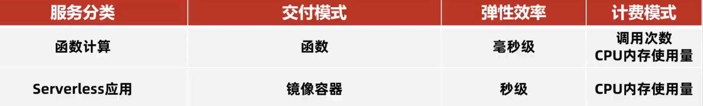


#### 案例3：将程序部署到阿里云 Serverless 应用

步骤：

1. 在项目中编写 Dockerfile 文件。
2. 使用服务器制作镜像，这一步会消耗大量的 CPU 和内存资源。
3. 配置 Serverless 应用，选择容器镜像、CPU 和内存。
4. 绑定外网负载均衡并使用 Postman 进行测试。


### 1.4 参数优化和故障诊断

#### GraalVM 的内存参数

由于 GraalVM 是一款独立的 JDK，所以大部分 HotSpot 中的虚拟机参数都不适用。常用参数可参考 [官方文档](https://www.graalvm.org/22.3/reference-manual/native-image/optimizations-and-performance/MemoryManagement/)。

- 社区版只能使用串行垃圾回收器 (Serial GC)，使用串行垃圾回收器的默认最大 Java 堆大小会设置为物理内存大小的 80%，调整方式为使用 `-Xmx最大堆大小`。如果希望在编译期就指定该大小，可以在编译时添加参数 `-R:MaxHeapSize=最大堆大小`。
- G1 垃圾回收器只能在企业版中使用，开启方式为添加 `--gc=G1` 参数，有效降低垃圾回收的延迟。
- 另外提供一个 Epsilon GC，开启方式：`--gc=epsilon`，它不会产生任何的垃圾回收行为，所以没有额外的内存、CPU 开销。如果在公有云上运行的程序生命周期短暂且不产生大量的对象 (函数计算)，可以使用该垃圾回收器，以节省最大的资源。

`-XX:+PrintGC -XX:+VerboseGC`  参数打印垃圾回收详细信息。


#### 案例4：内存快照文件的获取

需求：获取运行中的内存快照文件，使用 MAT 进行分析。

步骤：

1. 编译程序时，添加 `--enable-monitoring=heapdump`，参数添加到 pom 文件的对应插件中。

   ```xml
   <plugin>
       <groupId>org.graalvm.buildtools</groupId>
       <artifactId>native-maven-plugin</artifactId>
       <configuration>
           <buildArgs>
               <arg>--enable-monitoring=heapdump</arg>
           </buildArgs>
       </configuration>
   </plugin>
   ```

2. 运行中使用 `kill -SIGUSR1 进程ID` 命令，创建内存快照文件。

3. 使用 MAT 分析内存快照文件。


#### 案例5：运行时数据的获取

JDK Flight Recorder (JFR) 是一个内置于 JVM 中的工具，可以收集正在运行中的 Java 应用程序的诊断和分析数据，比如线程、异常等内容。GraalVM 本地镜像也支持使用 JFR 生成运行时数据，导出的数据可以使用 VisualVM 分析。

步骤：

1. 编译程序时，添加 `--enable-monitoring=jfr`，参数添加到 pom 文件的对应插件中。、

   ```xml
   <plugin>
       <groupId>org.graalvm.buildtools</groupId>
       <artifactId>native-maven-plugin</artifactId>
       <configuration>
           <buildArgs>
               <arg>--enable-monitoring=heapdump,jfr</arg>
           </buildArgs>
       </configuration>
   </plugin>
   ```

2. 运行程序，添加 `-XX:StartFlightRecording=filename=recording.jfr,duration=10s` 参数。

3. 使用 VisualVM 分析 JFR 记录文件。


### 1.5 总结

1. 什么是 GraalVM ？

   GraalVM 是 Oracle 官方推出的一款高性能 JDK，具备两种模式，JIT 模式使用方式与 Oracle JDK 相同；使用 AOT 模式制作的本地镜像，具备启动速度快、CPU 和内存占用率低的优点，分为免费的社区版和收费的企业版，企业版有比社区版更好的性能。

2. 什么场景下使用 GraalVM ？

   1.希望拥有更好的性能，使用 JIT 模式或者升级为企业版。

   2.执行时间较短的业务，使用 GraalVM 生成本地镜像，发布到函数计算云服务。

   3.执行时间较长的业务，比如长时间的计算任务，使用 GraalVM 生成本地镜像，发布到 Serverless 容器云服务。


## 2. 新一代的 GC

### 2.1 垃圾回收器的技术演进

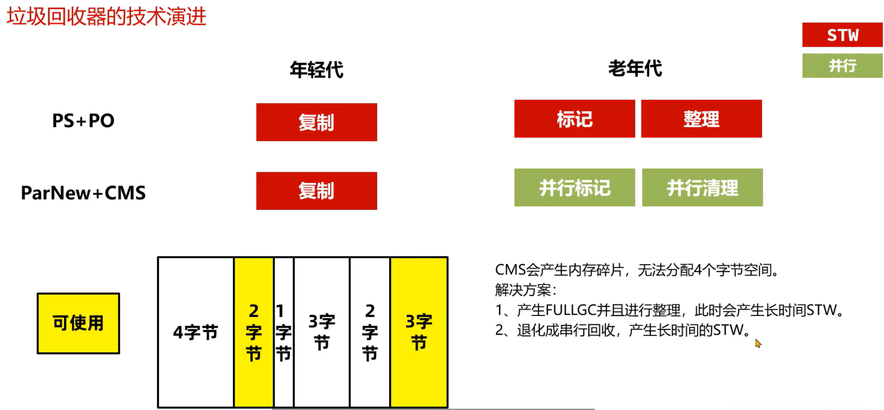

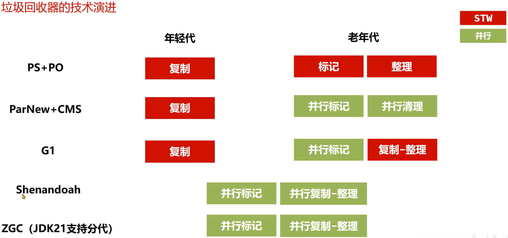


不同垃圾回收器设计的目标是不同的，如下图所示：

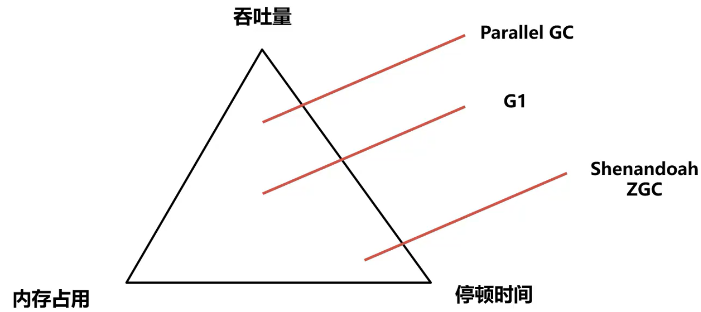


### 2.2 Shenandoah GC

####  什么是 Shenandoah？

Shenandoah 是由 Red Hat 开发的一款低延迟的垃圾收集器，Shenandoah 并发执行大部分 GC 工作，包括并发地整理，堆大小对 STW 的时间基本没有影响。

> 由于是 Red Hat 开发的，所以 oracle jdk 中不包含 Shenandoah，需要在 open jdk 中使用 Shenandoah。


#### Shenandoah 的使用方法

1. 下载。Shenandoah 只包含在 OpenJDK 中，默认不包含在内，需要单独构建，可以下载构建好的版本。

   下载地址：https://builds.shipilev.net/openjdk-jdk-shenandoah/

   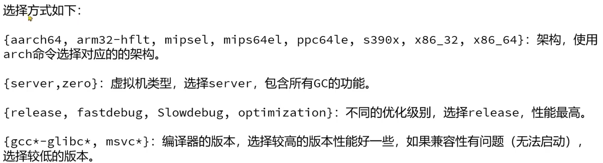

2. 配置。将 OpenJDK 配置到环境变量中，使用 java -version 进行测试。

3. 添加参数，运行 Java 程序。

   `-xx:+UseShenandoahGC` 开启 Shenandoah GC

   `-Xlog:gc` 打印 GC 日志


测试代码

```java
// 执行5轮预热，每次持续2秒
@Warmup(iterations = 5, time = 2, timeUnit = TimeUnit.SECONDS)
// 输出毫秒单位
@OutputTimeUnit(TimeUnit.MILLISECONDS)
// 统计方法执行的平均耗时
@BenchmarkMode(Mode.AverageTime)
// java -jar benchmark.jar -rf json
@State(Scope.Benchmark)
public class MyBenchMark {

    // 每次测试的对象大小4KB和4MB
    @Param({"4", "4096"})
    int perSize;

    private void test(Blackhole bh) {

        // 每次循环创建占堆内存60%的对象 JMX获取到Java运行中的实时数据
        MemoryMXBean memoryMXBean = ManagementFactory.getMemoryMXBean();
        // 获取堆内存大小
        MemoryUsage heapMemoryUsage = memoryMXBean.getHeapMemoryUsage();
        // 获取到剩余的堆内存大小
        long heapSize = (long) ((heapMemoryUsage.getMax() - heapMemoryUsage.getUsed()) * 0.6);
        // 计算循环次数
        long size = heapSize / (1024 * perSize);

        for (int i = 0; i < 4; i++) {
            List<byte[]> objects = new ArrayList<>((int) size);
            for (int j = 0; j < size; j++) {
                objects.add(new byte[1024 * perSize]);
            }
            bh.consume(objects);
        }
    }

    @Benchmark
    @Fork(value = 1, jvmArgsAppend = {"-Xms4g","-Xmx4g","-XX:+UseSerialGC"})
    public void serialGC(Blackhole bh) {
        test(bh);
    }

    @Benchmark
    @Fork(value = 1, jvmArgsAppend = {"-Xms4g","-Xmx4g","-XX:+UseParallelGC"})
    public void parallelGC(Blackhole bh) {
        test(bh);
    }

    @Benchmark
    @Fork(value = 1, jvmArgsAppend = {"-Xms4g","-Xmx4g"})
    public void g1(Blackhole bh) {
        test(bh);
    }

    @Benchmark
    @Fork(value = 1, jvmArgsAppend = {"-Xms4g","-Xmx4g", "-XX:+UseShenandoahGC"})
    public void shenandoahGC(Blackhole bh) {
        test(bh);
    }

    public static void main(String[] args) throws RunnerException {
        Options opt = new OptionsBuilder()
                .include(MyBenchMark.class.getSimpleName())
                .forks(1)
                .build();
        new Runner(opt).run();
    }
}
```

使用 maven 打包项目 jar 包。

执行命令，并生成 json 文件

```bash
java -jar gc-benchmark -rf json
```

将生成的 json 文件上传 https://jmh.morethan.io 进行分析


### 2.3 ZGC

#### 什么是 ZGC？

ZGC 是一种可扩展的低延迟垃圾回收器。ZGC 在垃圾回收过程中，STW 的时间不会超过一毫秒，适合需要低延迟的应用。支持几百兆到 16TB 的堆大小，堆大小对 STW 的时间基本没有影响。

ZGC 降低了停顿时间，能降低接口的最大耗时，提升用户体验。但是吞吐量不佳，所以如果 Java 服务比较关注 QPS (每秒的查询次数) 那么 G1 是比较不错的选择。

#### ZGC 的版本更迭

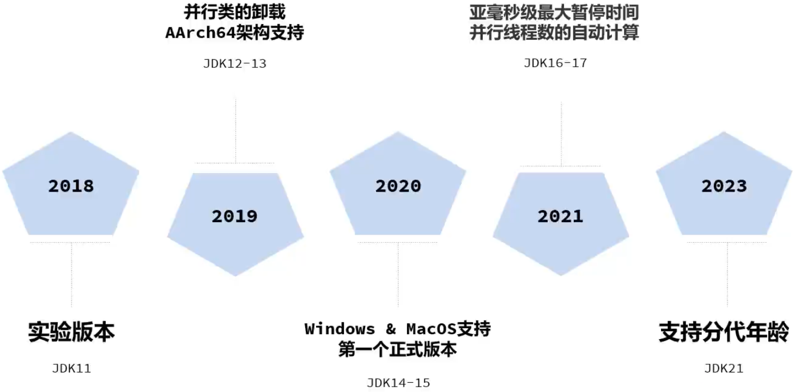

#### ZGC 的使用方法

OracleJDK 和 OpenJDK 都支持 ZGC，阿里的 DragonWell 龙井 JDK 也支持 ZGC，但属于对 OpenJDK11 的 ZGC 自行研究优化的版本。

建议使用 JDK17 之后的版本，延迟较低同时无需手动赔偿并行线程数。

- 分代 ZGC 添加参数 `-XX:+UseZGC -XX:+ZGenerational` 启用
- 非分代 ZGC 通过参数 `-XX:+UseZGC` 启用

#### ZGC 的参数设置

ZGC 在设计上做到了自适应，根据运行情况自动调整参数，让用户手动配置的参数最少化。

- 自动设置年轻代大小，无需设置 -Xmn 参数
- 自动设置晋升阈值 (在年轻代中复制存活多少次才搬运到老年代)，无需设置 `-XX:TenuringThreshold`
- JDK17 之后支持自动设置并行线程数，无需设置 `-XX:ConcGCThreads`

需要设置的参数：

`-Xmx值` 最大堆内存大小

这是 ZGC 最重要的一个参数，必须设置。ZGC 在运行过程中会使用一部分内存用来处理垃圾回收，所以尽量保证堆中有足够的空间。设置多少值取决于对象分配的速度，根据测试情况来决定。

可以设置的参数：

`-XX:SoftMaxHeapSize=值`

ZGC 会尽量保证堆内存小于该值，这样在内存靠近这个值时会尽早地进行垃圾回收，但是依然有可能会超过该值。例如，`-Xmx5g -XX:SoftMaxHeapSize=4g` 这个参数设置，ZGC 会尽量保证堆内存小于 4GB，最多不会超过 5GB。

#### ZGC 的优化

ZGC 中可以使用 Linux 的 Huge Page 大页技术优化性能，提升吞吐量、降低延迟。

注意：安装过程需要 root 权限，所以 ZGC 默认没有开启此功能。

操作步骤：

1. 计算所需页数，Linux x86 架构中大页大小为 2MB，根据所需堆内存的大小估算大页数量。比如堆空间需要 16G，预留 2G (JVM 需要额外的一些非堆空间)，那么页数就是 18G / 2MB = 9216。

2. 配置系统的大页池以具有所需的页数 (需要 root 权限)

   ```bash
   echo 9216 > /sys/kernel/mm/hugepages/hugepages-2048kB/nr_hugepages
   ```

3. 添加参数 `-XX:+UseLargePages` 启动程序进行测试


### 2.4 实战案例

#### 实战案例：内存不足时的垃圾回收测试

需求：Java 服务中存在大量软引用的缓存导致内存不足，测试下 g1、Shenandoah、ZGC 这三种垃圾回收器在这种场景下的回收情况。

步骤：

1. 启动程序，添加不同的虚拟机参数进行测试。
2. 使用 Apache Benchmark 测试工具对本机进行压测。
3. 生成 GC 日志，使用 GCeasy 进行分析。
4. 对比压测之后的结果。

测试代码

```java
@RestController
@RequestMapping("/fullgc")
public class FullGcController {
    private Cache cache = Caffeine.newBuilder().weakKeys().softValues().build();
    private List<Object> objs = new ArrayList<>();

    private static final int _1MB = 1024 * 1024;

    // FullGC 测试
    // -Xms8g -Xmx8g -Xss256k -XX:MaxMetaspaceSize=512m -XX:+DisableExplicitGC -XX:+HeapDumpOnOutOfMemoryError
    // -XX:HeapDumpPath=my-service.hprof -XX:+PrintGCDetails -XX:+PrintGCDateStamps -Xloggc:文件路径

    // ps + po
    // 50并发：xxx 100并发：xxx 200并发：xxx
    // cms -XX:+UseParNewGC -XX:+UseConcMarkSweepGC
    // 50并发：xxx 100并发：xxx 200并发：xxx
    // g1 jdk11
    // 50并发：xxx 100并发：xxx 200并发：xxx
    @GetMapping("/1")
    public void test() {
        cache.put(RandomStringUtils.randomAlphabetic(8), new byte[10 * _1MB]);
    }
```

打包项目为 performance.jar，执行命令测试

使用 ZGC

```bash
java -jar -Xms4g -Xmx4g -Xss256k -XX:MaxMetaspaceSize=512m -XX:+DisableExplicitGC -XX:+UseZGC -XX:+ZGenerational -Xlog:gc*:file=zgc.log performance.jar
```

使用 Apache Benchmark 测试工具测试，`-n 10000` 执行 10000 次请求，`-c 100` 使用 100 个并发线程。建议执行两次，第一次用于预热，实际结果取第二次。

```bash
ab -n 10000 -c 100 http://localhost:8080/fullgc/1
```

使用 Shenandoah GC

```bash
java -jar -Xms4g -Xmx4g -Xss256k -XX:MaxMetaspaceSize=512m -XX:+DisableExplicitGC -XX:+UseShenandoahGC -Xlog:gc*:file=shenandoahgc.log performance.jar
```

重新使用 Apache Benchmark 预热、测试。

使用 G1

```bash
java -jar -Xms4g -Xmx4g -Xss256k -XX:MaxMetaspaceSize=512m -XX:+DisableExplicitGC -Xlog:gc*:file=g1.log performance.jar
```

重新使用 Apache Benchmark 预热、测试。

将三份 GC 日志上传 GCeasy 进行分析。


#### 总结

ZGC 和 Shenandoah 设计的目标都是追求较短的停顿时间，他们具体的使用场景如下：

两种垃圾回收器在并行回收时都会使用垃圾回收线程占用 CPU 资源

1. 在内存足够的情况下，ZGC 垃圾回收表现的效果会更好，停顿时间更短。
2. 在内存不是特别充足的情况下，Shenandoah GC 表现更好，并行垃圾回收的时间较短，用户请求的执行效率比较高。


## 3. 揭秘 Java 工具

Java 工具的介绍

在 Java 的世界中，除了 Java 编写的业务系统之外，还有一类程序也需要 Java 开发者参与编写，这类程序就是 Java 工具。

常见的 Java 工具有以下几类：

1. 诊断类工具，如 Arthas、VisualVM 等。
2. 开发类工具，如 Idea、Eclipse 等。
3. APM 应用性能检测工具，如 Skywalking、Zipkin 等。
4. 热部署工具，如 Jrebel 等。

问题：

- Arthas 这款工具用到了什么 Java 技术，有没有了解过？
- 微服务架构中常用的 APM 系统，可以监控微服务的性能，你知道它是怎么实现的吗？
- 我们想实现动态检测 Java 程序运行情况的系统，你有类似的经历吗？

学习路线：

1. 学习 Java 工具常用技术 Java Agent

2. 了解 Arthas、VisualVM、APM 系统等底层实现

3. 实战案例

   简化版 Arthas

   性能监控工具

### 3.1 Java 工具的核心：Java Agent 技术

#### Java Agent 技术

Java Agent 技术是 JDK 提供的用来编写 Java 工具的技术，使用这种技术生成一种特殊的 jar 包，这种 jar 包可以让 Java 程序运行其中的代码。

#### Java Agent 技术的两种模式

Java Agent 技术实现了让 Java 程序执行独立的 Java Agent 程序中的代码，执行方式有两种：

- 静态加载模式
- 动态加载模式

##### Java Agent 技术的两种模式 - 静态加载模式

静态加载模式可以在程序启动的一开始就执行我们需要执行的代码，适合用 APM 等性能监测系统从一开始就监控程序的执行性能。静态加载模式需要在 Java Agent 的项目中编写一个 premain 的方法，并打包成 jar 包。

```java
public static void premain(String agentArgs, Instrumentation inst) {}
```

接下来使用以下命令启动 Java 程序，此时 Java 虚拟机将会加载 agent 中的代码并执行。

```bash
java -javaagent:./agent.jar -jar test.jar
```

premain 方法会在主线程中执行


##### Java Agent 技术的两种模式 - 动态加载模式

动态加载模式可以随时让 java agent 代码执行，使用 Arthas 等诊断系统。动态加载模式需要在 Java Agent 的项目中编写一个 agentmain 的方法，并打包成 jar 包。

```java
public static void agentmain(String agentArgs, Instrumentation inst) {}
```

接下来使用以下代码就可以让 java agent 代码在指定的 java 进程中执行了。

```java
VirtualMachine vm = VirtualMachine.attach("24200"); // 动态连接到24200进程ID的Java程序
vm.loadAgent("agent.jar"); // 加载java agent
```

agentmain 方法会在独立线程中执行


##### 搭建 java agent 静态加载模式的环境

步骤：

1. 创建 maven 项目，添加 maven-assembly-plugin 插件，此插件可以打包出 java agent 的 jar 包。
2. 编写类和 premain 方法，premain 方法中打印一行信息。
3. 编写 MANIFEST.MF 文件，此文件主要用于描述 java agent 的配置属性，比如使用哪一个类的 premain 方法。
4. 使用 maven-assembly-plugin 进行打包。
5. 创建 spring boot 应用，并静态加载上一步打包完的 java agent。

pom.xml

```xml
<build>
    <plugins>
        <plugin>
            <groupId>org.apache.maven.plugins</groupId>
            <artifactId>maven-assembly-plugin</artifactId>
            <version>2.2-beta-5</version>
            <configuration>
                <!-- 将所有依赖打包到同一个jar包中 -->
                <descriptorRefs>
                    <descriptorRef>jar-with-dependencies</descriptorRef>
                </descriptorRefs>
                <!-- 指定java agent相关配置文件 -->
                <archive>
                    <manifestFile>src/main/resources/MANIFEST.MF</manifestFile>
                </archive>
            </configuration>
        </plugin>
    </plugins>
</build>
```

AgentMain

```java
public class AgentMain {
    // premain方法
    public static void premain(String agentArgs, Instrumentation inst) {
        System.out.println("premain执行了....");
    }
}
```

 MANIFEST.MF

```
Manifest-Version: 1.0
Premain-Class: com.entropy.agent.AgentMain
Agent-Class: com.entropy.agent.AgentMain
Can-Redefine-Classes: true
Can-Retransform-Classes: true
Can-Set-Native-Method-Prefix: true

```

单独编写一个简单的 SpringBootDemoApplication

```java
@SpringBootApplication
public class SpringBootDemoApplication {
    public static void main(String[] args) {
        System.out.println("main执行了....");
        SpringApplication.run(SpringBootDemoApplication.class, args);
    }
}
```

执行命令测试静态加载模式。

```bash
java -javaagent:./agent.jar -jar demo.jar
```


##### 搭建 java agent 动态加载模式的环境

步骤：

1. 创建 maven 项目，添加 maven-assembly-plugin 插件，此插件可以打包出 java agent 的 jar 包。
2. 编写类和 agentmain 方法，agentmain 方法中打印一行信息。
3. 编写 MANIFEST.MF 文件，此文件主要用于描述 java agent 的配置属性，比如使用哪一个类的 agentmain 方法。
4. 使用 maven-assembly-plugin 进行打包。
5. 编写 main 方法，动态连接到运行中的 java 程序。

AgentMain

```java
public class AgentMain {
    // premain方法
    public static void premain(String agentArgs, Instrumentation inst) {
        System.out.println("premain执行了....");
    }

    public static void agentmain(String agentArgs, Instrumentation inst) {
        System.out.println("agentmain执行了....");
    }
}

```

AttachMain，进程 ID 需要提前启动一个 spring boot 程序获取，jar 包路径使用绝对路径

```java
public class AttachMain {
    public static void main(String[] args) throws IOException, AttachNotSupportedException, AgentLoadException, AgentInitializationException {
        // 获取进程虚拟机对象
        VirtualMachine vm = VirtualMachine.attach("5774");
        // 执行java agent中的agentmain方法
        vm.loadAgent("/path/to/agent-1.0-SNAPSHOT-jar-with-dependencies.jar");
    }
}
```

agentmain 中的方法会在 spring boot 程序的控制台上输出。

注意：动态加载模式在修改了 agentmain 方法并重新打包后，需要将目标连接程序重启才能使用新的 agentmain 方法。这样有个问题就是每次重启目标连接程序都需要重新获取新的进程 ID，可以获取当前的进程列表进行选择 (Arthas 的实现策略，下文给出简化版的实现)。

根据进程列表手动输入进程 ID 实现连接

```java
public class AttachMain {
    public static void main(String[] args) throws IOException, AttachNotSupportedException, AgentLoadException, AgentInitializationException {
        // 获取进程列表，手动选择
        // 1.执行jps命令，打印进程列表
        Process jps = Runtime.getRuntime().exec("jps");
        BufferedReader bufferedReader = new BufferedReader(new InputStreamReader(jps.getInputStream()));
        try (bufferedReader) {
            String line;
            while ((line = bufferedReader.readLine()) != null) {
                System.out.println(line);
            }
        }
        // 2.输入进程id
        Scanner scanner = new Scanner(System.in);
        String processId = scanner.next();

        // 获取进程虚拟机对象
        VirtualMachine vm = VirtualMachine.attach(processId);
        // 执行java agent中的agentmain方法
        vm.loadAgent("/path/to/agent-1.0-SNAPSHOT-jar-with-dependencies.jar");
    }
}
```

> 该代码使用了 try-with-resources 特性，且只支持 JDK9 以上版本，JDK9以下版本使用 try-finally 即可。


### 3.2 实战案例1：简化版的 Arthas

#### 功能性需求

编写一个简化版的 Arthas 程序，具备以下几个功能：

1. 查看内存使用情况
2. 生成堆内存快照
3. 打印栈信息
4. 打印类加载器
5. 打印类的源码
6. 打印方法的参数和耗时

#### 非功能性需求

该程序是一个独立的 jar 包，可以应用于任何 Java 编写的系统中。

具备以下特点：代码无侵入性、操作简单、性能高。


#### 获取运行时信息 - JMX 技术

JDK 从 1.5 开始提供了 Java Management Extensions (JMX) 技术，通过 Mbean 对象的写入和获取，实现：

- 运行时配置的获取和更改
- 应用程序运行信息的获取 (线程栈、内存、类信息等)

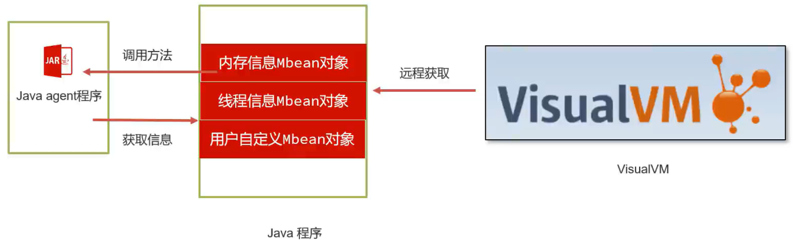

获取 JVM 默认提供的 Mbean 可以通过如下的方式，例如获取内存信息：

```java
ManagementFactory.getMemoryPoolMXBeans()
```

ManagementFactory 提供了一系列的方法获取各种各样的信息：

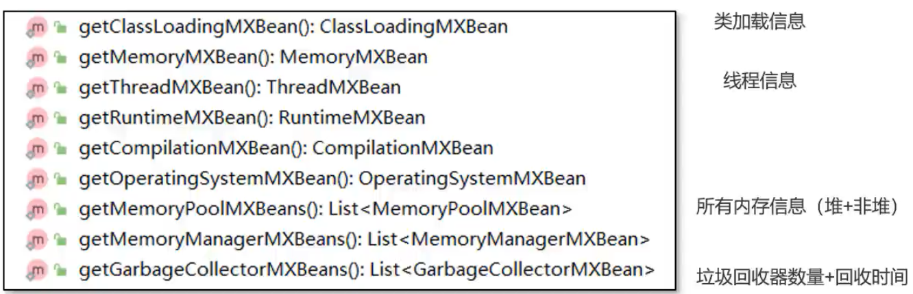

#### 查看内存使用情况

打印所有内存信息实现

```java
public class MemoryCommand {

    // 打印所有内存信息
    public static void printMemory() {
        List<MemoryPoolMXBean> memoryPoolMXBeans = ManagementFactory.getMemoryPoolMXBeans();

        // 堆内存
        System.out.println("堆内存:");
        getMemoryInfo(memoryPoolMXBeans, MemoryType.HEAP);
        // 非堆内存
        System.out.println("非堆内存:");
        getMemoryInfo(memoryPoolMXBeans, MemoryType.NON_HEAP);
    }

    private static void getMemoryInfo(List<MemoryPoolMXBean> memoryPoolMXBeans, MemoryType heap) {
        memoryPoolMXBeans.stream().filter(x -> x.getType().equals(heap))
                .forEach(x -> {
                    StringBuilder sb = new StringBuilder();
                    sb.append("name:")
                            .append(x.getName())
                            .append(" used:")
                            .append(x.getUsage().getUsed() / 1024 / 1024)
                            .append("m")

                            .append(" committed:")
                            .append(x.getUsage().getCommitted() / 1024 / 1024)
                            .append("m")

                            .append(" max:")
                            .append(x.getUsage().getMax() / 1024 / 1024)
                            .append("m");
                    System.out.println(sb);
                });
    }
}
```

在 agentmain 方法中调用 printMemory

```java
public class AgentMain {
    public static void agentmain(String agentArgs, Instrumentation inst) {
        MemoryCommand.printMemory();
    }
}
```

重新使用 maven-assembly-plugin 插件打包，启动 spring boot 项目，运行 AttachMain 的 main 方法连接进程，输出内存信息。

注意：G1 垃圾回收器堆内存 Eden 区和 Survivor 区如果没有设置 max 大小，默认值为 -1，-1 / 1024 / 1024 = 0，所以控制台可能看到它们的max 显示为 0m。同理非堆内存的 metaspace 大小也是默认为 -1。

使用 `-XX:+UseSerialGC` 参数测试其它垃圾回收器的内存信息。


#### 查看直接内存使用情况，生成堆内存快照

更多的信息可以通过 ManagementFactory.getPlatformMXBeans 获取，比如：

```java
Class bufferPoolMXBeanClass = Class.forName("java.lang.manaegement.BufferPoolMXBean");
List<BufferPoolMXBean> bufferPoolMXBeans = ManagementFactory.getPlatformMXBeans(bufferPoolMXBeanClass);
```

通过这种方式，获取到了 Java 虚拟机中分配的直接内存和内存映射缓冲区的大小。


```java
HotSpotDiagnosticMXBean hotSpotDiagnosticMXBean = ManagementFactory.getPlatformMXBean(HotSpotDiagnosticMXBean.class);
```

获取到虚拟机诊断用的 MXBean，通过这个 Bean 对象可以生成内存快照。


在 MemoryCommand 类的 printMemory 方法增加打印 nio 相关内存的功能代码

```java
public static void printMemory() {
    List<MemoryPoolMXBean> memoryPoolMXBeans = ManagementFactory.getMemoryPoolMXBeans();

    // 堆内存
    System.out.println("堆内存:");
    getMemoryInfo(memoryPoolMXBeans, MemoryType.HEAP);
    // 非堆内存
    System.out.println("非堆内存:");
    getMemoryInfo(memoryPoolMXBeans, MemoryType.NON_HEAP);
    // 打印nio相关内存
    System.out.println("nio相关内存:");
    try {
        Class clazz = Class.forName("java.lang.management.BufferPoolMXBean");
        List<BufferPoolMXBean> bufferPoolMXBeans = ManagementFactory.getPlatformMXBeans(clazz);

        // 打印内容
        for (BufferPoolMXBean bufferPoolMXBean : bufferPoolMXBeans) {
            StringBuilder sb = new StringBuilder();
            sb.append("name:")
                .append(bufferPoolMXBean.getName())
                .append(" used:")
                .append(bufferPoolMXBean.getMemoryUsed() / 1024 / 1024)
                .append("m")

                .append(" capacity:")
                .append(bufferPoolMXBean.getTotalCapacity() / 1024 / 1024)
                .append("m");
            System.out.println(sb);
        }
    } catch (ClassNotFoundException e) {
        throw new RuntimeException(e);
    }
}
```

每次修改都需要重新用 maven-assembly-plugin 插件打包才能生效。

在启动类中手动申请直接内存

```java
@SpringBootApplication
public class SpringBoot3NativeDemoApplication {

	public static void main(String[] args) {
		ByteBuffer byteBuffer = ByteBuffer.allocateDirect(1024 * 1024 * 100);
		System.out.println("main方法执行了....");
		byte b = byteBuffer.get();
		SpringApplication.run(SpringBoot3NativeDemoApplication.class, args);
	}

}
```

启动项目，使用 AttachMain 连接进程进行测试。


在 MemoryCommand 中添加生成内存快照的代码

```java
// 生成内存快照
public static void heapDump() {
    SimpleDateFormat simpleDateFormat = new SimpleDateFormat("yyyy-MM-dd-HH-mm");
    HotSpotDiagnosticMXBean hotSpotDiagnosticMXBean = ManagementFactory.getPlatformMXBean(HotSpotDiagnosticMXBean.class);
    try {
        hotSpotDiagnosticMXBean.dumpHeap(simpleDateFormat.format(new Date()) + ".hprof", true);
    } catch (IOException e) {
        throw new RuntimeException(e);
    }
}
```

在 agentmain 方法中调用

```java
public static void agentmain(String agentArgs, Instrumentation inst) {
    MemoryCommand.heapDump();
}
```

重新打包，使用 AttachMain 连接进程测试。

#### 打印栈信息

ThreadCommand 实现

```java
public class ThreadCommand {
    // 获取线程运行信息
    public static void printThreadInfo() {
        ThreadMXBean threadMXBean = ManagementFactory.getThreadMXBean();
        ThreadInfo[] threadInfos = threadMXBean.dumpAllThreads(threadMXBean.isObjectMonitorUsageSupported(),
                threadMXBean.isSynchronizerUsageSupported());

        // 打印线程信息
        for (ThreadInfo threadInfo : threadInfos) {
            StringBuilder sb = new StringBuilder();
            sb.append("name:")
                    .append(threadInfo.getThreadName())
                    .append(" threadId:")
                    .append(threadInfo.getThreadId())
                    .append(" threadState:")
                    .append(threadInfo.getThreadState());
            System.out.println(sb);

            // 打印栈信息
            StackTraceElement[] stackTrace = threadInfo.getStackTrace();
            for (StackTraceElement stackTraceElement : stackTrace) {
                System.out.println(stackTraceElement);
            }
        }
    }
}
```

在 agentmain 中调用

```java
public static void agentmain(String agentArgs, Instrumentation inst) {
    ThreadCommand.printThreadInfo();
}
```

重新打包，使用 AttachMain 连接进程测试。

#### 获取类和类加载器的信息 - Instrumentation 对象

Java Agent 中可以获得 Java 虚拟机提供的 Instrumentation 对象

该对象有以下几个作用：

1. redefine，重新设置类的字节码信息。
2. retransform，根据现有类的字节码信息进行增强。
3. 获取所有已加载的类信息。

Oracle 官方手册 https://docs.oracle.com/en/java/javase/21/docs/api/java.instrument/java/lang/instrument/Instrumentation.html

ClassCommand 实现

```java
public class ClassCommand {
    // 打印所有类加载器
    public static void printAllClassLoader(Instrumentation inst) {
        Set<ClassLoader> classLoaders = new HashSet<>();
        // 获取所有类
        Class[] allLoadedClasses = inst.getAllLoadedClasses();

        for (Class allLoadedClass : allLoadedClasses) {
            ClassLoader classLoader = allLoadedClass.getClassLoader();
            classLoaders.add(classLoader);
        }

        // 打印类加载器
        String str = classLoaders.stream().map(x -> {
            if (x == null) {
                return "BootStrapClassLoader";
            } else {
                return x.getName();
            }
        }).filter(Objects::nonNull).distinct().sorted(String::compareTo).collect(Collectors.joining(","));

        System.out.println(str);
    }
}
```

注意：有些类加载器的名字为 null，例如 DelegatingClassLoader，这些类加载器不是重点关注对象，可以过滤掉。


#### 打印类的源码

打印类的源码需要分为以下几个步骤

1. 获得内存中的类的字节码信息，利用 Instrumentation 提供的转换器来获取字节码信息。

2. 通过反编译工具将字节码信息还原成源代码信息。

   这里可以使用 jd-core 依赖库来完成，github 地址 https://github.com/java-decompiler/jd-core

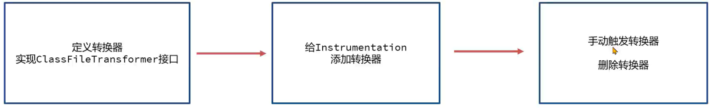


在 ClassCommand 中新增方法获取字节码信息

```java
// 打印类的源代码
public static void printClassSourceCode(Instrumentation inst) {
    System.out.println("请输入类名:");
    // 手动输入类名
    Scanner scanner = new Scanner(System.in);
    String className = scanner.next();

    // 根据类名找到class对象
    Class[] allLoadedClasses = inst.getAllLoadedClasses();
    for (Class allLoadedClass : allLoadedClasses) {
        if (allLoadedClass.getName().equals(className)) {
            //System.out.println(allLoadedClass);

            ClassFileTransformer transformer = new ClassFileTransformer() {
                @Override
                public byte[] transform(ClassLoader loader, String className, Class<?> classBeingRedefined, ProtectionDomain protectionDomain, byte[] classfileBuffer) throws IllegalClassFormatException {
                    System.out.println("字节码信息:" + classfileBuffer);
                    return ClassFileTransformer.super.transform(loader, className, classBeingRedefined, protectionDomain, classfileBuffer);
                }
            };

            // 1.添加转换器
            inst.addTransformer(transformer, true);

            // 2.手动触发转换
            try {
                inst.retransformClasses(allLoadedClass);
            } catch (UnmodifiableClassException e) {
                throw new RuntimeException(e);
            } finally {
                // 3.删除转换器
                inst.removeTransformer(transformer);
            }
        }
    }
}
```

重新打包，使用 AttachMain 连接进程，手动输入类名测试输出。


引入 jd-core 依赖，注意该依赖只支持 JDK8-JDK12 之间的版本。

```xml
<dependencies>
    <dependency>
        <groupId>org.jd</groupId>
        <artifactId>jd-core</artifactId>
        <version>1.1.3</version>
    </dependency>
</dependencies>
```

增加 printJDCoreSourceCode 反编译源代码，并在 ClassFileTransformer 转换器中调用

```java
// 打印类的源代码
public static void printClassSourceCode(Instrumentation inst) {
    System.out.println("请输入类名:");
    // 手动输入类名
    Scanner scanner = new Scanner(System.in);
    String className = scanner.next();

    // 根据类名找到class对象
    Class[] allLoadedClasses = inst.getAllLoadedClasses();
    for (Class allLoadedClass : allLoadedClasses) {
        if (allLoadedClass.getName().equals(className)) {
            //System.out.println(allLoadedClass);

            ClassFileTransformer transformer = new ClassFileTransformer() {
                @Override
                public byte[] transform(ClassLoader loader, String className, Class<?> classBeingRedefined, ProtectionDomain protectionDomain, byte[] classfileBuffer) throws IllegalClassFormatException {
                    //System.out.println("字节码信息:" + classfileBuffer);

                    // 通过jd-core反编译并打印源代码
                    try {
                        printJDCoreSourceCode(classfileBuffer, className);
                    } catch (Exception e) {
                        throw new RuntimeException(e);
                    }
                    return ClassFileTransformer.super.transform(loader, className, classBeingRedefined, protectionDomain, classfileBuffer);
                }
            };

            // 1.添加转换器
            inst.addTransformer(transformer, true);

            // 2.手动触发转换
            try {
                inst.retransformClasses(allLoadedClass);
            } catch (UnmodifiableClassException e) {
                throw new RuntimeException(e);
            } finally {
                // 3.删除转换器
                inst.removeTransformer(transformer);
            }
        }
    }
}

// 通过jd-core打印源代码
private static void printJDCoreSourceCode(byte[] bytes, String className) throws Exception {
    // loader对象
    Loader loader = new Loader() {
        @Override
        public byte[] load(String internalName) throws LoaderException {
            return bytes;
        }

        @Override
        public boolean canLoad(String internalName) {
            return true;
        }
    };

    // printer对象
    Printer printer = new Printer() {
        protected static final String TAB = "  ";
        protected static final String NEWLINE = "\n";

        protected int indentationCount = 0;
        protected StringBuilder sb = new StringBuilder();

        @Override public String toString() { return sb.toString(); }

        @Override public void start(int maxLineNumber, int majorVersion, int minorVersion) {}
        @Override public void end() {
            // 打印源代码
            System.out.println(sb);
        }

        @Override public void printText(String text) { sb.append(text); }
        @Override public void printNumericConstant(String constant) { sb.append(constant); }
        @Override public void printStringConstant(String constant, String ownerInternalName) { sb.append(constant); }
        @Override public void printKeyword(String keyword) { sb.append(keyword); }
        @Override public void printDeclaration(int type, String internalTypeName, String name, String descriptor) { sb.append(name); }
        @Override public void printReference(int type, String internalTypeName, String name, String descriptor, String ownerInternalName) { sb.append(name); }

        @Override public void indent() { this.indentationCount++; }
        @Override public void unindent() { this.indentationCount--; }

        @Override public void startLine(int lineNumber) { for (int i=0; i<indentationCount; i++) sb.append(TAB); }
        @Override public void endLine() { sb.append(NEWLINE); }
        @Override public void extraLine(int count) { while (count-- > 0) sb.append(NEWLINE); }

        @Override public void startMarker(int type) {}
        @Override public void endMarker(int type) {}
    };

    // 通过jd-core方法打印
    ClassFileToJavaSourceDecompiler decompiler = new ClassFileToJavaSourceDecompiler();

    decompiler.decompile(loader, printer, className);

}
```

重新打包，使用 AttachMain 连接进程，手动输入类名测试输出。


#### 打印方法执行的参数和耗时

问题：Spring AOP 是不是也可以实现类似的功能？

Spring AOP 确实可以实现统计方法执行时间，打印方法参数等功能，但是使用这种方式存在几个问题：

1. 代码具有侵入性，AOP 代码必须在当前项目中被引入才能完成相应的功能。
2. 无法做到灵活地开启和关闭功能。
3. 与 Spring 框架强耦合，如果项目没有使用 Spring 框架就无法使用 AOP。

使用 Java Agent 技术 + 字节码增强技术，就可以解决上述三个问题。

打印方法执行的参数和耗时

打印方法执行的参数和耗时需要对原始类的方法进行增强，可以使用类似于 Spring AOP 这类面向切面编程的方式，但是考虑到并非每个项目都使用了 Spring 这些框架，所以我们选择的是最基础的字节码增强框架。字节码增强框架是在当前类的字节码信息中插入一部分字节码指令，从而起到增强的作用。

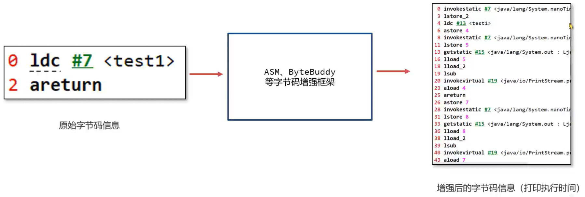

##### 打印方法执行的参数和耗时 - ASM

ASM 是一个通用的 Java 字节码操作和分析框架，它可以用于直接以二进制形式修改现有类或动态生成类。

ASM 重点关注性能，让操作尽可能小且尽可能快，所以它非常适合在动态系统中使用。

ASM 的缺点是代码复杂。

ASM 官方地址：https://asm.ow2.io/

操作步骤：

1. 引入依赖

   ```xml
   <dependency>
       <groupId>org.ow2.asm</groupId>
       <artifactId>asm</artifactId>
       <version>9.7</version>
   </dependency>
   ```

2. 搭建基础框架，代码是固定写法

   ```java
   ClassWriter cw = new ClassWriter(0);
   ClassVisitor cv = new ClassVisitor(ASM7, cw) {
       @Override
       public MethodVisitor visitMethod(int access, String name, String descriptor, String signature, String[] exceptions) {
           MethodVisitor mv = super.visitMethod(access, name, descriptor, signature, exceptions);
   
           return new MyMethodVisitor(this.api, mv);
       }
   };
   
   ClassReader cr = new ClassReader(bytes);
   classReader.accept(cv, 0);
   ```

3. 编写一个类描述如何去增强类，类需要继承自 MethodVisitor

   ```java
   class MyMethodVisitor extends MethodVisitor {
       public MyMethodVisitor(int api, MethodVisitor mv) {
           super(api, mv);
   
       }
       // 方法执行一开始，调用System.out.println("开始执行")方法
       @Override
       public void visitCode() {
           mv.visitFieldInsn(Opcodes.GETSTATIC, "java/lang/System", "out", "Ljava/io/PrintStream;");
           mv.visitLdcInsn("开始执行");
           mv.visitMethodInsn(INVOKEVIRTUAL, "java/io/PrintStream", "println", "Ljava/lang/String;)V", false);
           super.visitCode();
       }
       // 返回时，执行System.out.println("结束执行")方法
       @Override
       public void visitInsn(int opcode) {
           if (opcode == ARETURN || opcode == RETURN) {
               mv.visitFieldInsn(Opcodes.GETSTATIC, "java/lang/System", "out", "Ljava/io/PrintStream;");
               mv.visitLdcInsn("结束执行");
               mv.visitMethodInsn(INVOKEVIRTUAL, "java/io/PrintStream", "println", "Ljava/lang/String;)V", false);
           }
           super.visitInsn(opcode);
       }
       // 指定最大栈深度20，最大局部变量表大小是50
       @Override
       public void visitMaxs(int maxStack, int maxLocals) {
           super.visitMaxs(maxStack, maxLocals);
       }
   }
   ```

   

使用案例：使用 ASM 修改字节码文件，注意 ClassVisitor 的 ASM api 参数需要和 JDK 版本对应，例如 ASM7 对应 JDK17。

```java
// ASM案例，向每个方法添加一行字节码指令
public class ASMDemo {
    public static void main(String[] args) throws IOException {
        // 1.从本地读取一个字节码文件，返回byte[]
        byte[] bytes = FileUtils.readFileToByteArray(new File("/path/to/Demo.class"));
        // 2.通过ASM修改字节码文件
        // 将二进制数据转换成可解析内容
        ClassReader classReader = new ClassReader(bytes);
        // 创建visitor对象，修改字节码信息
        ClassWriter classWriter = new ClassWriter(0);
        ClassVisitor classVisitor = new ClassVisitor(ASM7, classWriter) {
            @Override
            public MethodVisitor visitMethod(int access, String name, String descriptor, String signature, String[] exceptions) {

                MethodVisitor mv = super.visitMethod(access, name, descriptor, signature, exceptions);
                // 返回自定义的MethodVisitor
                return new MethodVisitor(this.api, mv) {
                    // 修改字节码指令

                    @Override
                    public void visitCode() {
                        // 插入一行字节码指令 ICONST_0
                        visitInsn(ICONST_0);
                    }
                };
            }
        };
        classReader.accept(classVisitor, 0);
        // 3.将修改完的字节码信息写入文件中，进行替换
        FileUtils.writeByteArrayToFile(new File("/path/to/Demo.class"), classWriter.toByteArray());
    }
}
```

使用 jclasslib 对比 class 文件在修改前后的字节码信息。


AsmEnhancer 实现字节码增强

```java
public class AsmEnhancer {
    public static byte[] enhanceClass(byte[] bytes) {
        ClassWriter classWriter = new ClassWriter(0);
        ClassVisitor classVisitor = new ClassVisitor(ASM7, classWriter) {
            @Override
            public MethodVisitor visitMethod(int access, String name, String descriptor, String signature, String[] exceptions) {
                MethodVisitor mv = super.visitMethod(access, name, descriptor, signature, exceptions);

                return new MyMethodVisitor(this.api, mv);
            }
        };

        ClassReader classReader = new ClassReader(bytes);
        classReader.accept(classVisitor, 0);

        // 返回结果
        return classWriter.toByteArray();
    }
}

class MyMethodVisitor extends MethodVisitor {
    public MyMethodVisitor(int api, MethodVisitor mv) {
        super(api, mv);

    }
    // 方法执行一开始，调用System.out.println("开始执行")方法
    @Override
    public void visitCode() {
        mv.visitFieldInsn(Opcodes.GETSTATIC, "java/lang/System", "out", "Ljava/io/PrintStream;");
        mv.visitLdcInsn("开始执行");
        mv.visitMethodInsn(INVOKEVIRTUAL, "java/io/PrintStream", "println", "Ljava/lang/String;)V", false);
        super.visitCode();
    }
    // 返回时，执行System.out.println("结束执行")方法
    @Override
    public void visitInsn(int opcode) {
        if (opcode == ARETURN || opcode == RETURN) {
            mv.visitFieldInsn(Opcodes.GETSTATIC, "java/lang/System", "out", "Ljava/io/PrintStream;");
            mv.visitLdcInsn("结束执行");
            mv.visitMethodInsn(INVOKEVIRTUAL, "java/io/PrintStream", "println", "Ljava/lang/String;)V", false);
        }
        super.visitInsn(opcode);
    }
    // 指定最大栈深度20，最大局部变量表大小是50
    @Override
    public void visitMaxs(int maxStack, int maxLocals) {
        super.visitMaxs(maxStack, maxLocals);
    }
}
```

在 ClassCommand 类中实现 enhanceClass 方法，调用 AsmEnhancer 进行增强

```java
// 对类进行增强，统计执行时间
public static void enhanceClass(Instrumentation inst) {
    System.out.println("请输入类名:");
    // 手动输入类名
    Scanner scanner = new Scanner(System.in);
    String className = scanner.next();

    // 根据类名找到class对象
    Class[] allLoadedClasses = inst.getAllLoadedClasses();
    for (Class allLoadedClass : allLoadedClasses) {
        if (allLoadedClass.getName().equals(className)) {
            ClassFileTransformer transformer = new ClassFileTransformer() {
                @Override
                public byte[] transform(ClassLoader loader, String className, Class<?> classBeingRedefined, ProtectionDomain protectionDomain, byte[] classfileBuffer) throws IllegalClassFormatException {
                    // 通过ASM对类进行增强，返回字节码信息
                    byte[] bytes = AsmEnhancer.enhanceClass(classfileBuffer);
                    return bytes;
                }
            };

            // 1.添加转换器
            inst.addTransformer(transformer, true);

            // 2.手动触发转换
            try {
                inst.retransformClasses(allLoadedClass);
            } catch (UnmodifiableClassException e) {
                throw new RuntimeException(e);
            } finally {
                // 3.删除转换器
                inst.removeTransformer(transformer);
            }
        }
    }
}
```

在 agentmain 中调用方法

```java
public static void agentmain(String agentArgs, Instrumentation inst) {
    ClassCommand.enhanceClass(inst);
}
```

重新打包，使用 AttachMain 连接进程，手动输入类名测试输出。


ASM 的代码写法过于复杂繁琐，可以使用底层基于 ASM 实现的 Byte Buddy 框架编写简洁清晰的代码。


##### 打印方法执行的参数和耗时- Byte Buddy

Byte Buddy 是一个代码生成和操作库，用于在 Java 应用程序运行时创建和修改 Java 类，而无需编译器的帮助。

Byte Buddy 底层基于 ASM，提供了非常方便的 API。

Byte Buddy 官网：https://bytebuddy.net/

操作步骤：

1. 引入依赖

   ```xml
   <dependency>
       <groupId>net.bytebuddy</groupId>
       <artifactId>byte-buddy</artifactId>
       <version>1.14.13</version>
   </dependency>
   <dependency>
       <groupId>net.bytebuddy</groupId>
       <artifactId>byte-buddy-agent</artifactId>
       <version>1.14.13</version>
   </dependency>
   ```

2. 搭建基础框架，代码是固定写法

3. 编写一个 Advice 通知描述如何去增强类


使用 byte buddy 可以优化原来的 enhanceClass 方法

```java
// 对类进行增强，统计执行时间
public static void enhanceClass(Instrumentation inst) {
    System.out.println("请输入类名:");
    // 手动输入类名
    Scanner scanner = new Scanner(System.in);
    String className = scanner.next();

    // 根据类名找到class对象
    Class[] allLoadedClasses = inst.getAllLoadedClasses();
    for (Class allLoadedClass : allLoadedClasses) {
        if (allLoadedClass.getName().equals(className)) {

            // 使用bytebuddy增强类
            new AgentBuilder.Default()
                // 禁止bytebuddy处理时修改类名
                .disableClassFormatChanges()
                // 处理时使用retransform增强
                .with(AgentBuilder.RedefinitionStrategy.RETRANSFORMATION)
                // 打印错误日志
                .with(new AgentBuilder.Listener.WithTransformationsOnly(AgentBuilder.Listener.StreamWriting.toSystemOut()))
                // 匹配哪些类
                .type(ElementMatchers.named(className))
                // 增强，使用MyAdvice通知，对所有方法都进行增强
                .transform((builder, typeDescription, classLoader, javaModule, protectionDomain) ->
                           builder.visit(Advice.to(MyAdvice.class).on(ElementMatchers.any())))
                .installOn(inst);

        }
    }
}
```

实现自定义的 MyAdvice

```java
public class MyAdvice {

    // 方法进入时，打印所有参数，返回开始时间
    @Advice.OnMethodEnter
    static long enter(@Advice.AllArguments Object[] array) {
        if (array != null) {
            for (int i = 0; i < array.length; i++) {
                System.out.println("参数:" + i + " 内容:" + array[i]);
            }
        }
        return System.nanoTime();
    }

    // 方法退出时，统计方法执行耗时
    @Advice.OnMethodExit
    static void exit(@Advice.Enter long value) {
        System.out.println("耗时为: " + (System.nanoTime() - value) + "纳秒");
    }
}
```

重新打包，使用 AttachMain 连接进程，手动输入类名测试输出。


最后将整个简化版的 arthas 进行打包，在服务器上测试。使用 maven-shade-plugin 插件可以将所有依赖打入同一个 jar 包中并指定入口 main 方法。

优化原本的 agentmain 方法设计

```java
public static void agentmain(String agentArgs, Instrumentation inst) {
    Scanner scanner = new Scanner(System.in);
    while (true) {
        System.out.println("菜单:\n" +
                           "1.查看内存使用情况\n" +
                           "2.生成堆内存快照\n" +
                           "3.打印栈信息\n" +
                           "4.打印类加载器\n" +
                           "5.打印类源码\n" +
                           "6.打印方法的参数和耗时\n" +
                           "7.退出\n");
        String input = scanner.next();
        switch (input) {
            case "1" -> MemoryCommand.printMemory();
            case "2" -> MemoryCommand.heapDump();
            case "3" -> ThreadCommand.printThreadInfo();
            case "4" -> ClassCommand.printAllClassLoader(inst);
            case "5" -> ClassCommand.printClassSourceCode(inst);
            case "6" -> ClassCommand.enhanceClass(inst);
            case "7" -> {
                return;
            }
        }
    }
}
```

将原来 AttachMain 的方法优化，使其可以读取同级目录的 jar 包，方便在服务器上使用

```java
public class AttachMain {
    public static void main(String[] args) throws IOException, AttachNotSupportedException, AgentLoadException, AgentInitializationException {
        // 获取进程列表，手动选择
        // 1.执行jps命令，打印进程列表
        Process jps = Runtime.getRuntime().exec("jps");
        BufferedReader bufferedReader = new BufferedReader(new InputStreamReader(jps.getInputStream()));
        try (bufferedReader) {
            String line;
            while ((line = bufferedReader.readLine()) != null) {
                System.out.println(line);
            }
        }
        // 2.输入进程id
        Scanner scanner = new Scanner(System.in);
        String processId = scanner.next();

        // 获取进程虚拟机对象
        VirtualMachine vm = VirtualMachine.attach(processId);
        // 执行java agent中的agentmain方法
        vm.loadAgent("agent-1.0-SNAPSHOT-jar-with-dependencies.jar");
    }
}
```


添加 maven-shade-plugin 插件

```xml
<plugin>
    <groupId>org.apache.maven.plugins</groupId>
    <artifactId>maven-shade-plugin</artifactId>
    <version>3.5.0</version>
    <executions>
        <execution>
            <phase>package</phase>
            <goals>
                <goal>shade</goal>
            </goals>
            <configuration>
                <finalName>attach-agent</finalName>
                <transformers>
                    <!-- java -jar默认启动的主类 -->
                    <transformer implementation="org.apache.maven.plugins.shade.resource.ManifestResourceTransformer">
                        <mainClass>com.entropy.agent.AttachMain</mainClass>
                    </transformer>
                </transformers>
            </configuration>
        </execution>
    </executions>
</plugin>
```

先用 maven-assembly-plugin 插件打包，再用 maven package 命令打包。

将 agent-1.0-SNAPSHOT-jar-with-dependencies.jar 和 attach-agent.jar 放在同级目录，启动 attach-agent.jar 连接到现有的 java 进程，测试功能。


### 3.3 实战案例2：APM 系统的数据采集

#### Application performance monitor (APM) 系统

Application performance monitor (APM) 应用程序性能监控系统是采集运行程序的实时数据并使用可视化的方式展示，使用 APM 可以确保系统可用性，优化服务性能和响应时间，持续改善用户体验。常用的 APM 系统有 Apache Skywalking、Zipkin 等。

Skywalking 官方网站：https://skywalking.apache.org/

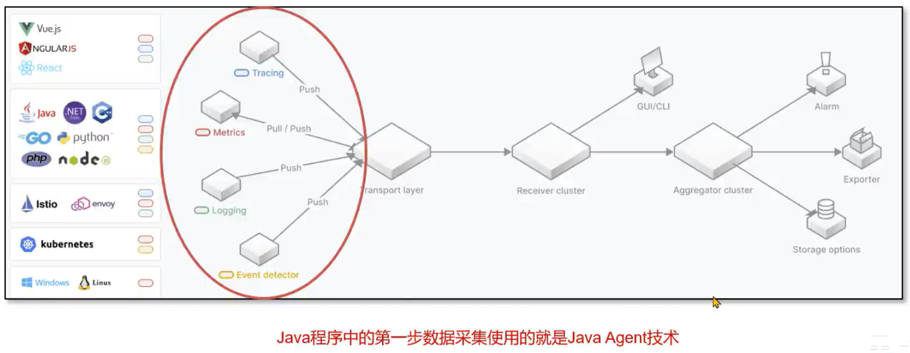

需求：

编写一个简化版的 APM 数据采集程序，具备以下几个功能：

1. 无侵入性获取 spring boot 应用中 controller 层方法的调用时间。
2. 将所有调用时间写入文件中。

问题：这里的 Java agent 采用静态加载模式还是动态加载模式？

一般程序启动之后就需要持续地进行信息的采集，所以采用静态加载模式。


编写 AgentMain 中的 premain 方法

```java
public static void premain(String agentArgs, Instrumentation inst) {
    // 使用bytebuddy增强类
    new AgentBuilder.Default()
        // 禁止bytebuddy处理时修改类名
        .disableClassFormatChanges()
        // 处理时使用retransform增强
        .with(AgentBuilder.RedefinitionStrategy.RETRANSFORMATION)
        // 打印错误日志
        .with(new AgentBuilder.Listener.WithTransformationsOnly(AgentBuilder.Listener.StreamWriting.toSystemOut()))
        // 匹配哪些类
        .type(ElementMatchers.isAnnotatedWith(ElementMatchers.named("org.springframework.web.bind.annotation.RestController")
                                              .or(ElementMatchers.named("org.springframework.web.bind.annotation.Controller"))))
        // 增强，使用MyAdvice通知，对所有方法都进行增强
        .transform((builder, typeDescription, classLoader, javaModule, protectionDomain) ->
                   builder.visit(Advice.to(TimingAdvice.class).on(ElementMatchers.any())))
        .installOn(inst);
}
```

TimingAdvice 实现统计耗时，打印方法名、类名

```java
// 统计耗时，打印方法名、类名
public class TimingAdvice {

    // 方法进入时，返回开始时间
    @Advice.OnMethodEnter
    static long enter() {
        return System.nanoTime();
    }

    // 方法退出时，统计方法执行耗时
    @Advice.OnMethodExit
    static void exit(@Advice.Enter long value,
                     @Advice.Origin("#t") String className,
                     @Advice.Origin("#m") String methodName) {
        String str = methodName + "@" + className + "耗时为: " + (System.nanoTime() - value) + "纳秒\n";
        try {
            FileUtils.writeStringToFile(new File("apm.log"), str, StandardCharsets.UTF_8, true);
        } catch (IOException e) {
            throw new RuntimeException(e);
        }
    }
}
```

使用 maven-assembly-plugin 打包项目，将 jar 包复制到示例项目的同级目录执行命令

```bash
java -jar -javaagent:agent-1.0-SNAPSHOT-jar-with-dependencies.jar demo.jar
```

对示例项目的接口发起请求，查看 log 日志文件。


上面的 log 日志文件是硬编码，可以修改为通过参数设置。

#### Java Agent 参数的获取

在 Java Agent 中，可以通过如下的方式传递参数：

```bash
java -javaagent:./agent.jar=参数 -jar test.jar
```

接下来通过 premain 参数中的 agentArgs 变量获取：

```java
public static void premain(String agentArgs, Instrumentation inst) {
    System.out.println("agentArgs: " + agentArgs);
}
```

如果有多个参数，可以使用如下方式：

```bash
java -javaagent:./agent.jar=param1=value1,param2=value2 -jar test.jar
```

在 Java 代码中使用字符串解析出对应的 key value。

这里获取到的数据还需要传递给 byte buddy

#### Byte Buddy 参数的传递

在 Java Agent 中如果需要传递参数到 Byte Buddy，可以采用如下的方式：

1. 绑定 Key Value，Key 是一个自定义注解，Value 是参数的值

   ```java
   new AgentBuilder.Default()
       .disableClassFormatChanges()
       .with(AgentBuilder.RedefinitionStrategy.RETRANSFORMATION)
       .with(new AgentBuilder.Listener.WithTransformationsOnly(AgentBuilder.Listener.StreamWriting.toSystemOut()))
       .type(ElementMatchers.isAnnotatedWith(ElementMatchers.named("org.springframework.web.bind.annotation.RestController")
                                             .or(ElementMatchers.named("org.springframework.web.bind.annotation.Controller"))))
       .transform((builder, typeDescription, classLoader, javaModule, protectionDomain) ->
                  builder.visit(Advice.withCustomMapping()
                               .bind(AgentParam.class, agentArgs)
                               .to(TimingAdvice.class)
                               .on(ElementMatchers.any()))
       .installOn(inst);
   ```

2. 自定义注解

   ```java
   @Retention(RetentionPolicy.RUNTIME)
   @Target(ElementType.PARAMETER)
   public @interface AgentParam {
       String value();
   }
   ```

3. 通过注解注入

   ```java
   @Advice.OnMethodExit
   static void exit(@Advice.Enter long value,
                    @Advice.Origin("#t") String className,
                    @Advice.Origin("#m") String methodName,
                    @AgentParam("agent.log") String fileName) {
       String str = methodName + "@" + className + "耗时为: " + (System.nanoTime() - value) + "纳秒\n";
       try {
           FileUtils.writeStringToFile(new File(fileName), str, StandardCharsets.UTF_8, true);
       } catch (IOException e) {
           throw new RuntimeException(e);
       }
   }
   ```

使用 maven-assembly-plugin 重新打包项目，将 jar 包复制到示例项目的同级目录执行命令测试。

```bash
java -jar -javaagent:agent-1.0-SNAPSHOT-jar-with-dependencies.jar=agenttest.log demo.jar
```


### 3.4 总结

面试题1：Arthas 这款工具用到了什么 Java 技术，有没有了解过？

回答：

Arthas 主要使用了 Java Agent 技术，这种技术可以让运行中的 Java 程序执行 Agent 中编写的代码。

Arthas 使用了 Agent 中的动态加载模式，可以选择让某个特定的 Java 进程加载 Agent 并执行其中的监控代码。监控方面主要使用的就是 JMX 提供的一些监控指标，同时使用字节码增强技术，对某些类和某些方法进行增强，从而监控方法的执行耗时、参数等内容。

面试题2：APM 系统是如何获取到 Java 程序运行中的性能数据的？

回答：

APM 系统比如 Skywalking 主要使用了 Java Agent 技术，这种技术可以让运行中的 Java 程序执行 Agent 中的编写的代码。

Skywalking 编写的 Java Agent，使用的是 Java Agent 中的静态加载模式，在当前程序启动过程中直接将 Agent 中的代码进行加载并执行，使用字节码增强技术，使用 byte buddy 对某些类和某些方法进行增强，从而监控方法的执行耗时、参数等内容。比如对 Controller 层方法增强，获取接口调用的时长信息，对数据库连接增强，获取数据库查询的时长、SQL 语句等信息。
